# WAD - Web Application Document - Módulo 2 - Inteli

## Grupo 1

#### Catarina Felipe, Giovanna Neves, Isabel Montenegro, Lavinia Mendonça, Lorena Garcia, Nicole Neves, Vitor Lucena

## Sumário

<details>
  <summary><a href="#c1">1. Introdução</a></summary>
</details>

<details>
  <summary><a href="#c2">2. Visão Geral da Aplicação Web</a></summary>
  <ul>
    <li>
      <a href="#c2.1">2.1. Escopo do Projeto</a>
      <ul>
        <li><a href="#c2.1.1">2.1.1. Modelo 5 Forças de Porter</a></li>
        <li><a href="#c2.1.2">2.1.2. Análise Swot da Instituição Parceira</a></li>
        <li><a href="#c2.1.3">2.1.3. Solução</a></li>
        <li><a href="#c2.1.4">2.1.4. Value Proposition Canvas</a></li>
        <li><a href="#c2.1.5">2.1.5. Matriz de Riscos do Projeto</a></li>
      </ul>
    </li>
    <li><a href="#c2.2">2.2. Personas</a></li>
    <li><a href="#c2.3">2.3. User Stories</a></li>
  </ul>
</details>

<details>
  <summary><a href="#c3">3. Projeto Técnico da Aplicação Web</a></summary>
  <ul>
    <li><a href="#c3.1">3.1. Arquitetura</a></li>
    <li><a href="#c3.2">3.2. Wireframes</a></li>
    <li><a href="#c3.3">3.3. Guia de Estilos</a></li>
    <ul>
    <li><a href="#c3.3.1">3.3.1. Cores</a></li>
    <li><a href="#c3.3.2">3.3.2. Tipografia</a></li>
    <li><a href="#c3.3.3">3.3.3. Iconografia e Imagens</a></li>
    <li><a href="#c3.3.4">3.3.4. Grid e Layout</a></li>
    <li><a href="#c3.3.5">3.3.5. Boas práticas - O que Não Fazer</a></li>
    </ul>
    <li><a href="#c3.4">3.4. Protótipo de Alta Fidelidade</a></li>
    <li><a href="#c3.5">3.5. Modelagem do Banco de Dados</a></li>
    <ul>
    <li><a href="#c3.5.1">3.5.1. Modelo Relacional</a></li>
    <li><a href="#c3.5.2">3.5.2. Consultas SQL e Lógica Proposicional</a></li>
    </ul>
    <li><a href="#c3.6">3.6. WebAPI e Endpoints</a></li>
  </ul>
</details>

<details>
<summary><a href="#c4">4. Desenvolvimento da Aplicação Web</a></summary>
  <ul>
    <li><a href="#c4.1">4.1. Primeira Versão da Aplicação WEB</a></li>
    <li><a href="#c4.2">4.2. Segunda Versão da Aplicação WEB</a></li>
    <li><a href="#c4.3">4.3. Versão Final da Aplicação WEB</a></li>
  </ul>
</details>

<details>
  <summary><a href="#c5">5. Testes da Aplicação Web</a></summary>
  <ul>
    <li><a href="#c5.1">5.1. Relatório de Testes de Integração de Endpoints Automatizados</a></li>
    <ul>
    <li><a href="#c5.1.1">5.1.1. Teste do controller admController</a></li>
    <li><a href="#c5.1.2">5.1.2. Teste do controller enderecoController</a></li>
    <li><a href="#c5.1.3">5.1.3. Teste do controller servicoController</a></li>
    <li><a href="#c5.1.4">5.1.4. Teste do controller admController</a></li>
    <li><a href="#c5.1.5">5.1.5. Teste do controller enderecoController</a></li>
    <li><a href="#c5.1.6">5.1.6. Teste do controller servicoController</a></li>
    <li><a href="#c5.1.7">5.1.7. Teste do middleware authMiddleware</a></li>
    <li><a href="#c5.1.8">5.1.8. Teste do middleware isAdm.js</a></li>
    <li><a href="#c5.1.9">5.1.9. Execução e cobertura dos testes</a></li>
    <li><a href="#c5.1.10">5.1.10. Conclusão</a></li>
    </ul>
    <li><a href="#c5.2">5.2. Testes de Usabilidade</a></li>
    <li><a href="#c5.2">5.3. Testes OWASP Top 10</a></li>
  </ul>
</details>

<details>
  <summary><a href="#c6">6. Estudo de Mercado e Plano de Marketing</a></summary>
  <ul>
    <li><a href="#c6.1">6.1. Resumo Executivo</a></li>
    <li><a href="#c6.2">6.2. Análise de Mercado</a></li>
      <ul>
        <li><a href="#c6.2.1">6.2.1. Visão Geral do Setor</a></li>
        <li><a href="#c6.2.2">6.2.2. Tamanho e Crescimento do Mercado</a></li>
        <li><a href="#c6.2.3">6.2.3. Tendências de mercado</a></li>
      </ul>
    <li><a href="#c6.3">6.3. Análise da Concorrência</a></li>
      <ul>
        <li><a href="#c6.3.1">6.3.1. Principais Concorrentes</a></li>
        <li><a href="#c6.3.2">6.3.2. Vantagens Competitivas da Aplicação Web</a></li>
      </ul>
    <li><a href="#c6.4">6.4. Público Alvo</a></li>
      <ul>
        <li><a href="#c6.4.1">6.4.1. Segmentação de Mercado</a></li>
        <li><a href="#c6.4.2">6.4.2. Perfil do Público-Alvo</a></li>
      </ul>
    <li><a href="#c6.5">6.5. Posicionamento</a></li>
      <ul>
        <li><a href="#c6.5.1">6.5.1. Proposta de Valor Única</a></li>
        <li><a href="#c6.5.2">6.5.2. Estratégia de Diferenciação</a></li>
      </ul>
    <li><a href="#c6.6">6.6. Estratégia de Marketing</a></li>
        <ul>
        <li><a href="#c6.6.1">6.6.1. Produto/Serviço</a></li>
        <li><a href="#c6.6.2">6.6.2. Preço</a></li>
        <li><a href="#c6.6.3">6.6.3. Praça (Distribuição)</a></li>
        <li><a href="#c6.6.4">6.6.4. Promoção</a></li>
      </ul>
  </ul>
</details>

<details>
<summary><a href="#c7">7. Conclusões e trabalhos futuros</a></summary>
</details>

<details>
<summary><a href="#c8">8. Referências</a></summary>
</details>

<br>

# <a name="c1"></a>1. Introdução

O Mandacaru é uma plataforma digital desenvolvida com o propósito de facilitar o acesso a informações confiáveis sobre locais e equipamentos voltados à promoção da saúde mental, especialmente para mulheres e adolescentes em situação de vulnerabilidade social. Pensado como uma ferramenta gratuita, acessível e acolhedora, o projeto busca ser um ponto de apoio para quem precisa encontrar, com facilidade e segurança, serviços de cuidado emocional e psicológico em sua região.

Para garantir uma construção sólida e bem fundamentada da aplicação web, foi elaborado o Web Application Document (WAD). Este documento é essencial durante o desenvolvimento, pois reúne de forma estruturada os aspectos técnicos, visuais e conceituais da aplicação, permitindo que toda a equipe envolvida compartilhe de uma visão clara e coesa do produto.

O WAD apresenta arquitetura do sistema, wireframes, protótipos, guias de estilo, funcionalidades implementadas e decisões tomadas ao longo do processo, tornando-se um guia de referência tanto para o desenvolvimento atual quanto para futuras manutenções e melhorias da plataforma. Ele também registra o percurso de ideação, testes e aprendizado da equipe, garantindo transparência, alinhamento de expectativas e um histórico completo da evolução do produto.

Dessa forma, o WAD não apenas documenta o que foi feito, mas também orienta o caminho para futuras melhorias e ampliações da aplicação.

# <a name="c2"></a>2. Visão Geral da Aplicação Web

O Mandacaru surge como resposta à necessidade identificada pelo Instituto Cactus: a ausência de uma ferramenta digital gratuita, acessível e confiável que centralize informações sobre locais e equipamentos voltados à promoção da saúde mental. O projeto propõe uma solução que combina geolocalização, curadoria de dados e design inclusivo para conectar usuários a espaços de cuidado em suas regiões, como CAPS, parques, academias e centros culturais. Para embasar o desenvolvimento da plataforma, foram conduzidas análises de mercado, como o Modelo das Cinco Forças de Porter e a Análise SWOT, além da definição clara da proposta de valor, matriz de riscos, personas e user stories.

## <a name="c2.1"></a>2.1. Escopo do Projeto

Com o objetivo de solucionar a problemática apresentada pelo Instituto Cactus, associada à falta de uma ferramenta gratuita que centraliza a informações sobre equipamentos ligados à saúde mental, o projeto visa a criação de uma aplicação Web que disponibiliza e facilita o acesso a esse conteúdo. Suprindo a necessidade identificada, a solução oferece uma plataforma prática, acessível e confiável aos seus usuários, além de contribuir para o fortalecimento da rede de apoio em saúde mental. A seção em questão detalha as pesquisas de mercado acerca da área de atuação do parceiro e do projeto.

### <a name="c2.1.1"></a>2.1.1. Modelo de 5 Forças de Porter

Após a pandemia da Covid-19, a saúde mental ganhou mais atenção no Brasil, aumentando a busca por apoio psicológico e ampliando as discussões na sociedade. Nesse cenário, o Instituto Cactus se destaca por promover ações baseadas em dados, com foco em jovens e mulheres. Sua atuação busca oferecer suporte e fortalecer a prevenção, ampliando o acesso a cuidados em saúde mental de forma mais coletiva e estruturada. Diante desse contexto, apresenta-se a análise das Cinco Forças de Porter, ferramenta útil para entender a concorrência em um setor.<sup>1, 5, 6</sup>

<div align="center">
<sub>Figura 01 - 5 Forças de Porter</sub>

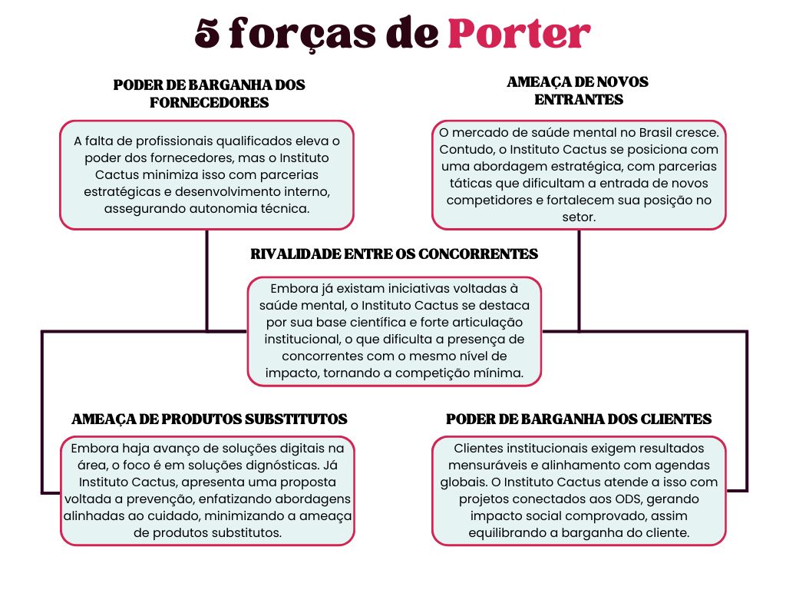

<sup>Fonte: Material produzido pelos autores (2025)</sup>

</div>

- **Ameaça de Novos Entrantes (Baixa)**

O setor de saúde mental vem se expandindo com o avanço da conscientização e da tecnologia. Contudo, destacar-se nesse mercado exige mais que boa intenção. O Instituto, com sua atuação fundamentada em dados, se beneficia de barreiras institucionais e técnicas que dificultam a entrada de novos competidores. Ademais, parcerias estratégicas, articulação política e uso de evidências reforçam sua posição e desestimulam concorrentes menos preparados.

- **Ameaça de Produtos Substitutos (Baixa)**

Apesar da crescente oferta de aplicativos e soluções individuais voltadas a dignósticos mentais e psicológicos, muitas carecem da visão preventiva. O Instituto, por sua vez, adota uma abordagem coletiva e educativa, alinhada a prevenção e cuidado da saúde mental mais do que o tratamento, lhe garantindo uma proposta de valor diferenciada. Dessa forma, substituí-lo por soluções mais voltadas ao tratamento representaria perda de impacto e concientização do cuidado.

- **Poder de Barganha dos Fornecedores (Equilibrado)**

Com a escassez de profissionais especializados, é natural que se eleve o poder de barganha dos fornecedores de conhecimento e mão de obra. Contudo, o Instituto contorna esse cenário investindo em parcerias com universidades e centros de pesquisa, fortalecendo sua autonomia técnica e reduzindo a dependência externa.

- **Poder de Barganha dos Clientes (Equilibrado)**

No contexto atual, clientes institucionais e financiadores exigem maior comprovação de impacto social e aderência a pautas globais, como os ODS. Para atender a essa demanda, o Instituto desenvolve projetos embasados em evidências e métricas, tornando-se, assim, um parceiro estratégico confiável. Logo, sua capacidade de alinhar missão institucional com resultados mensuráveis reduz a margem de pressão externa.

- **Rivalidade entre Concorrentes Existentes (Equilibrado)**

Embora o campo da saúde mental no Brasil ainda seja fragmentado, a concorrência por financiamento, visibilidade e espaço em políticas públicas é grande. Nesse cenário, o Instituto se diferencia pela combinação de impacto social mensurável, inovação baseada em dados e legitimidade institucional, garantindo vantagem competitiva.

### <a name="c2.1.2"></a>2.1.2. Análise SWOT da Instituição Parceira

A imagem a seguir aborda a Análise SWOT do Instituto Cactus, ferramenta que busca avaliar seu cenário interno e externo.

<div align="center">
<sub>Figura 02 - Análise SWOT </sub>
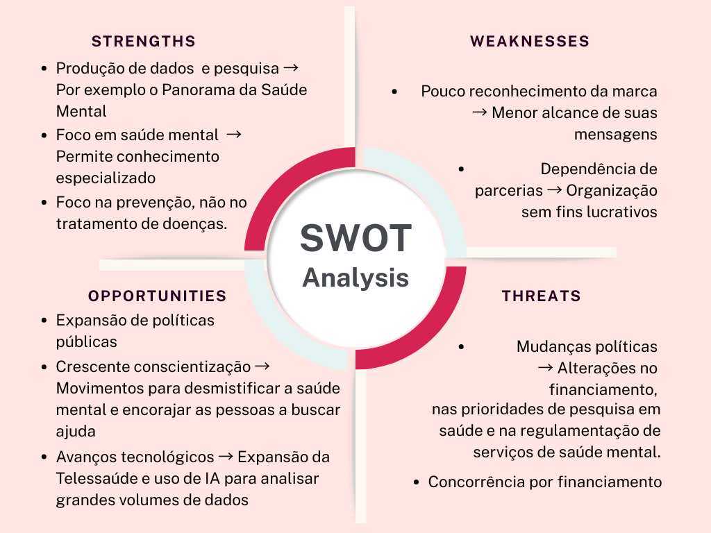
<sup>Fonte: Material produzido pelos autores (2025)</sup>
</div>

O Instituto Cactus se destaca pela especialização em saúde mental, com autoridade técnica, metodologias próprias e influência em políticas públicas. Sua produção robusta de dados o diferencia de concorrentes focados em serviços. No entanto, enfrenta desafios como baixa visibilidade e dependência de colaborações externas. Em um contexto de maior atenção à saúde mental e avanços tecnológicos, surgem oportunidades de ampliar o impacto. Ainda assim, o Instituto precisa superar a competição por financiamento e as incertezas políticas.<sup>3,4</sup>

### <a name="c2.1.3"></a>2.1.3. Solução

- **Problema a ser resolvido**

Apesar da ampla disponibilidade de informações sobre saúde mental e de diversos locais de atendimento no meio digital, o mercado carece de uma ferramenta simples, acessível e centralizadora de dados realmente confiáveis. Diante desse cenário, surge o desafio de desenvolver uma solução que amplie o acesso e conecte as pessoas a serviços que promovam um cuidado integral à saúde mental.

- **Dados disponíveis**

Foram coletados dados de geolocalização de espaços públicos e privados que oferecem iniciativas relacionadas ao bem-estar e à saúde mental. As fontes incluem plataformas públicas (como dados do SUS), mapas culturais, bases de prefeituras e curadorias próprias do Instituto. As informações incluem tipo de local, endereço, categoria_localidade e, quando possível, links e horários de funcionamento.<sup>2</sup>

- **Solução proposta**

A proposta consiste no desenvolvimento de uma plataforma digital com um mapa interativo que utilize geolocalização para indicar ao usuário diferentes espaços que promovem a saúde mental em sua região, como CAPS, parques, academias, entre outros. A iniciativa busca descentralizar o cuidado, reconhecendo e valorizando equipamentos culturais e comunitários como agentes fundamentais na promoção do bem-estar emocional.

- **Forma de utilização da solução**

O acesso à plataforma será realizado através do site do Instituto Cactus. Nele, o usuário poderá ativar a geolocalização para visualizar, em um mapa interativo, os espaços de cuidado mais próximos. As localidades estarão organizadas pelas categoria_localidades: cultura, esporte e saúde, com filtros de busca e descrições detalhadas. O design será inclusivo e responsivo, garantindo acessibilidade e uma navegação intuitiva.

- **Benefícios esperados**

A plataforma visa tornar mais acessível e centralizada a busca por cuidado com a saúde mental no cotidiano, incentivando a autonomia do usuário e a descoberta de novas formas de bem-estar. Dessa maneira, também reforça a ideia de que o cuidado vai além do ambiente clínico, criando uma construção coletiva e cultural.

- **Critério de sucesso e como será avaliado**

O sucesso do projeto será medido pela entrega da aplicação funcional no prazo, com o sistema de busca e demais funcionalidades implementadas. A avaliação considerará a qualidade do produto final, os resultados dos testes de usabilidade com usuários reais e a validação do Instituto Cactus. Estabilidade e boa experiência de navegação serão critérios fundamentais para sua aprovação.

### <a name="c2.1.4"></a>2.1.4. Value Proposition Canvas

O Canvas de Proposta de Valor é um modelo de negócios de extrema importância no mercado. Amplamente utilizado, sua função é auxiliar a empresa a se posicionar em torno dos valores e das necessidades reais dos clientes¹.

Ele é organizado em dois quadrantes principais: o primeiro, à esquerda, é voltado para a proposta de valor da solução apresentada; já a coluna à direita refere-se ao cliente: suas dores, tarefas e desejos.

Dessa forma, o modelo Canvas estabelece uma conexão direta entre as necessidades do cliente e o que a empresa oferece como solução, proporcionando um direcionamento claro tanto para a equipe quanto para o público.

Abaixo, está apresentado o modelo do Canvas que representa a solução criada para o Instituto Cactus, com o objetivo de aliviar dores e gerar ganhos. Em seguida, há uma descrição mais detalhada de cada componente.

<div align="center">
<sub>Figura 03 - Value Proposition Canvas</sub>
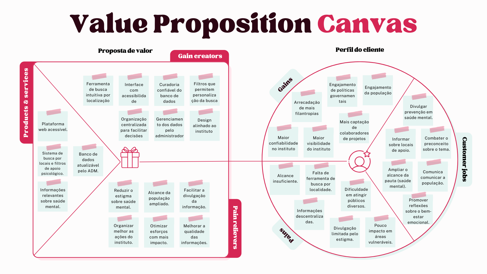
<sup>Fonte: Material produzido pelos autores (2025)</sup>
</div>

### PROPOSTA DE VALOR

#### Produtos & Serviços

Esta seção detalha os produtos e serviços que fazem parte da proposta de valor entregue ao cliente.

- **Plataforma web acessível** <br>
  A solução será disponibilizada por meio de um site, permitindo o acesso a partir de diferentes dispositivos e plataformas.
- **Sistema de busca por locais com filtros de apoio psicológico** <br>
  O principal diferencial da plataforma está no sistema de busca por locais de apoio psicológico, que conta com filtros para personalizar e refinar os resultados de acordo com as necessidades do usuário.
- **Banco de dados atualizável pelo administrador** <br>
  O sistema contará com um perfil administrativo que permitirá a gestão dos dados, incluindo a adição, edição e exclusão de locais, garantindo informações sempre atualizadas.
- **Informações relevantes sobre saúde mental** <br>
  Além da funcionalidade de busca, o site oferecerá conteúdos educativos e informativos voltados à prevenção e ao cuidado com a saúde mental.

#### Gain Creators (Criadores de Ganhos)

Esta seção detalha os elementos da solução que atuam como criadores de ganho para o cliente, fortalecendo a proposta de valor da instituição.

- **Ferramenta de busca intuitiva por localização** <br>
  A estrutura da plataforma é objetiva e intuitiva, com uso de mapas e ícones que facilitam a navegação e agregam valor à experiência do usuário.
- **Interface com acessibilidade** <br>
  Um diferencial importante é a presença de um recurso de acessibilidade na interface, garantindo inclusão de públicos diversos.
- **Curadoria confiável do banco de dados** <br>
  Os dados disponibilizados passam por curadoria criteriosa, incluindo informações do próprio Instituto e de pesquisas aprofundadas da equipe.
- **Filtros para personalização da busca** <br>
  Os filtros tornam a busca mais eficiente e direta, evitando que o usuário perca tempo com resultados irrelevantes.
- **Organização centralizada para facilitar decisões** <br>
  A plataforma centraliza locais de atendimento e informações importantes, o que contribui para decisões mais eficazes por parte do Instituto.
- **Gerenciamento dinâmico de dados pelo administrador** <br>
  Com atualizações constantes, a plataforma garante que os dados estejam sempre corretos e alinhados às necessidades do público.
- **Design alinhado ao Instituto** <br>
  A identidade visual do site é pensada para se aproximar da estética do Instituto, mantendo harmonia com sua missão, mas adaptando-se aos objetivos da solução.

#### Pain Relievers (Aliviadores de Dores)

Esta seção apresenta os elementos da solução que atuam como aliviadores das dores identificadas no perfil do cliente, reforçando o alinhamento entre suas necessidades e a proposta de valor da instituição.

- **Redução do estigma sobre saúde mental** <br>
  A plataforma atua no combate ao preconceito relacionado à saúde mental, promovendo um ambiente mais acolhedor.
- **Melhoria na organização das ações do Instituto** <br>
  Com informações centralizadas, o Instituto ganha mais controle e clareza para suas ações.
- **Otimização de esforços com maior impacto** <br>
  A ferramenta potencializa as atividades já realizadas pelo Instituto, tornando-as mais eficazes e abrangentes.
- **Maior alcance populacional** <br>
  Sendo responsivo e multiplataforma, o site rompe barreiras geográficas e tecnológicas, alcançando um público maior.
- **Melhoria na qualidade das informações** <br>
  Diante da sobrecarga de conteúdos na internet, o site busca oferecer informações confiáveis e bem estruturadas.
- **Facilidade na divulgação de informações** <br>
  Por se tratar de um canal digital, o site reduz custos e esforços físicos na disseminação de conteúdos relevantes.

### PERFIL DO CLIENTE

#### Customer Jobs (Tarefas do Cliente)

Esta seção descreve as principais responsabilidades, objetivos e desafios enfrentados pelo cliente, os quais orientam o desenvolvimento da solução proposta pela instituição.

- **Divulgar ações de prevenção em saúde mental** <br>
  É papel do Instituto compartilhar informações preventivas, sendo esta uma de suas principais responsabilidades.
- **Informar sobre locais de apoio** <br>
  Divulgar centros de apoio psicológico em nível nacional é essencial para o alcance da missão institucional.
- **Combater o preconceito sobre saúde mental** <br>
  O Instituto enfrenta o desafio constante de desconstruir o estigma social que envolve o tema.
- **Ampliar o alcance da pauta** <br>
  A organização acredita que saúde mental é assunto de todos, buscando levar essa mensagem ao maior número de pessoas possível.
- **Comunicar-se com a população** <br>
  Estabelecer uma comunicação eficaz com públicos diversos é um desafio, devido às diferenças de linguagem, acesso e compreensão.
- **Promover reflexões sobre bem-estar emocional** <br>
  O foco está na valorização da saúde emocional como forma de promover o cuidado e o autoconhecimento, além do tratamento clínico.

#### Gains (Ganhos Desejados)

Esta seção apresenta os ganhos esperados pelo cliente com a adoção da solução, demonstrando como a proposta de valor contribui para ampliar os impactos positivos da atuação da instituição.

- **Maior arrecadação de filantropias** <br>
  A plataforma contribui para uma comunicação mais clara dos projetos do Instituto, o que pode atrair novos filantropos.
- **Engajamento de políticas governamentais** <br>
  A visibilidade da pauta pode estimular ações e políticas públicas voltadas à saúde mental, área de interesse da instituição.
- **Engajamento da população** <br>
  O acesso facilitado à informação contribui para que mais pessoas se envolvam com a causa e a valorizem.
- **Captação de novos colaboradores para projetos** <br>
  A vitrine dos projetos no site pode atrair parcerias e interessados em colaborar com a organização.
- **Aumento da confiabilidade no Instituto** <br>
  Uma plataforma clara, atualizada e funcional fortalece a imagem institucional perante seu público.
- **Maior visibilidade institucional** <br>
  De forma geral, o site ajuda a expandir a presença e o reconhecimento do Instituto em âmbito nacional.

#### Pains (Dores)

Esta seção descreve os principais desafios, limitações e obstáculos enfrentados pelo cliente, que a proposta de valor busca compreender e amenizar por meio de soluções eficazes

- **Baixo alcance nacional** <br>
  O Instituto tem o objetivo de impactar todo o país, mas encontra limitações operacionais e comunicacionais para isso.
- **Ausência de ferramenta de busca eficiente** <br>
  Apesar de já possuir um site, ainda não existe um sistema que centralize informações por localidade de forma eficaz.
- **Informações descentralizadas** <br>
  Os dados sobre saúde mental são, em geral, dispersos e pouco padronizados, o que prejudica a ação coordenada do Instituto.
- **Dificuldade de alcançar públicos diversos** <br>
  Apesar de existirem centros de atendimento, a divulgação ainda é limitada e pouco adaptada aos diferentes perfis da população.
- **Estigma social sobre saúde mental** <br>
  O preconceito cultural dificulta a atuação do Instituto e a busca por ajuda por parte da população.
- **Baixo impacto em áreas vulneráveis** <br>
  Regiões com maior vulnerabilidade social são as mais difíceis de alcançar, e a tecnologia pode ser um meio eficaz para contornar esse desafio.

Dessa forma, é possível perceber, por meio do modelo, que a solução proposta não apenas se dedica a aliviar as dores identificadas no perfil do cliente, como também visa promover ganhos significativos em sua atuação. Para isso, foi elaborado um detalhamento abrangente, contemplando os diversos âmbitos nos quais a instituição está inserida.

### <a name="c2.1.5"></a>2.1.5. Matriz de Riscos do Projeto 

A matriz de riscos é uma ferramenta estratégica indispensável e necessária na análise e desenvolvimento de um negócio. Visando ilustrar a probabilidade e o impacto de potenciais problemas, desde comunicações falhas até situações improváveis, ela é essencial para priorizar os esforços, ajustando-se continuamente às mudanças do projeto e assegurando preparo para enfrentar desafios com eficácia. Mantendo o alinhamento com os objetivos estipulados, é de suma importância retornar à matriz durante o desenvolvimento do projeto. A seguir, é possível conferir a matriz de risco, contando com ameaças e oportunidades e, ainda abaixo, com planos de ação.

---

<div align="center">
<sub>Figura 04 - Matriz de Risco</sub>
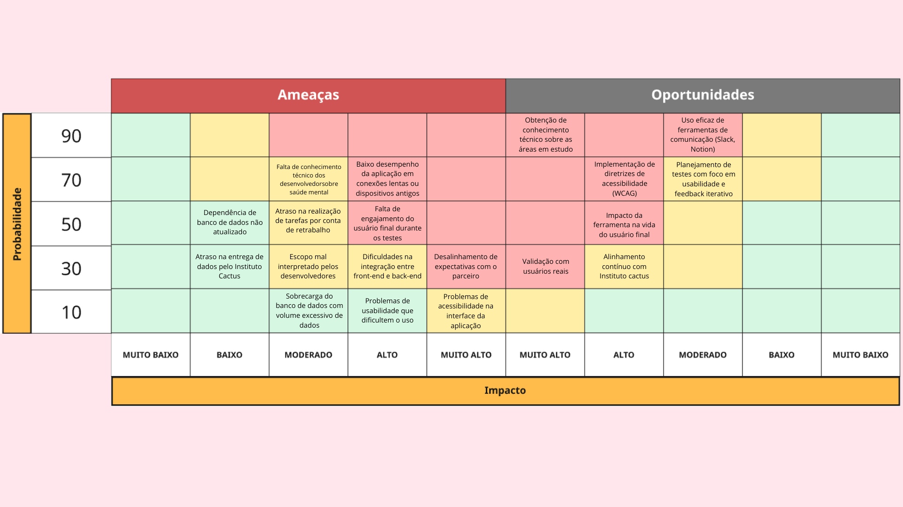
<sup>Fonte: Material produzido pelos autores (2025)</sup>
</div>

### Detalhamento dos planos de ação:

- **Atraso na entrega de dados pelo Instituto Cactus:** <br>
  Estabelecimento de prazos entre os desenvolvedores e os representantes da instituição

- **Escopo mal interpretado pelos desenvolvedores:** <br>
  Alinhamento com o instituto cactus sobre o problema identificado e sobre a solução a ser desenvolvida

- **Falta de conhecimento técnico dos desenvolvedores sobre saúde mental:** <br>
  Estudo detalhado sobre a abordagem do tema por parte da equipe, garantindo a implementação dessas pesquisas na aplicação

- **Dependência de banco de dados não atualizado:** <br>
  A solução desenvolvida deve ser agnóstica ao banco de dados

- **Problemas de acessibilidade na interface da aplicação:** <br>
  Garantir, desde a etapa de ideação, a implementação de ferramentas que garantam a utilização da aplicação web pelo maior número de indivíduos presentes no público alvo.

- **Dificuldades na integração entre front-end e back-end:** <br>
  Montagem de um banco de dados bem estruturado, garantindo que menos problemas sejam enfrentados nesse aspecto

- **Falta de engajamento do usuário final durante os testes:** <br>
  Análise dos elementos que devem ser aprimorados e facilitados visando o uso intuitivo da aplicação desenvolvida

- **Problemas de usabilidade que dificultem o uso:** <br>
  Pesquisa detalhada acerca da raiz do problema com o objetivo de resolução direcionada

- **Desalinhamento de expectativas com o parceiro:** <br>
  Validação da solução e do desenvolvimento a cada sprint

- **Atraso na realização de tarefas por conta de retrabalho:** <br>
  Planejamento que inclua intervalos curtos, garantindo mais de uma revisão por tarefa

- **Baixo desempenho da aplicação em conexões lentas ou dispositivos antigos:** <br>
  Otimização máxima da solução web

- **Sobrecarga do banco de dados com volume excessivo de dados:** <br>
  Compactação e serialização das informações adicionadas

### Detalhamento das Oportunidades:

- **Uso eficaz de ferramentas de comunicação (Slack, Notion):** <br>
  Utilizar ferramentas como Slack e Notion para formalizar decisões e agilizar o acesso às informações, reduzindo falhas de comunicação.

- **Validação com usuários reais:** <br>
  Realizar validações contínuas com usuários reais para garantir o alinhamento com suas necessidades e aprimorar rapidamente com base em dados concretos.

- **Implementação de diretrizes de acessibilidade (WCAG):** <br>
  Implementar as diretrizes da WCAG para garantir acessibilidade, ampliar o público e incluir pessoas com deficiência.

- **Alinhamento contínuo com Instituto Cactus:** <br>
  Manter o alinhamento com o Instituto Cactus para validar o propósito social e aumentar a legitimidade institucional do projeto.

- **Planejamento de testes com foco em usabilidade e feedback iterativo:** <br>
  Aplicar testes focados em usabilidade de forma iterativa, ajustando a solução com base em evidências e melhorando a experiência do usuário final.

- **Obtenção de conhecimento técnico sobre as áreas em estudo:** <br>
  Aprofundar o conhecimento técnico em áreas como acessibilidade, geolocalização e arquitetura de software, contribuindo para o crescimento da equipe e a qualidade do produto.

- **Impacto da ferramenta na vida do usuário final:** <br>
  Analisar e comunicar o impacto positivo da ferramenta para reforçar o propósito social, demonstrar valor da solução e engajar potenciais parceiros.

## <a name="c2.2"></a>2.2. Personas

Representando indivíduos específicos de forma singular, as personas são descrições que, apesar de fictícias, devem ser realistas o suficiente para caracterizar usuários semelhantes ao público alvo do produto (nesse caso, aplicação Web) sendo desenvolvido. Ao compreender comportamentos, objetivos e atitudes dos clientes, uma persona permite a visualização das necessidades que devem ser incluídas no protótipo. Elas reúnem informações relevantes, como idade, gênero, ocupação, comportamentos e preocupações, focando em características que impactam diretamente o que está sendo projetado. A seguir, são apresentados exemplos de personas e os respectivos mapas mentais delas associadas ao projeto em questão — a aplicação Web Mandacaru.

<div align="center">
<sub>Figura 05 - Persona do usuário 1</sub>
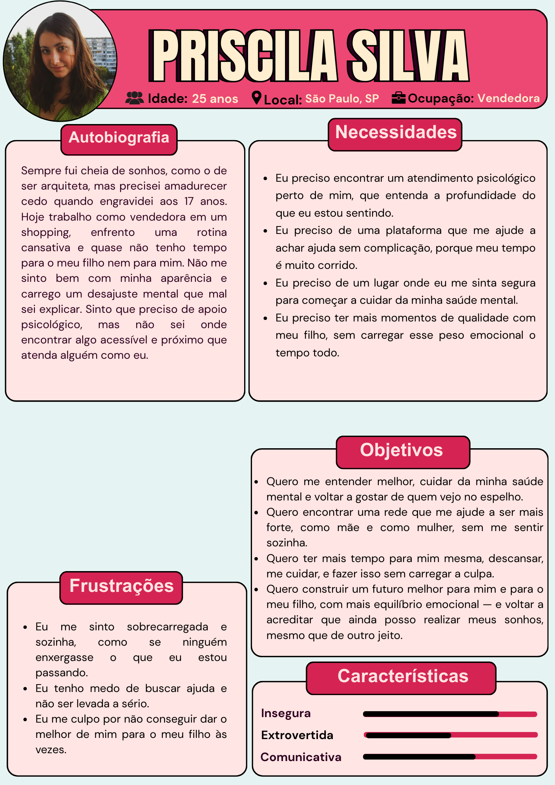
<sup>Fonte: Material produzido pelos autores (2025)</sup>
</div>

<div align="center">
<sub>Figura 06 - Mapa de empatia do usuário 1</sub>

<sup>Fonte: Material produzido pelos autores (2025)</sup>
</div>

A partir dessa persona, pode-se mapear a sobrecarga emocional de mulheres jovens que conciliam maternidade, trabalho exaustivo. Sua necessidade por acolhimento emocional, aliada à dificuldade em identificar pontos de atendimento psicológico próximos, exige que o website ofereça uma navegação simples, com destaque para geolocalização, e linguagem acessível. O site deve reforçar empatia e acolhimento em todas as interações, evitando termos técnicos e possibilitando que a busca por ajuda não seja mais um fardo em sua rotina.

<div align="center">
<sub>Figura 07 - Persona do usuário 2</sub>
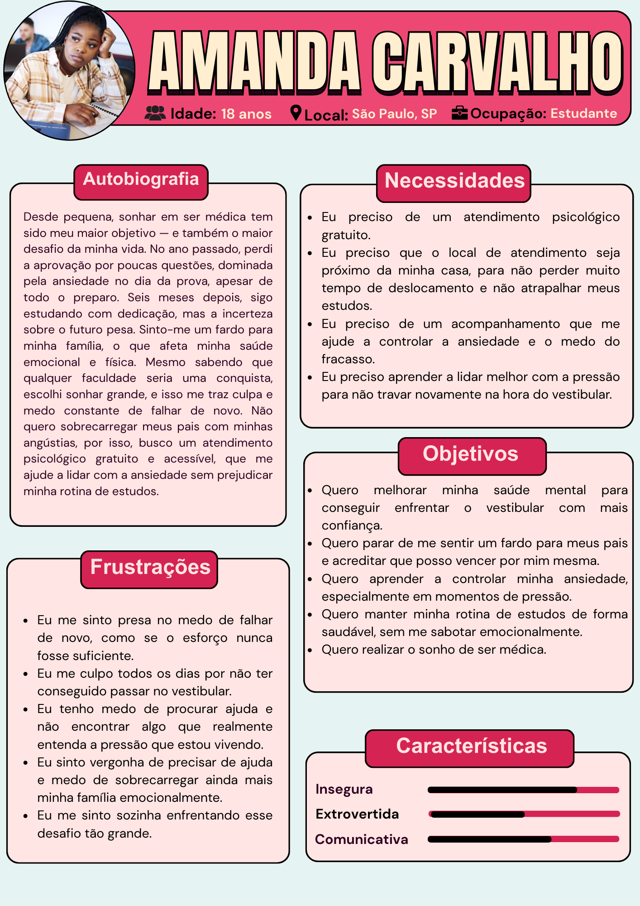
<sup>Fonte: Material produzido pelos autores (2025)</sup>
</div>

<div align="center">
<sub>Figura 08 - Mapa de empatia do usuário 2</sub>
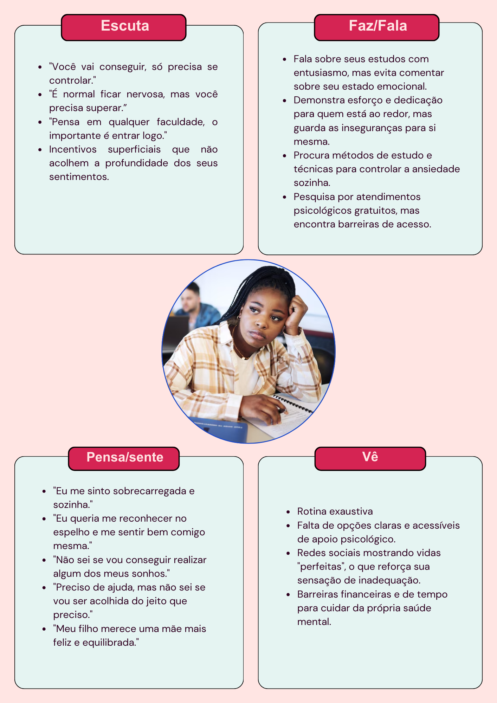
<sup>Fonte: Material produzido pelos autores (2025)</sup>
</div>

A partir dessa persona, pode-se mapear a pressão emocional de jovens em situação de vulnerabilidade socioeconômica que enfrentam o vestibular como um divisor de águas em suas vidas. A insegurança, a ansiedade e o medo de falhar precisam ser compreendidos como partes de um cenário delicado. Dessa forma, o website deve ser sensível ao momento de quem o utiliza, oferecendo informações claras sobre atendimentos gratuitos, com filtros simples, localização precisa e visual acolhedor.

<div align="center">
<sub>Figura 09 - Persona do usuário 3</sub>
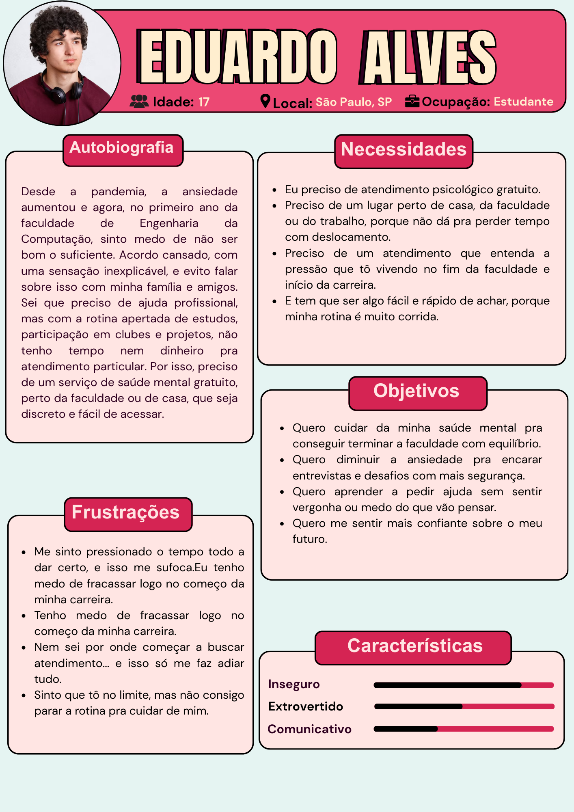
<sup>Fonte: Material produzido pelos autores (2025)</sup>
</div>

<div align="center">
<sub>Figura 10 - Mapa de empatia do usuário 3</sub>
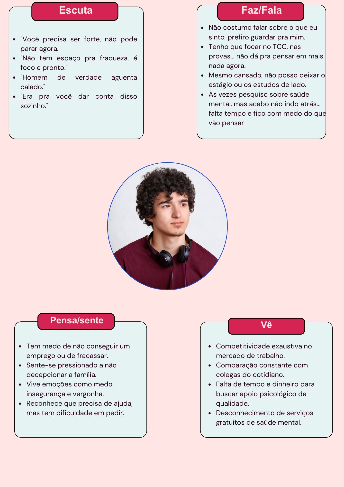
<sup>Fonte: Material produzido pelos autores (2025)</sup>
</div>

A partir dessa persona, pode-se mapear a dificuldade de jovens homens em expressar vulnerabilidades emocionais, além da sobrecarga entre clubes e projetos e expectativas familiares. Por isso, o website deve oferecer um ambiente discreto, com recursos rápidos de busca, evitando formulários longos ou interações que exponham emocionalmente o usuário. É importante garantir filtros que facilitem a busca por locais com horários flexíveis e próximos ao usuário, respeitando o tempo e a necessidade de autonomia emocional dessa persona.

<div align="center">
<sub>Figura 11 - Persona do usuário 3</sub>
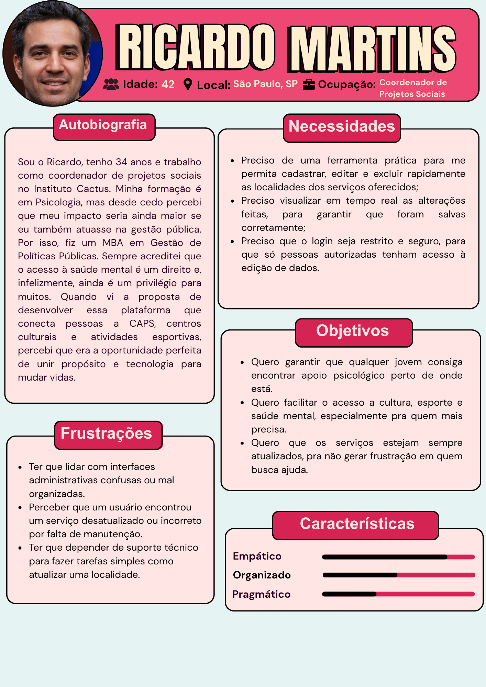
<sup>Fonte: Material produzido pelos autores (2025)</sup>
</div>

<div align="center">
<sub>Figura 12 - Mapa de empatia do usuário 3</sub>
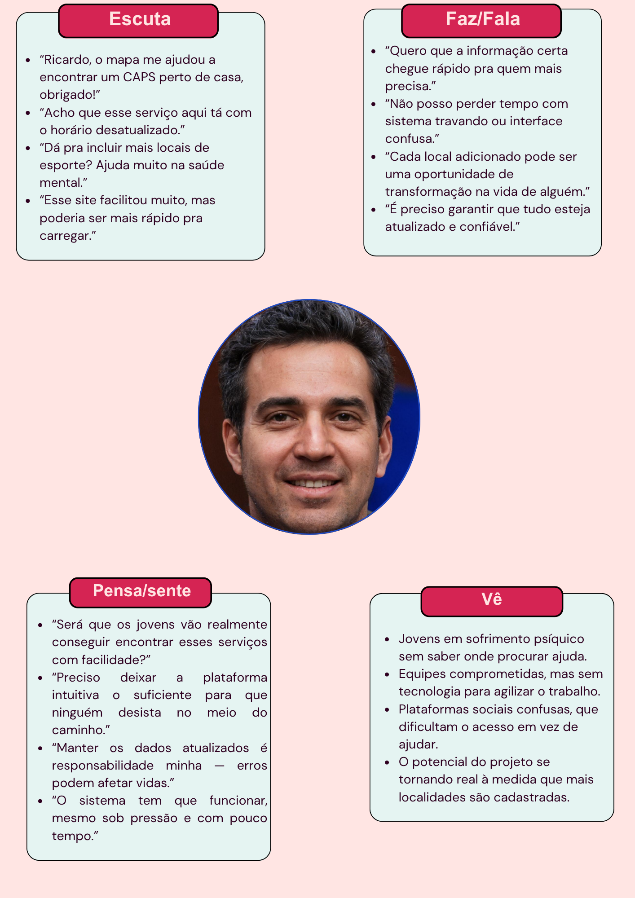
<sup>Fonte: Material produzido pelos autores (2025)</sup>
</div>

A partir da persona do administrador Ricardo, é possível mapear desafios enfrentados por profissionais que atuam nos bastidores de iniciativas sociais voltadas à saúde mental. Ricardo carrega o peso de garantir que jovens em sofrimento encontrem ajuda real, prática e acessível — tudo isso enquanto lida com limitações técnicas, falta de tempo e a responsabilidade de manter a plataforma funcional e atualizada. Sua rotina exige ferramentas eficientes, com interfaces intuitivas e autonomia para edição de dados, sem burocracias ou travas.

Por fim, observa-se a importância das personas para mapear as necessidades e as dores dos usuários que podem ser solucionadas ou amenizadas pela nossa aplicação web. Por fim, elas também auxiliarão na elaboração das user stories, as quais serão apresentadas e explicadas no tópico 2.3.

## <a name="c2.3"></a>2.3. User Stories

Utilizada para retratar o que o usuário precisa e qual a motivação por trás dessa necessidade, as User Stories são descrições simples que auxiliam a equipe de desenvolvimento a ter uma visão compartilhada e menos abstrata do que será entregue em termos de projeto. Seguindo o princípio INVEST (Independentes, Negociáveis, Valiosas, Estimáveis, Sob medida e Testáveis), elas orientam a elaboração de soluções focadas em necessidades reais. De modo a garantir a flexibilidade no desenvolvimento da solução e mantendo o foco no valor entregue ao usuário, o time considerou as seguintes User Stories:

<div align="center">
<sub><a name="t1"></a>User story 01</sub>

| Identificação        | US01                                                                                                                                                                                                                                                                                                                                                                                                                                                  |
| -------------------- | ----------------------------------------------------------------------------------------------------------------------------------------------------------------------------------------------------------------------------------------------------------------------------------------------------------------------------------------------------------------------------------------------------------------------------------------------------- |
| Persona              | Priscila Silva                                                                                                                                                                                                                                                                                                                                                                                                                                        |
| User Story           | Como uma vendedora com pouco tempo, eu quero encontrar CAPS próximos da minha localização para buscar apoio psicológico.                                                                                                                                                                                                                                                                                                                              |
| Critério de aceite 1 | **CR1:** Deve haver, ao rolar a página da seção mapas para baixo, um filtro de tipo de localidade que, ao ser clicado, exiba "CAPS" como uma das opções.                                                                                                                                                                                                                                                                                              |
| Critério de aceite 2 | **CR2:** O sistema deve exibir uma lista de CAPS ordenados pela distância, com informações básicas (endereço, telefone, horários).                                                                                                                                                                                                                                                                                                                    |
| Critérios INVEST     | **Independente:** A funcionalidade é modular e pode ser implementada isoladamente, mesmo que dependa de dados de geolocalização já existentes. <br> **Negociável:** Pode ajustar a forma de exibir a lista de CAPS. <br> **Valorosa:** Facilita o acesso a apoio psicológico gratuito. <br> **Estimável:** Esforço de desenvolvimento é claro. <br> **Pequena:** Foco em localização e rota. <br> **Testável:** Pode validar a busca e rotas no mapa. |

<sup>Fonte: Material produzido pelos autores (2025)</sup>

</div>

<div align="center">
<sub><a name="t1"></a>User story 02</sub>

| Identificação        | US02                                                                                                                                                                                                                                                                                                                                                                                                                                                                                                                                                                                                                                                                                                                                                                                                                                                                |
| -------------------- | ------------------------------------------------------------------------------------------------------------------------------------------------------------------------------------------------------------------------------------------------------------------------------------------------------------------------------------------------------------------------------------------------------------------------------------------------------------------------------------------------------------------------------------------------------------------------------------------------------------------------------------------------------------------------------------------------------------------------------------------------------------------------------------------------------------------------------------------------------------------- |
| Persona              | Priscila Silva                                                                                                                                                                                                                                                                                                                                                                                                                                                                                                                                                                                                                                                                                                                                                                                                                                                      |
| User Story           | Como uma vendedora sobrecarregada, quero encontrar facilmente espaços públicos para atividades físicas, como quadras ou parques, para aliviar a tensão do dia a dia.                                                                                                                                                                                                                                                                                                                                                                                                                                                                                                                                                                                                                                                                                                |
| Critério de aceite 1 | **CR1:** Deve haver, ao rolar a página inicial para baixo, um filtro de tipo de localidade que, ao ser clicado, exiba "quadras públicas" como uma das opções.                                                                                                                                                                                                                                                                                                                                                                                                                                                                                                                                                                                                                                                                                                       |
| Critério de aceite 2 | **CR2:** Deve haver um sistema para exibir uma lista de quadras ordenados pela distância com informações de disponibilidade e tipo de quadra (ex: vôlei, futsal).                                                                                                                                                                                                                                                                                                                                                                                                                                                                                                                                                                                                                                                                                                   |
| Critérios INVEST     | **Dependente:** O filtro e a opção "quadras públicas" dependem do funcionamento do banco de dados e da geolocalização do usuário. <br> **Negociável:** A forma de apresentar as quadras (lista, mapa ou ambos) pode ser ajustada conforme feedback do time ou dos usuários. <br> **Valorosa:** Ajuda a reduzir a ansiedade por meio do acesso facilitado a atividades físicas gratuitas e próximas. <br> **Estimável:** Pode ser estimada com base na implementação de filtros, integração com geolocalização e exibição de dados simples. <br> **Pequena:** A funcionalidade pode ser desenvolvida em uma iteração curta, pois envolve apenas filtragem, exibição e ordenação de dados. <br> **Testável:** É possível testar se o filtro aparece, se exibe "quadras públicas", e se a lista apresenta quadras com informações corretas e ordenadas pela distância. |

<sup>Fonte: Material produzido pelos autores (2025)</sup>

</div>

<div align="center">
<sub><a name="t1"></a>User story 03</sub>

| Identificação        | US03                                                                                                                                                                                                                                                                                                                                                                                                                                                                      |
| -------------------- | ------------------------------------------------------------------------------------------------------------------------------------------------------------------------------------------------------------------------------------------------------------------------------------------------------------------------------------------------------------------------------------------------------------------------------------------------------------------------- |
| Persona              | Priscila Silva                                                                                                                                                                                                                                                                                                                                                                                                                                                            |
| User Story           | Como uma mãe jovem, eu quero filtrar por idade para encontrar lugares que atendam tanto a mim quanto ao meu filho.                                                                                                                                                                                                                                                                                                                                                        |
| Critério de aceite 1 | **CR1:** Deve haver um filtro de idade ao rolar a página inicial para baixo.                                                                                                                                                                                                                                                                                                                                                                                              |
| Critério de aceite 2 | **CR2:** De haver um filtro que permita escolher faixas etárias (ex: "adulto", "criança", "família") e listar locais adequados.                                                                                                                                                                                                                                                                                                                                           |
| Critérios INVEST     | **Dependente:** O filtro e a opção "idade" dependem do funcionamento do banco de dados e da geolocalização do usuário. <br> **Negociável:** Faixas etárias podem ser ajustadas conforme necessidade. <br> **Valorosa:** Facilita encontrar atendimento para si e para o filho. <br> **Estimável:** Simples de estimar pelo número de filtros. <br> **Pequena:** Foco específico no filtro de idade. <br> **Testável:** Pode validar se o filtro lista os locais corretos. |

<sup>Fonte: Material produzido pelos autores (2025)</sup>

</div>


</div>

<div align="center">
<sub><a name="t1"></a>User story 04</sub>

| Identificação        | US04                                                                                                                                                                                                                                                                                                                                                                                                                                                       |
| -------------------- | ---------------------------------------------------------------------------------------------------------------------------------------------------------------------------------------------------------------------------------------------------------------------------------------------------------------------------------------------------------------------------------------------------------------------------------------------------------- |
| Persona              | Amanda Carvalho                                                                                                                                                                                                                                                                                                                                                                                                                                            |
| User Story           | Como uma estudante ansiosa, quero acessar uma explicação simples sobre saúde mental para entender melhor meus sintomas.                                                                                                                                                                                                                                                                                                                                    |
| Critério de aceite 1 | **CR1:** Na página inicial, deve haver um ícone de saúde mental que redireciona para uma página com textos e dicas acessíveis.                                                                                                                                                                                                                                                                                                                             |
| Critério de aceite 2 | **CR2:** Deve haver informações na página da seção de saúde sobre como identificar sinais de sobrecarga emocional e a importância do autocuidado.                                                                                                                                                                                                                                                                                                          |
| Critérios INVEST     | **Independente:** A página de saúde mental é um módulo isolado, sem depender de outros recursos como geolocalização ou listas. <br> **Negociável:** Estrutura e formato dos conteúdos podem ser adaptados. <br> **Valorosa:** Ajuda a educar o usuário sobre saúde mental. <br> **Estimável:** Conteúdo e exibição são fáceis de medir. <br> **Pequena:** Apenas uma página de informações. <br> **Testável:** Validação ao exibir os textos corretamente. |

<sup>Fonte: Material produzido pelos autores (2025)</sup>

</div>

<div align="center">
<sub><a name="t1"></a>User story 05</sub>

| Identificação        | US05                                                                                                                                                                                                    |
| -------------------- | ------------------------------------------------------------------------------------------------------------------------------------------------------------------------------------------------------- |
| Persona              | Amanda Carvalho                                                                                                                                                                                         |
| User Story           | Como uma estudante lidando com ansiedade, quero acessar explicações simples sobre como lazer cultural pode influenciar na minha saúde mental.                                                           |
| Critério de aceite 1 | **CR1:** Deve haver, na página inicial, um ícone de cultura que redirecione para uma explicação clara da relação entre cultura e saúde mental.                                                          |
| Critério de aceite 2 | **CR2:** Deve haver, na página da seção lazer exemplos de atividades culturais que amenizem sintomas de estresse, ansiedade ou depressão, como visitas a museus, shows gratuitos e oficinas artísticas. |
| Critérios INVEST| **Independente:** Funciona separadamente, sem depender de recursos como login ou geolocalização. . <br> **Negociável:** O conteúdo e formato da explicação e exemplos podem ser ajustados conforme necessário. <br> **Valorosa:** Ajuda o usuário a entender como o lazer cultural pode melhorar sua saúde mental. <br> **Estimável:** É fácil estimar o tempo de criação da página e dos conteúdos . <br> **Pequena:**	Envolve apenas uma página com explicações e exemplos, facilitando sua entrega. <br> **Testável:** É possível verificar se o ícone leva à página correta e se os textos e exemplos são exibidos corretamente.  |


<sup>Fonte: Material produzido pelos autores (2025)</sup>

</div>

<div align="center">
<sub><a name="t1"></a>User story 06</sub>

| Identificação        | US06                                                                                                                                    |
| -------------------- | --------------------------------------------------------------------------------------------------------------------------------------- |
| Persona              | Amanda Carvalho                                                                                                                         |
| User Story           | Como uma estudante ansiosa, quero acessar uma explicação simples sobre como prática de esportes pode influenciar na minha saúde mental. |
| Critério de aceite 1 | **CR1:** Deve haver, na página inicial, um ícone de esporte que leve para uma página informativa.                                       |
| Critério de aceite 2 | **CR2:** Deve haver explicações na página da seção esportes sobre os benefícios e instruções para começar práticas leves de esporte.    |

<sup>Fonte: Material produzido pelos autores (2025)</sup>

</div>

<div align="center">
<sub><a name="t1"></a>User story 07</sub>

| Identificação        | US07                                                                                                                              |
| -------------------- | --------------------------------------------------------------------------------------------------------------------------------- |
| Persona              | Eduardo Alves                                                                                                                     |
| User Story           | Como homem que busca um ambiente de acolhimento, quero filtrar locais de atendimento especializados em atendimento masculino.     |
| Critério de aceite 1 | **CR1:** Acessar página do mapa com filtro de busca por gênero (masculino, feminino, unissex).                                    |
| Critério de aceite 2 | **CR2:** Listar locais que explicitamente ofereçam atendimento direcionado por gênero, quando essa informação estiver disponível. |
| Critério de aceite 3 | **CR3:** Exibir essa informação (gênero atendido) de forma clara no resultado da busca.                                           |

<sup>Fonte: Material produzido pelos autores (2025)</sup>

</div>

<div align="center">
<sub><a name="t1"></a>User story 08</sub>

| Identificação        | US08                                                                                                                                  |
| -------------------- | ------------------------------------------------------------------------------------------------------------------------------------- |
| Persona              | Eduardo Alves                                                                                                                         |
| User Story           | Como estudante sobrecarregado, quero encontrar academias públicas próximas a mim para praticar atividade física e aliviar o estresse. |
| Critério de aceite 1 | **CR1:** Procurar pela aba de categoria mapa deve levar para busca de academias públicas pela localização.                            |
| Critério de aceite 2 | **CR2:** Gerar resultados que mostram distância, horário de funcionamento e tipo de equipamento.                                      |
| Critério de aceite 3 | **CR3:** Possibilitar a visualização de rotas no Google Maps.                                                                         |

<sup>Fonte: Material produzido pelos autores (2025)</sup>

</div>

<div align="center">
<sub><a name="t1"></a>User story 09</sub>

| Identificação        | US09                                                                                                                                                                        |
| -------------------- | --------------------------------------------------------------------------------------------------------------------------------------------------------------------------- |
| Persona              | Eduardo Alves                                                                                                                                                               |
| User Story           | Como estudante interessado em psicologia, eu quero conhecer os projetos do Instituto Cactus para identificar iniciativas que podem me ajudar ou me inspirar a buscar apoio. |
| Critério de aceite 1 | **CR1:** Na página inicial, deve haver uma seção dedicada chamada "Instituto Cactus" com filtro para "Projetos".                                                            |
| Critério de aceite 2 | **CR2:** O texto deve listar projetos relevantes relacionados à saúde mental, acessibilidade de tratamento e cultura/esporte como apoio emocional.                          |
| Critério de aceite 3 | **CR3:** A seção deve permitir expandir o conteúdo para ler mais detalhes sobre cada projeto.                                                                               |

<sup>Fonte: Material produzido pelos autores (2025)</sup>

</div>

<div align="center">
<sub><a name="t1"></a>User story 10</sub>

| Identificação        | US10                                                                                                                                                      |
| -------------------- | --------------------------------------------------------------------------------------------------------------------------------------------------------- |
| Persona              | Eduardo Alves                                                                                                                                             |
| User Story           | Como estudante em busca de ajuda psicológica confiável, eu quero entender a missão do Instituto Cactus para confiar na seriedade das informações do site. |
| Critério de aceite 1 | **CR1:** Deve haver uma seção visível na página inicial com o título "Instituto Cactus" com filtro para "Missão".                                         |
| Critério de aceite 2 | **CR2:** O texto deve explicar de forma clara o propósito do Instituto Cactus relacionado à saúde mental e ao acesso gratuito a cuidados.                 |
| Critério de aceite 3 | **CR3:** O texto deve ser breve e impactante, com possibilidade de expandir para mais detalhes se o usuário quiser.                                       |

<sup>Fonte: Material produzido pelos autores (2025)</sup>

</div>

<div align="center">
<sub><a name="t1"></a>User story 11</sub>


| **Identificação**       | US11 |
|-------------------------|------|
| **Persona**             | Ricardo Martins |
| **User Story**          | Como um administrador responsável por manter os dados atualizados, eu quero acessar um painel seguro com login e senha, para garantir que apenas pessoas autorizadas possam editar as informações da plataforma. |
| **Critério de aceite 1**| CR1: O sistema deve exigir autenticação com login e senha para acessar o painel administrativo. |
| **Critério de aceite 2**| CR2: Apenas usuários autenticados com perfil de administrador devem conseguir acessar as funcionalidades de edição, adição e exclusão de localidades. |
| **Critérios INVEST**    | **Independente**: Pode ser implementada separadamente de outras funcionalidades. <br> **Negociável**: O formato de autenticação (senha, autenticação em dois fatores) pode ser ajustado. <br> **Valorosa**: Garante segurança no gerenciamento de dados da plataforma. <br> **Estimável**: Tempo de desenvolvimento do login é claro e mensurável. <br> **Pequena**: Implementa apenas uma funcionalidade de acesso. <br> **Testável**: Pode ser testada com tentativas de acesso não autorizado. |


<sup>Fonte: Material produzido pelos autores (2025)</sup>

</div>

# <a name="c3"></a>3. Projeto da Aplicação Web

O desenvolvimento do projeto envolve a definição de aspectos técnicos e visuais essenciais para garantir uma experiência eficiente, acessível e alinhada aos objetivos do projeto. Nesta seção, são apresentados os elementos fundamentais do projeto da aplicação, incluindo a arquitetura do sistema que organiza a interação entre frontend, backend e banco de dados, além dos wireframes que esboçam a estrutura das telas e do guia de estilos, que define cores, tipografia, iconografia, layout e boas práticas de design para assegurar uma interface consistente e inclusiva.

Além disso, o protótipo de alta fidelidade traduz o design final implementado, enquanto a modelagem do banco de dados detalha a estrutura relacional necessária para armazenar e manipular os dados de forma segura e eficiente. Por fim, a especificação da WebAPI e seus endpoints demonstra como as funcionalidades do sistema se comunicam, garantindo a integração entre os componentes da aplicação. Assim, essa etapa do projeto consolida a base técnica e visual para o desenvolvimento da plataforma Mandacaru.

## <a name="c3.1"></a>3.1. Arquitetura

Esta seção apresenta a arquitetura da aplicação web desenvolvida, contemplando sua organização geral e os principais elementos que a compõem. São exibidos dois diagramas: um diagrama de arquitetura; e um diagrama de componentes.

#### Diagrama de Arquitetura

O diagrama abaixo representa a arquitetura de uma aplicação web organizada segundo o padrão MVC (Model-View-Controller). A estrutura contempla a separação entre front-end e back-end, com destaque para o uso do framework React e da API Leaflet, além da utilização de banco de dados relacional com Supabase.

<div align="center">
<sub>Figura 13 - Diagrama de Arquitetura </sub>

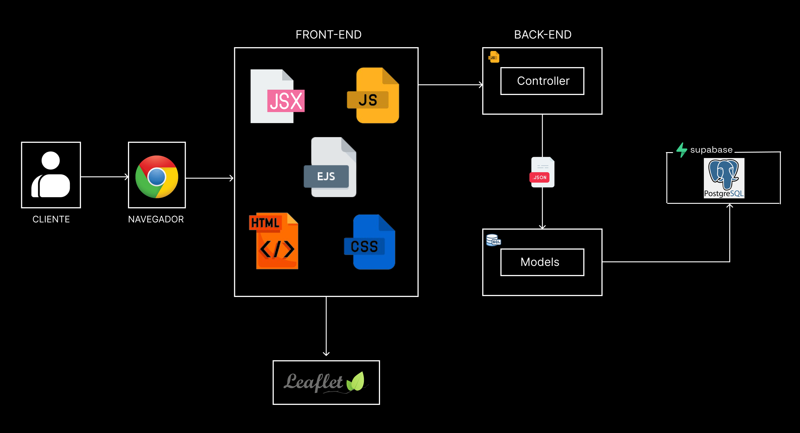

<sup>Fonte: Material produzido pelos autores (2025)</sup>

</div>

1. Cliente <br>
   O cliente (usuário final) acessa a aplicação via navegador e interage com a interface construída no front-end. As interações envolvem, por exemplo, consultar locais de atendimento em um mapa ou filtrar informações por categoria.
   <br>

2. Front-End <br>
   O front-end é a camada de visualização da aplicação e é composto por diversas tecnologias que trabalham em conjunto:

- React: framework utilizado para construir a interface da aplicação estruturada em componentes, facilitando a atualização dinâmica do conteúdo na tela.

- JSX: extensão de sintaxe para JavaScript utilizada com React, que permite escrever elementos HTML dentro do código JavaScript.

- JavaScript (JS): linguagem de programação responsável pela lógica e comportamento da aplicação no lado do cliente.

- HTML: estrutura básica das páginas da aplicação.

- CSS: estilização dos elementos visuais da interface.

- Leaflet: biblioteca JavaScript de código aberto usada para renderização de mapas interativos. No diagrama, a seta do front-end para o Leaflet indica corretamente que o front-end envia dados (como coordenadas geográficas) para que o Leaflet os represente graficamente.
  <br>

3. Back-End <br>
   O back-end lida com a lógica da aplicação, manipulação de dados e comunicação com o banco. Está dividido em:

- Controller: recebe as requisições do front-end, coordena a lógica de aplicação e aciona os modelos (models). Retorna os dados no formato JSON.

- Models: responsáveis pela comunicação com o banco de dados e pela estruturação dos dados da aplicação.
  <br>

4. Banco de Dados <br>
   PostgreSQL com Supabase: banco de dados relacional onde ficam armazenadas todas as informações da aplicação. O Supabase atua como backend-as-a-service, facilitando a integração com PostgreSQL, fornecendo APIs automáticas, autenticação e funcionalidades em tempo real.

### Diagrama de Componentes

O diagrama de componentes é uma ferramenta amplamente utilizada no desenvolvimento de software. Por meio dele, é possível não apenas identificar os principais componentes do sistema, mas também suas relações, interações e fluxos, detalhando o comportamento do sistema durante a experiência do usuário, em especial, evidenciando a comunicação entre a interface visual e o banco de dados. Além disso, o diagrama permite observar, de forma clara, a aplicação da arquitetura MVC, facilitando a compreensão de seu funcionamento dentro do sistema. Abaixo há o detalhamento do diagrama de componentes do sistema:

<div align="center">
<sub>Figura 14 - Diagrama de Componentes</sub>
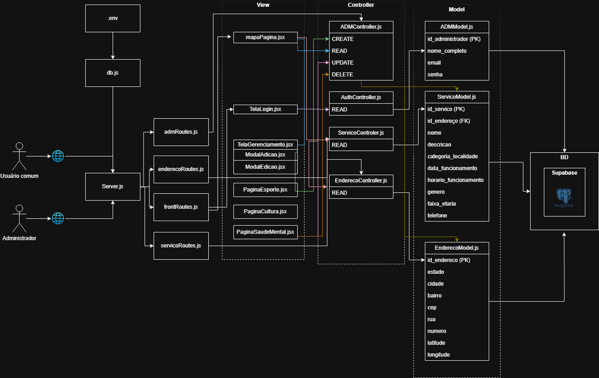
<sup>Fonte: Material produzido pelos autores (2025)</sup>
</div>

O diagrama apresentado organiza uma série de campos e relações de forma lógica para representar o fluxo do sistema. Ele se inicia no usuário, que pode ser tanto um administrador quanto um usuário comum. Este último tem apenas permissão para visualizar e filtrar os serviços indicados, sem acesso à gestão de dados.

Ao acessar o sistema, o usuário é direcionado para o arquivo `server.js`, que atua como ponto de entrada do projeto. Nesse processo, são importadas a chave de acesso ao banco de dados, armazenada no arquivo `.env`, e um arquivo de configuração chamado `db.js`. O servidor, ao ser iniciado, chama os arquivos de rota `admRoutes.js`, `enderecoRoutes.js`, `frontRoutes.js` e `servicoRoutes.js`. Por meio dessas rotas, são feitas requisições ao controller, cada qual com as funções pertinentes. Um exemplo é a requisição do tipo `GET`, em que a rota chama o método `listarServicos` no arquivo `servicoController`.

```javascript
router.get("/", servicoController.listarServicos);
```

Essa estrutura se repete para diferentes arquivos de rotas e tipos de requisição, como `POST` e `PUT`. Os arquivos de rota também garantem a renderização da página correta, tarefa atribuída às rotas de front-end, como exemplificado a seguir.

```javascript
router.get("/", (req, res) => {
  res.render(path.join(__dirname, "../views/pages/page1"), {
    pageTitle: "Página Inicial",
    content: path.join(__dirname, ""),
  });
});
```

Dando seguimento, o controller é responsável por controlar as requisições e os dados enviados ao banco de dados. Ele recebe as requisições e aciona o arquivo `models` ou `service`, conforme o contexto, além de lidar com a resposta. Um exemplo disso é a função `listarServicos`, que chama o método `buscarTodosServicos`, presente no arquivo `servicoService`, e retorna a resposta em formato JSON.

```javascript
const listarServicos = async (req, res) => {
  try {
    const servicos = await servicoService.buscarTodosServicos();
    res.json(servicos);
  } catch (error) {
    res.status(500).json({ error: error.message });
  }
};
```

Já no arquivo `service` estão os métodos que se comunicam diretamente com o banco de dados em SQL. O método `buscarTodosServicos`, por exemplo, realiza uma consulta utilizando `JOIN` e retorna os resultados e em caso de falha, retorna um erro.

```javascript
const buscarTodosServicos = async () => {
  try {
    const result = await db.query(`
      SELECT s.*, e.estado, e.cidade, e.bairro, e.cep, e.rua, e.numero, e.latitude, e.longitude
      FROM servicos s
      JOIN enderecos e ON s.id_endereco = e.id_endereco
    `);
    return result.rows;
  } catch (error) {
    throw new Error("Erro ao obter serviços: " + error.message);
  }
};
```

Nos arquivos da `view`, ocorre uma requisição utilizando `fetch API`, que lida com as respostas obtidas, para em seguida, exibir as informações ao usuário por meio de elementos HTML. A seguir, apresenta-se um exemplo de chamada e exibição de dados.

Fetch API:

```javascript
const response = await fetch("/servicos/filtrar?" + params.toString());
```

Exibição em html/ejs:

```html
<div
  style="
    border: 1px solid #ccc;
    border-radius: 8px;
    padding: 12px;
    width: 300px;
    box-shadow: 2px 2px 8px rgba(0,0,0,0.1);
    background: #fff;
  "
>
  <strong>Nome:</strong> ${s.nome}<br />
  <strong>Descrição:</strong> ${s.descricao}<br />
  <strong>Categoria:</strong> ${s.categoria_localidade}<br />
  <strong>Telefone:</strong> ${s.telefone}<br />
  <strong>Horário:</strong> ${s.horario_funcionamento}<br />
  <strong>Gênero:</strong> ${s.genero}<br />
  <strong>Faixa Etária:</strong> ${s.faixa_etaria}<br />
  <strong>Endereço:</strong> ${s.rua || ''}, ${s.numero || ''} - ${s.bairro ||
  ''}, ${s.cidade || ''} - ${s.estado || ''}, CEP: ${s.cep || ''}<br />
  <strong>Latitude:</strong> ${s.latitude || 'N/A'}<br />
  <strong>Longitude:</strong> ${s.longitude || 'N/A'}
</div>
```

Todo esse processo representa o funcionamento da aplicação, cujo fluxo é padronizado em diferentes partes do sistema, mesmo quando aplicadas a contextos distintos. Os exemplos apresentados ilustram esse padrão de forma clara.

## <a name="c3.2"></a>3.2. Wireframes

<!-- Introdução -->

<!-- Início seção Usuário -->

Com base na seleção das principais User Stories e visando representar visualmente a estrutura e o fluxo de navegação da solução proposta, foram desenvolvidos os wireframes da plataforma Mandacaru. Os wireframes são representações simplificadas das interfaces de um sistema, utilizadas para testar ideias de design, estrutura e usabilidade de forma rápida, antes da aplicação de elementos visuais mais detalhados. Sua elaboração foi orientada pelos conceitos trabalhados nas aulas de design UX, buscando garantir clareza, coerência e foco na experiência do usuário desde as etapas iniciais de concepção do produto.

O processo de construção partiu de protótipos de baixa fidelidade feitos no papel, que permitiram esboçar a lógica de uso da aplicação e validar rapidamente o fluxo principal. Com base nesses esboços, foram desenvolvidas versões digitais organizadas a partir de sistemas de grid inspirados em modelos amplamente utilizados em plataformas como o Miro. Houve atenção especial às margens, aos espaçamentos e à consistência visual entre diferentes telas, mesmo utilizando grids variados que se complementam. Além disso, o fluxo de telas foi planejado de acordo com a jornada natural do usuário dentro da aplicação, separando claramente os caminhos percorridos por perfis distintos: administrador e usuário comum.

A tela inicial “Home” apresenta ao usuário um menu com abas, acessíveis em todas as páginas, que permitem o acesso às diferentes seções do site, como Esportes, Saúde Mental, Cultura e Sobre Nós. Além disso, disponibiliza um mapa interativo que utiliza a localização atual do usuário para indicar, de forma prática, os locais mais próximos. A interface também oferece diversos filtros, como localidade, faixa etária, gênero e tipo de local, abrangendo espaços como CAPS, hospitais, quadras e academias.

<div align="center">
<sub>Figura 15 - Wireframe da tela "Home" de mapa e localidades com grid</sub>

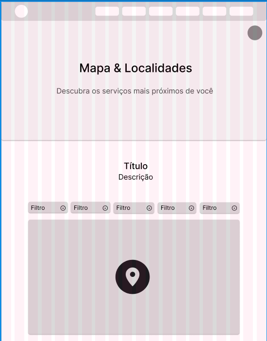

<sup>Fonte: Material produzido pelos autores (2025)</sup>

</div>

Essa funcionalidade atende às necessidades destacadas nas user stories US03, de Priscila Silva, e US05, de Amanda Carvalho, que expressam o interesse em localizar com facilidade tanto serviços de apoio psicológico quanto espaços voltados ao lazer e à prática esportiva. Nesse sentido, o wireframe da tela “Home” atende aos critérios de aceite estabelecidos, ao exibir informações detalhadas e posicionadas dentro de um grid de 20 colunas divididos em duas principais. A tela conta com dados aprofundados sobre cada local, incluindo dias e horários de funcionamento, além dos respectivos meios de contato, facilitando assim o acesso direto aos serviços desejados.

A tela “Cultura” disponibiliza conteúdos informativos sobre a relação entre atividades culturais e a saúde mental, evidenciando os benefícios associados a essas práticas. Essa tela foi desenvolvida com base na user story US04, na qual Priscila Silva expressa o desejo de compreender de que forma a cultura pode impactar positivamente sua saúde emocional. Nesse contexto, o wireframe contempla os critérios de aceite que indicam a necessidade de explicações claras, bem como de exemplos de atividades culturais gratuitas ou acessíveis ao público.

<div align="center">
<sub>Figura 16 - Wireframe da tela "Cultura"</sub>

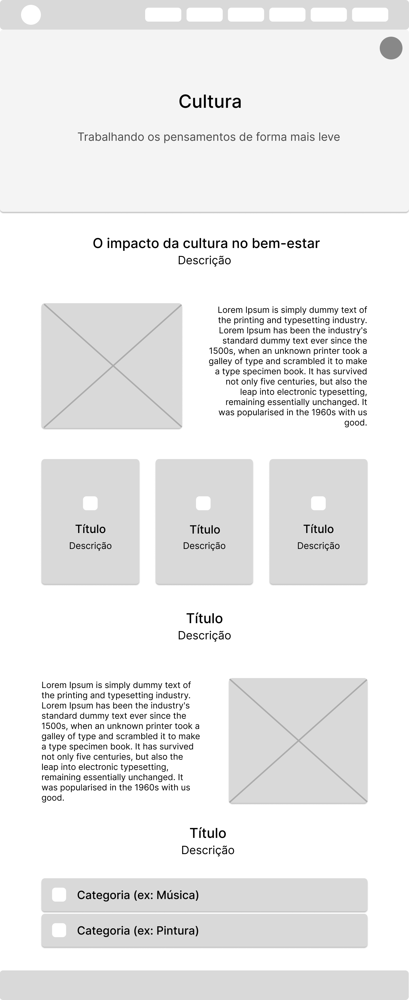

<sup>Fonte: Material produzido pelos autores (2025)</sup>

</div>

Além disso, a tela oferece a funcionalidade de redirecionamento para o Mapa, já com o filtro aplicado especificamente para locais culturais, o que facilita a navegação e o acesso direto a essas opções. Nesta página com layout para desktop, está sendo utilizado um grid de 20 colunas com margens bem estruturadas e espaçamento entre colunas bem definido. Os elementos centrais estão alinhados horizontalmente com base nesse grid, favorecendo equilíbrio visual e responsividade.

A tela “Esporte” apresenta conteúdos informativos sobre os benefícios da prática esportiva para a saúde mental, destacando como a atividade física pode contribuir para a melhora do bem-estar geral, além de oferecer orientações sobre como iniciar atividades físicas leves. Essa tela foi desenvolvida com base na user story US06, que aborda a necessidade da usuária Amanda Carvalho de entender de que forma os esportes podem auxiliar no enfrentamento da ansiedade e na construção de uma rotina mais equilibrada.

<div align="center">
<sub>Figura 17 - Wireframe da tela "Esporte"</sub>

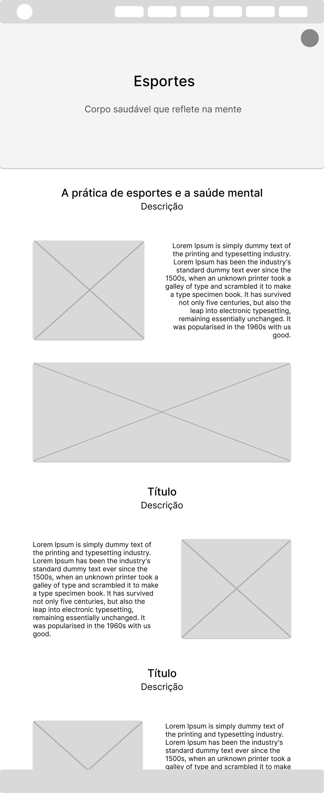

<sup>Fonte: Material produzido pelos autores (2025)</sup>

</div>

Nesse sentido, o wireframe atende aos critérios de aceite ao apresentar explicações simples e acessíveis, com linguagem clara e exemplos aplicáveis ao cotidiano dos usuários. Ele também utiliza um grid de 20 colunas com elementos centrais alinhados horizontalmente e pequenas alterações na disposição desses elementos visando maior dinamicidade de navegação. Além disso, a interface permite o redirecionamento direto para a tela “Mapa”, já com os filtros ativados para localizar quadras esportivas, academias públicas ou outros espaços destinados à prática de atividades físicas.

A tela “Saúde Mental” oferece conteúdos educativos sobre a importância do cuidado com a saúde mental, abordando sinais de sobrecarga emocional, práticas de autocuidado e os riscos associados à negligência dessa dimensão da saúde. Essa tela foi desenvolvida com base na user story US02, em que a persona Priscila Silva evidencia o desejo de compreender melhor seus sentimentos. Nesse contexto, o wireframe atende aos critérios de aceite ao apresentar textos claros, acessíveis e acompanhados de dicas práticas que auxiliam na conscientização e no controle das emoções.

<div align="center">
<sub>Figura 18 - Wireframe da tela "Saúde Mental"</sub>

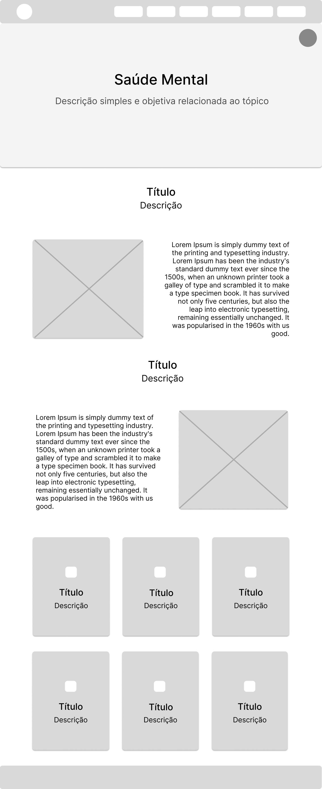

<sup>Fonte: Material produzido pelos autores (2025)</sup>

</div>

Além disso, a tela conta com a funcionalidade de redirecionamento para a tela “Mapa”, com filtros aplicados especificamente para centros de atendimento psicológico, como CAPS e hospitais, em conformidade com as user stories US01 e US05, que tratam da necessidade de localizar, de forma simples e eficiente, espaços de apoio à saúde mental. A tela utiliza o mesmo grid das páginas de esporte e cultura com alteração apenas na disposição de elementos entre elas, garantindo a uniformidade na aplicação.

A tela “Sobre Nós” apresenta informações sobre o Instituto Cactus, incluindo os projetos realizados e a equipe responsável por ampliar a promoção da saúde mental no Brasil. Essa tela foi elaborada com base nas user stories US10 e US11, nas quais o usuário Eduardo Alves demonstra interesse em conhecer tanto a missão quanto os projetos desenvolvidos pelo Instituto.

<div align="center">
<sub>Figura 19 - Wireframe da tela "Sobre nós" com grid</sub>

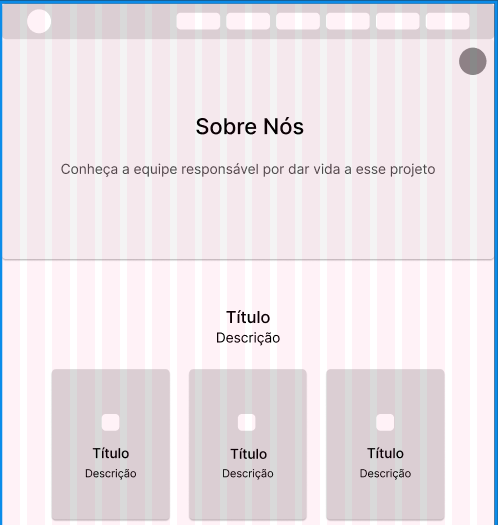

<sup>Fonte: Material produzido pelos autores (2025)</sup>

</div>

Dessa forma, por meio de um grid de 20 colunas com 3 colunas principais na primeira seção e duas colunas principais nas seguintes, o wireframe da tela atende aos critérios de aceite estabelecidos, ao incorporar uma seção visível intitulada “Instituto Cactus” e filtros como “Projetos” e “Missão”, permitindo a expansão do conteúdo e a visualização de informações com mais detalhes de forma prática e acessível.

As funcionalidades destinadas aos usuários também estão disponíveis na versão mobile. Para garantir uma melhor experiência em dispositivos móveis, foram realizadas adaptações no layout, com a alteração da estrutura de grids para 8 colunas. Essa modificação visa proporcionar uma visualização mais adequada e responsiva nas telas reduzidas. As adaptações podem ser observadas nas imagens a seguir.

<div align="center">
<sub>Figura 20 - Wireframe do usuário adaptado para versão mobile</sub>

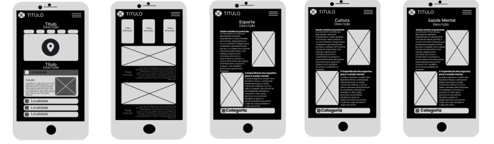

<sup>Fonte: Material produzido pelos autores (2025)</sup>

</div>

<!-- Fim seção Usuário -->

<!-- Início seção Adm -->

Em relação ao fluxo do administrador no site, seu primeiro passo está em realizar seu login, por meio de um email e senha definidos previamente e de forma manual no banco de dados. Pensando em simplificar o fluxo, foi adotado um grid de duas colunas para esse setor da aplicação web.

Na tela de login há um título de destaque em fonte maior com o escrito “Iniciar sessão”. E abaixo dele, um subtítulo em fonte menor exibe uma mensagem de boas-vindas. Em seguida, encontram-se dois campos de entrada: um para o email e outro para a senha. Por fim, inferior a esses campos, há um botão de ação para realizar o login. O objetivo do cadastro é que o administrador se credencie para acessar a área de edição, exclusão e inclusão dos locais de acesso a atendimento psicológico.

<div align="center">
<sub>Figura 21 - Wireframe da tela de login do administrador com grid</sub>

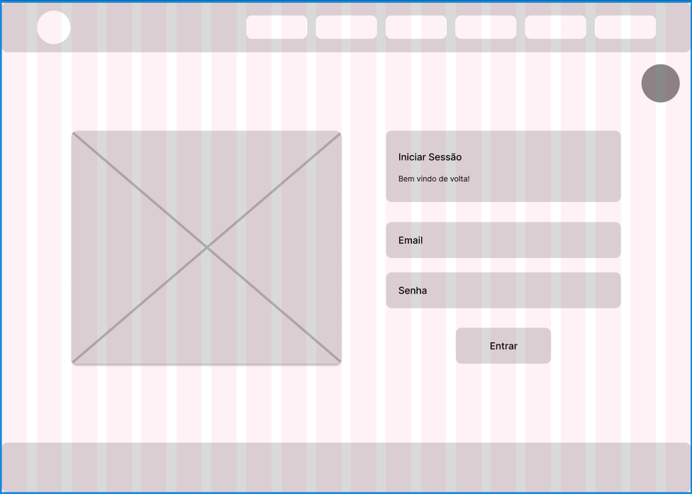

<sup>Fonte: Material produzido pelos autores (2025)</sup>

</div>

A tela seguinte, caracterizada pela funcionalidade de gerenciamento, conta com botões de ação para adição de novas localidades e, ainda, filtros em formato select para a visualização filtrada de localidades já adicionadas anteriormente. Abaixo dos filtros, são exibidas as localidades em um grid de 20 colunas com divisão em 3 colunas principais, permitindo uma distribuição equilibrada dos cartões de conteúdo. Cada bloco ocupa aproximadamente um terço da largura da área útil, com espaçamento uniforme entre eles. A estrutura garante organização, boa leitura visual e facilidade de adaptação para diferentes tamanhos de tela.  
Nessa tela, o administrador pode visualizar as localidades cadastradas em forma de cartões, utilizar filtros - de estado, categoria e faixa etária - para refinar a visualização e adicionar novas localidades por meio de um botão de ação. Abaixo, as outras localidades previamente cadastradas são exibidas, permitindo que o administrador visualize, filtre e gerencie com clareza as localidades cadastradas no sistema.

<div align="center">
<sub>Figura 22 - Wireframe da tela de gerenciamento do administrador com grid</sub>

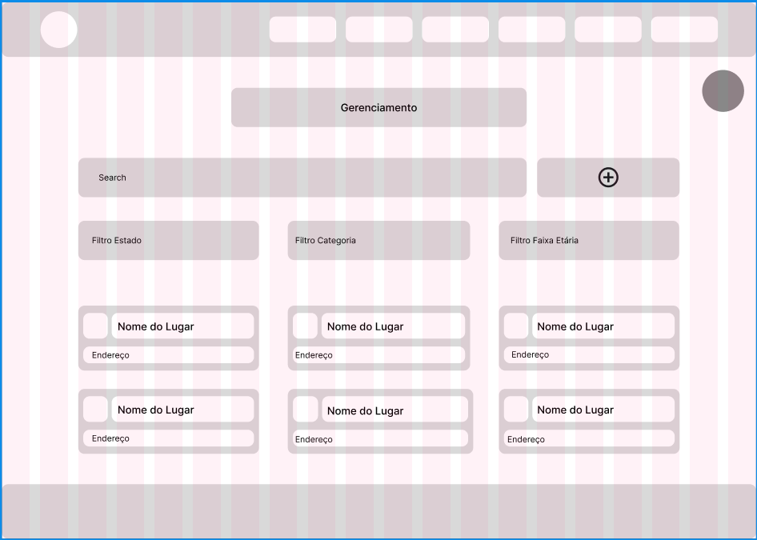

<sup>Fonte: Material produzido pelos autores (2025)</sup>

</div>

Ao clicar em uma localidade já existente, o administrador é capaz de editar as informações sobre aquele local. A tela em questão utiliza um grid de 20 colunas, com elementos distribuídos em duas colunas principais para organizar os campos do formulário de forma equilibrada que melhora a legibilidade e, assim, facilitar o alinhamento e garantir consistência visual. O uso de espaçamento entre colunas e margens regulares contribui para uma hierarquia clara entre os blocos de informação.
Na tela de edição, os campos disponíveis para edição incluem o nome da localidade, seu endereço, a categoria correspondente e os filtros relacionados. Além dos campos de edição, a tela conta com dois botões de ação bem definidos: um para salvar as alterações feitas e outro para cancelar ou descartar as modificações. A tela de edição oferece ao administrador um ambiente eficiente e visualmente limpo para manter a base de dados sempre atualizada e consistente.

</div>
<div align="center">
<sub>Figura 23 - Wireframe do modal de edição do administrador</sub>

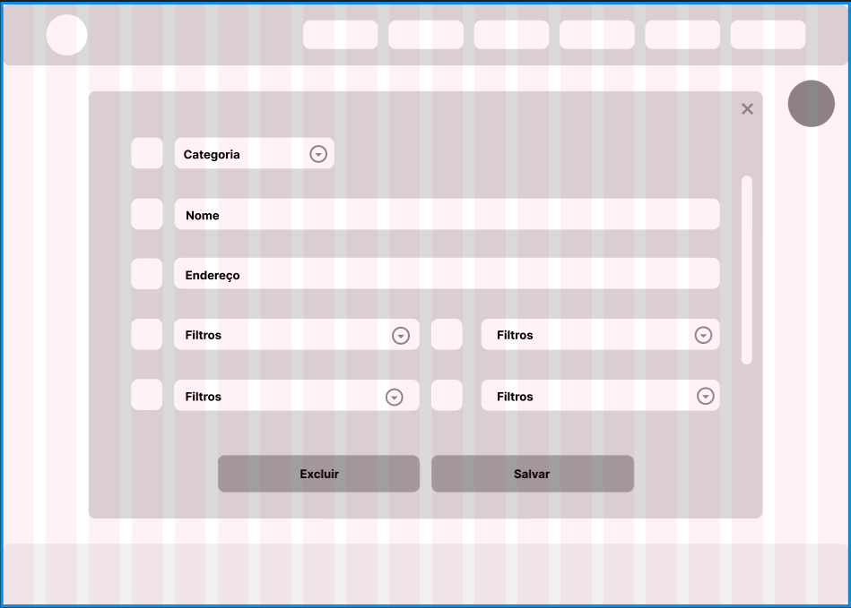

<sup>Fonte: Material produzido pelos autores (2025)</sup>

</div>

Ao clicar no botão de adição de localidade, o administrador é direcionado para uma tela que conta com campos principais de categoria, nome e endereço ocupando toda a largura em um layout que utiliza um grid de 20 colunas. Os filtros são distribuídos de forma simétrica de 5 colunas cada, separadas por um espaçamento central. O uso equilibrado do grid garante legibilidade e organização visual ao mesmo tempo em que as margens laterais mantêm o conteúdo centralizado e alinhado.
Nessa área, o administrador tem acesso a um formulário para cadastrar nome, endereço, categoria e filtros relacionados. A tela de edição oferece ao administrador um ambiente eficiente e visualmente limpo para manter a base de dados sempre atualizada e consistente.

</div>
<div align="center">
<sub>Figura 24 - Wireframe do modal de adição do administrador</sub>

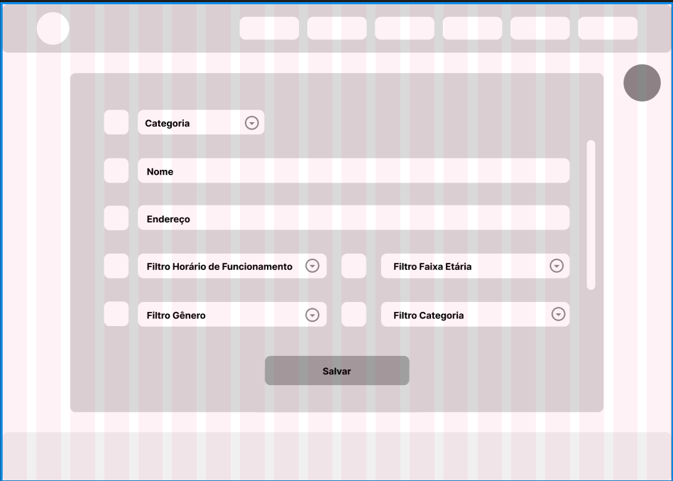

<sup>Fonte: Material produzido pelos autores (2025)</sup>

</div>

As mesmas funcionalidades estão presentes para o administrador em modo mobile, contando com alterações nos grids para 8 colunas, por conta das telas de dispositivos móveis. É possível visualizar as adaptações a seguir.

<div align="center">
<sub>Figura 25 - Wireframe do administrador adaptado para versão mobile</sub>

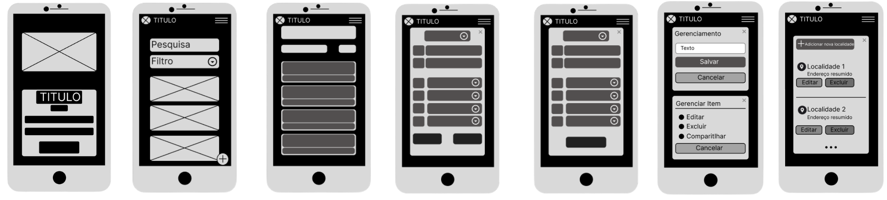

<sup>Fonte: Material produzido pelos autores (2025)</sup>

</div>

De forma integrada, as telas apresentadas compõem uma plataforma acessível e centrada nas necessidades dos usuários, fundamentada em princípios essenciais de design UX, ligados ao uso de grids, personas e user stories, durante todo o processo de criação, desenvolvimento e refinamento. O ambiente voltado ao administrador foi pensado para oferecer uma experiência simples e intuitiva na manutenção e atualização das localidades cadastradas. Além disso, a plataforma contribui para o bem-estar emocional ao oferecer informações relevantes, mapear áreas de interesse e valorizar práticas culturais e esportivas.
Os wireframes podem ser visualizados em maior qualidade por meio dos links a seguir.

<!-- Fim seção Adm -->

<!-- Conclusão -->

## <a name="c3.3"></a>3.3. Guia de estilos

O guia de estilos tem como objetivo garantir consistência visual e funcional em toda a interface da aplicação web desenvolvida. Ele serve como referência central para desenvolvedores e designers, padronizando o uso de cores, tipografias e elementos gráficos. O guia fortalece a identidade da plataforma e reduz ambiguidades na construção de interfaces, promovendo acessibilidade, escalabilidade e fidelidade visual entre telas administrativas e de usuários comuns. Seguindo suas orientações, evita-se a aplicação inadequada de estilos, garantindo uma estética conexa e harmoniosa, acessibilidade e reforço à identidade visual do Mandacaru como ferramenta extensiva do Instituto Cactus.

### <a name="c3.3.1"></a>3.3.1 Cores

A paleta de cores é um elemento essencial na construção visual de um sistema. Ela garante que a mensagem certa seja transmitida ao usuário, refletindo de forma sutil o tema, os valores e as emoções desejadas pela instituição, proporcionando uma experiência completa e consistente.

Tendo isso em vista, a paleta de cores do Mandacaru foi elaborada com base em princípios de contraste, acessibilidade e hierarquia visual, levando em conta a paleta de cores do Instituto Cactus, priorizando os tons e cores mais coerentes em relação ao projeto em questão e os adaptando para a solução desenvolvida. Cada cor definida possui uma função clara dentro da interface, seja para uso decorativo, informativo ou estrutural.

A cor principal é um tom vibrante de rosa (HEX #D52453), que transmite energia e acolhimento, sendo utilizada em botões, links, títulos e elementos interativos. Essa cor é acompanhada de suas variações, representadas pelos tons Darker(HEX #841B37), Lighter(HEX #F894AF)e Subtle(HEX #FFE5EC). Como cor secundária, o verde claro (HEX #E5F4F2) atua em áreas de suporte e equilíbrio visual, remetendo à base institucional do Cactus. Para textos, a aplicação usa variações de tons claros (HEX #ECECEC até HEX #EAD7DC) em fundos escuros e tons escuros (HEX #263234 até HEX #899294) em fundos claros.

<div align="center">
<sub>Figura 26 - Cores da aplicação web</sub>

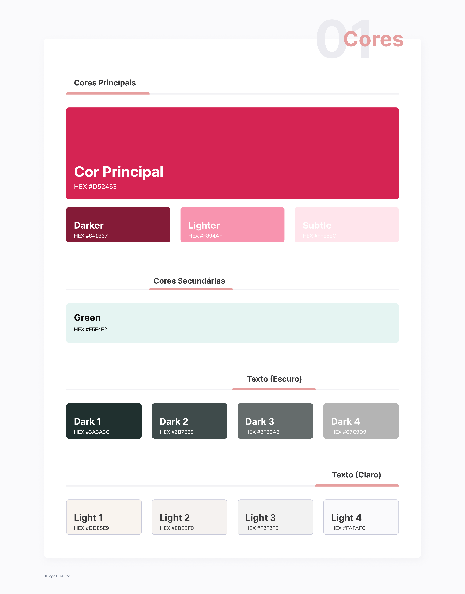

<sup>Fonte: Material produzido pelos autores (2025)</sup>

</div>

Essas definições garantem legibilidade e clareza em qualquer contexto visual e, em conjunto com o código HEX, asseguram reprodutibilidade precisa na aplicação em tela ou reprodução de elementos.

### <a name="c3.3.2"></a>3.3.2 Tipografia

A padronização da tipografia, ou seja, a aplicação do design das letras e da organização do texto, em uma aplicação web é essencial para garantir consistência visual, usabilidade e acessibilidade. Ao manter fontes, tamanhos e estilos uniformes, a interface se torna mais organizada e fácil de navegar, melhorando a experiência do usuário. Além disso, uma tipografia bem definida reforça a identidade visual da marca e contribui para a legibilidade, especialmente para pessoas com deficiências visuais. Do ponto de vista técnico, a padronização também facilita a manutenção do código e a adaptação do conteúdo em diferentes dispositivos, o que é fundamental em interfaces responsivas como a da aplicação web desenvolvida.

A tipografia do Mandacaru adota as famílias Poppins e Mulish, escolhidas por sua leitura fluida em tela e por transmitirem leveza, clareza e modernidade. Ambas são utilizadas em diferentes pesos e tamanhos conforme o nível da hierarquia textual apresentado:

<div align="center">
<sub>Figura 27 - Tipografia da aplicação web</sub>


<sup>Fonte: Material produzido pelos autores (2025)</sup>

</div>

Essa padronização garante harmonia entre os elementos textuais, desde títulos em destaque até blocos informativos e textos de apoio. Sua escolha e a aplicação coerentes vão muito além da estética: elas desempenham um papel central na eficácia e profissionalismo do Mandacaru e de qualquer aplicação web.

### <a name="c3.3.3"></a>3.3.3 Iconografia e imagens

A iconografia de um projeto é o conjunto de ícones e símbolos visuais utilizados para comunicar ideias. No projeto no Mandacaru, ela segue uma linguagem gráfica simples, próxima do público e conectada à proposta acolhedora da plataforma. Os ícones são construídos em grid, com espaçamentos equilibrados, e variam entre representações funcionais (como gráficos e setas) e afetivas, como o mascote, nomeado Tutti, que aparece em diversas telas e reforça a identidade visual de forma sutil e amigável.

<div align="center">
<sub>Figura 28 - Iconografia da aplicação web</sub>

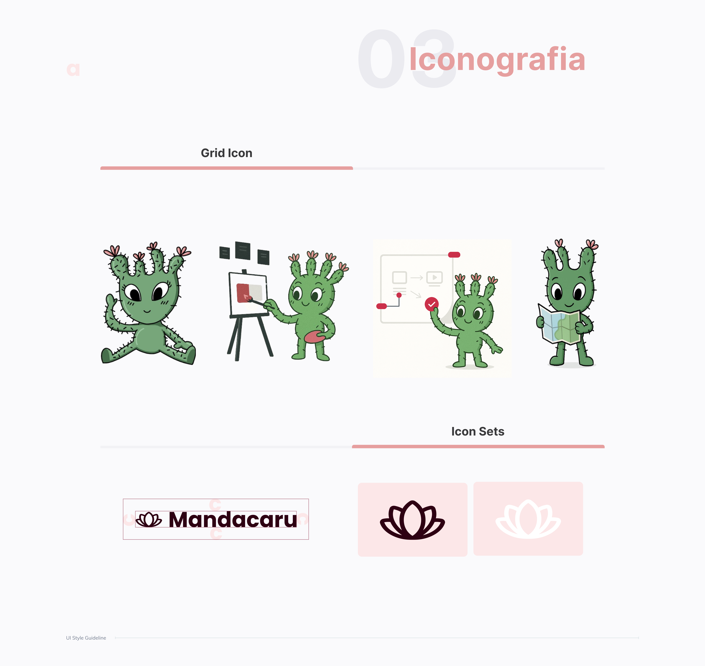

<sup>Fonte: Material produzido pelos autores (2025)</sup>

</div>

Inspirado em um cacto com flores mandacaru, o mascote é aplicado sempre em sua forma íntegra, mantendo proporção e alinhamento. Ele é utilizado em contextos institucionais e temáticos (como esportes, cultura e saúde mental), colaborando na ilustração prática de cada seção do site.

### <a name="c3.3.4"></a>3.3.4. Grid e Layout

O layout da aplicação define a estrutura em que ela será desenvolvida, organizando e distribuindo seus elementos de forma lógica. Dado isso, ele foi construído com base em grids responsivos, garantindo consistência visual entre diferentes telas e uma adaptação eficiente para diversos dispositivos. Em resoluções de desktop (1920x1080px), o grid é composto por 20 colunas, com gutter de 16px e largura de coluna de aproximadamente 80,8px, com alinhamento central em um container de largura total. Para dispositivos móveis (320x1024px), a estrutura é ajustada para 8 colunas, com gutter reduzido para 8px e largura de coluna de 33px, também com alinhamento central. Essa organização modular assegura uma apresentação coesa entre telas, facilita a manutenção visual e técnica, e permite a escalabilidade da aplicação com fidelidade.

<div align="center">
<sub>Figura 29 - Grid da aplicação web</sub>

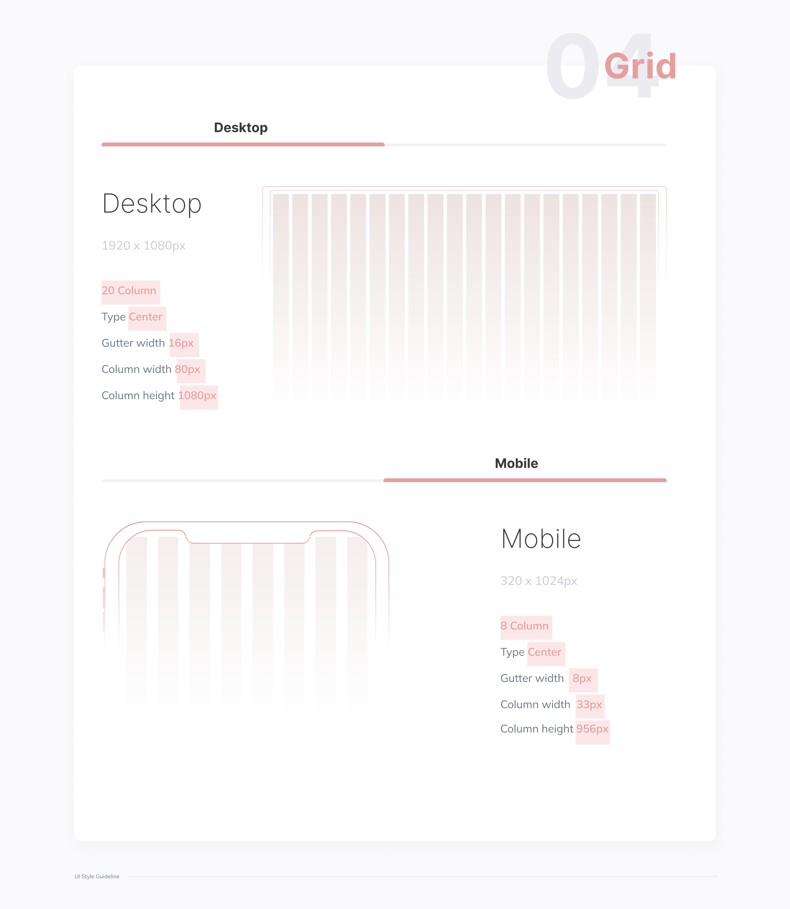

<sup>Fonte: Material produzido pelos autores (2025)</sup>

</div>

Essa estrutura baseada em grid permite organizar os componentes da interface de forma alinhada e proporcional, garantindo equilíbrio visual e hierarquia clara entre os elementos. Além disso, o uso de colunas e gutters bem definidos possibilita a reutilização de padrões de layout em diferentes partes da aplicação, otimizando o desenvolvimento e reduzindo inconsistências. Com essa abordagem, o design se torna mais escalável e adaptável a novas demandas, mantendo a coerência visual mesmo à medida que a aplicação cresce em complexidade.

### <a name="c3.3.5"></a>3.3.5. Boas práticas - O que Não Fazer

Para preservar a integridade visual e a consistência funcional da marca, o guia apresenta um conjunto de práticas que devem ser evitadas. Essas recomendações são essenciais para garantir que a identidade visual do projeto seja sempre transmitida de maneira clara e uniforme.

Primeiramente, é fundamental não rotacionar a logo ou o mascote em ângulos que não sejam múltiplos exatos de 90 graus. Rotacionar a marca em ângulos arbitrários pode causar distorções visuais, dificultando sua leitura e prejudicando a percepção da identidade do Mandacaru. Além disso, a sobreposição de elementos visuais como ícones, textos e ilustrações deve ser evitada, tendo em vista que tal prática pode gerar confusão visual, dificultar a compreensão da mensagem e comprometer a estética geral, causando um efeito desorganizado e pouco profissional. Por fim, é necessário não distorcer a proporção original dos elementos gráficos: alterar a largura, altura ou qualquer outra dimensão sem respeitar a proporção correta compromete a harmonia e o equilíbrio visual da marca, resultando em uma aparência desconexa da aplicação.

<div align="center">
<sub>Figura 30 - Boas práticas da aplicação web</sub>

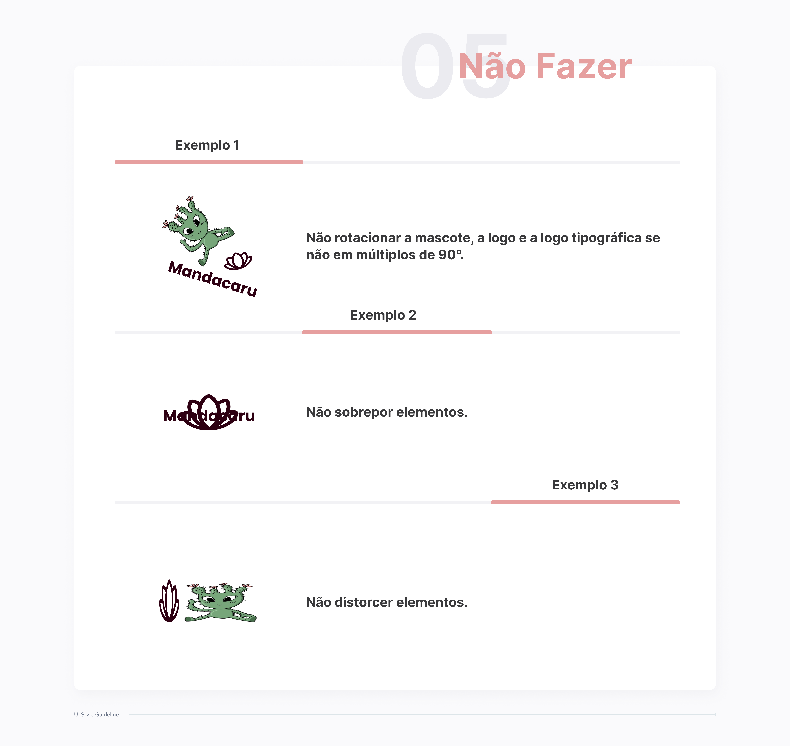

<sup>Fonte: Material produzido pelos autores (2025)</sup>

</div>

Seguir essas diretrizes evita ruídos visuais e inconsistências, garantindo que a identidade do projeto se mantenha sólida, reconhecível e coerente em todas as suas aplicações, seja em materiais digitais, impressos ou em qualquer outra mídia.

## <a name="c3.4"></a>3.4 Protótipo de alta fidelidade 

Um protótipo de alta fidelidade serve para representar de forma detalhada e realista a aparência e o funcionamento de um produto, como é o caso do Mandacaru. Ele simula com precisão o layout, cores, tipografia, interações e navegação, permitindo testes mais eficazes com usuários e validação de funcionalidades. Esse tipo de protótipo é ideal para comunicar ideias com clareza, reduzindo erros e retrabalho no processo de criação. O protótipo de alta fidelidade do projeto em questão pode ser vizualizado por meio dos links após as imagens.

<!-- IMAGENS -->

<div align="center">
<sub>Figura 31 - Tela Home/Mapa</sub>

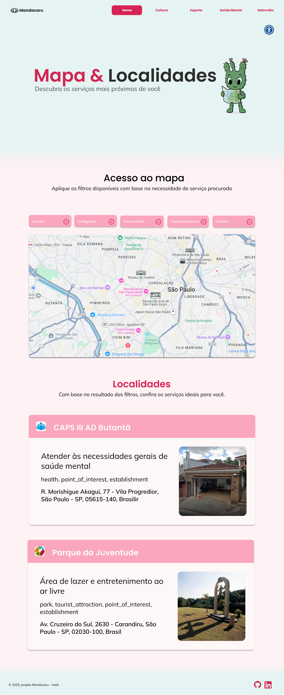

<sup>Fonte: Material produzido pelos autores (2025)</sup>

</div>

<!-- IMAGENS -->

<div align="center">
<sub>Figura 32 - Tela Cultura</sub>

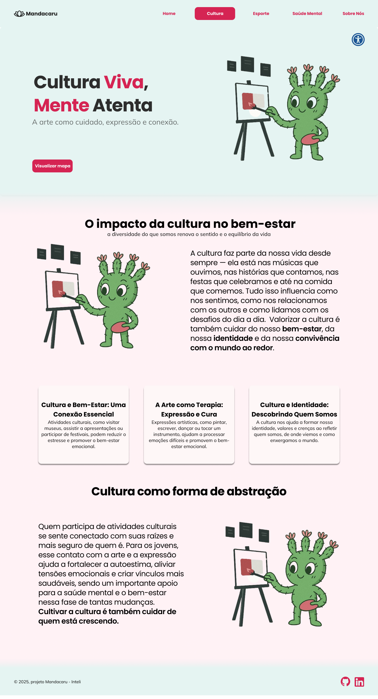

<sup>Fonte: Material produzido pelos autores (2025)</sup>

</div>

<!-- IMAGENS -->

<div align="center">
<sub>Figura 33 - Tela Esporte</sub>

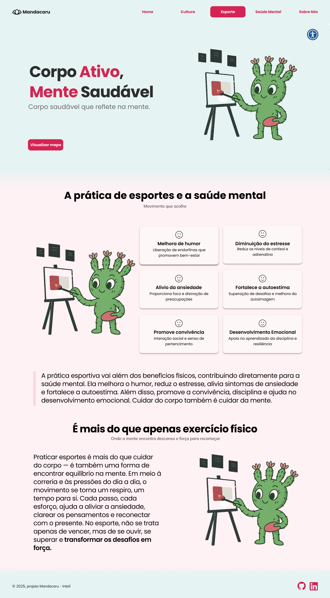

<sup>Fonte: Material produzido pelos autores (2025)</sup>

</div>

<!-- IMAGENS -->

<div align="center">
<sub>Figura 34 - Tela Saúde Mental</sub>

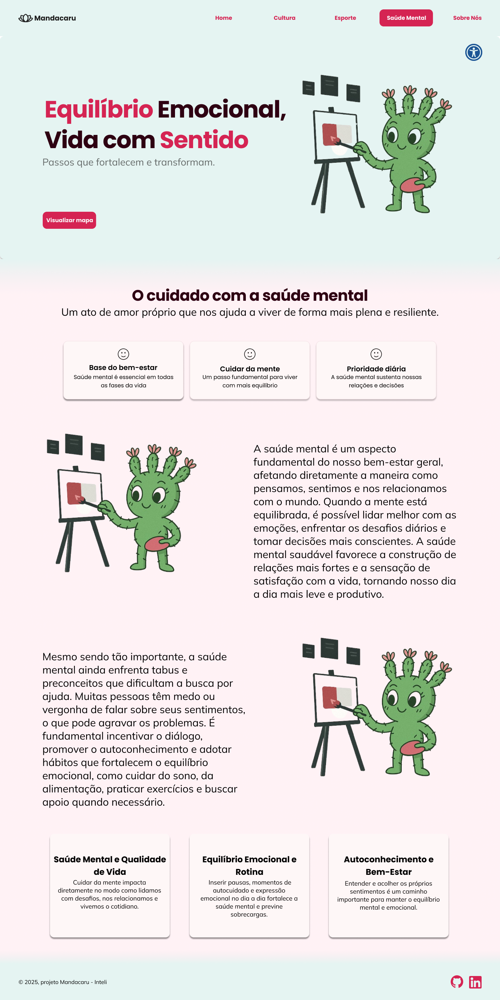

<sup>Fonte: Material produzido pelos autores (2025)</sup>

</div>

<!-- IMAGENS -->

<div align="center">
<sub>Figura 35 - Tela Sobre Nós</sub>

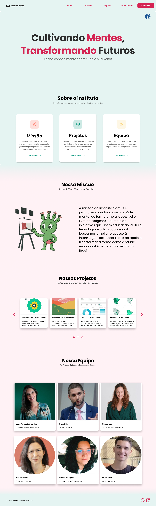

<sup>Fonte: Material produzido pelos autores (2025)</sup>

</div>

<!-- IMAGENS ADM -->

<div align="center">
<sub>Figura 36 - Tela ADM Login</sub>

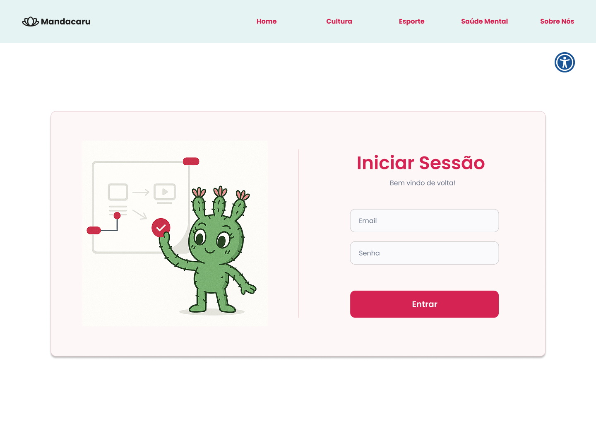

<sup>Fonte: Material produzido pelos autores (2025)</sup>

</div>

<!-- IMAGENS ADM -->

<div align="center">
<sub>Figura 37 - Tela ADM Gerenciamento</sub>

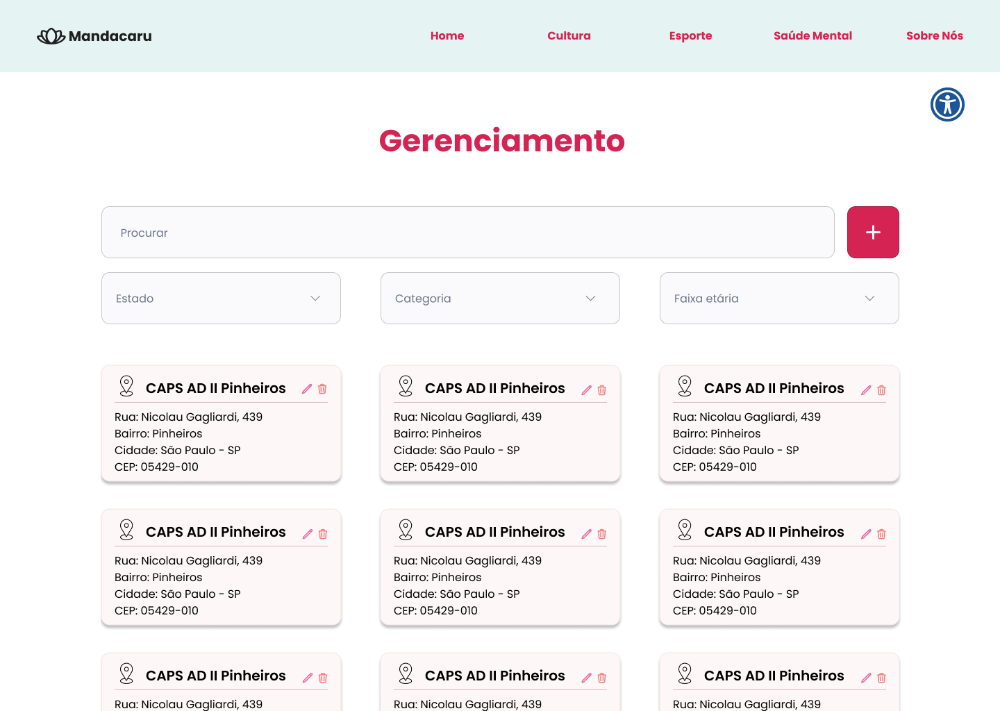

<sup>Fonte: Material produzido pelos autores (2025)</sup>

</div>

<!-- IMAGENS ADM -->

<div align="center">
<sub>Figura 38 - Tela ADM Edição</sub>

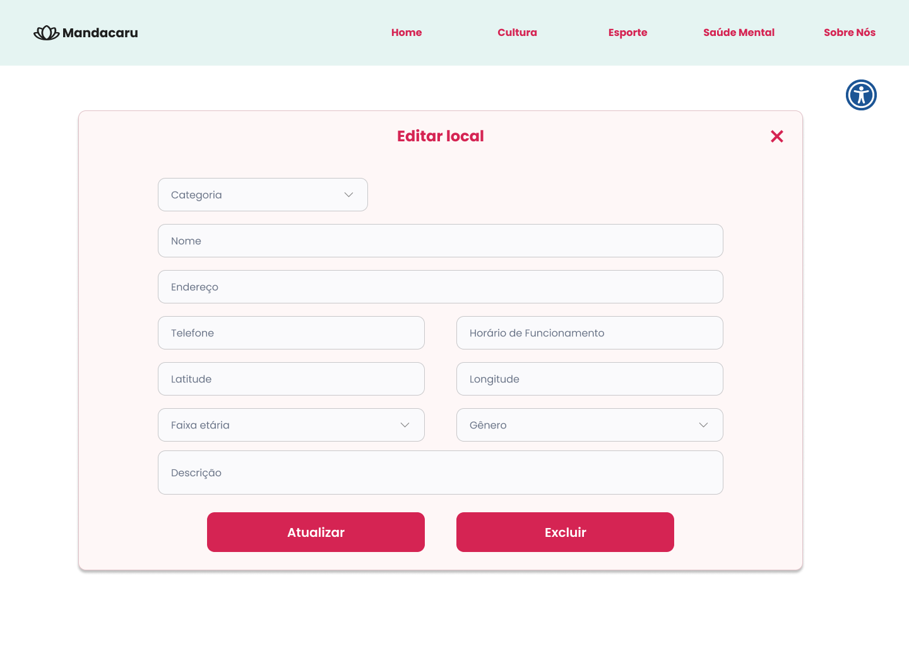

<sup>Fonte: Material produzido pelos autores (2025)</sup>

</div>

<!-- IMAGENS ADM -->

<div align="center">
<sub>Figura 39 - Tela ADM Adição</sub>

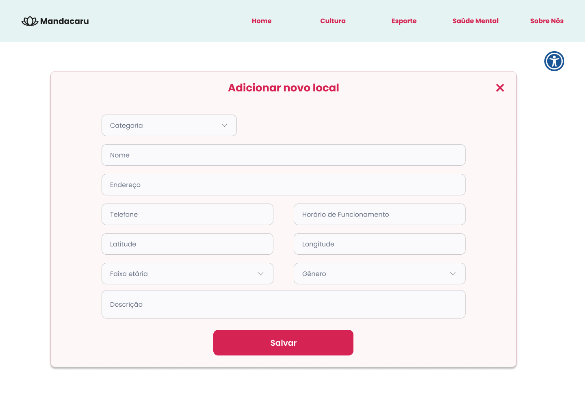

<sup>Fonte: Material produzido pelos autores (2025)</sup>

</div>

</div>
 <a href="https://www.figma.com/design/vEp7MWGBs80a1zByBFXeZc/Wireframe---Prot%C3%B3tipo?node-id=179-2&p=f&t=7bHWCZSjYf0bm9aJ-0"> Protótipo de Alta Fidelidade - DESKTOP</a>
</div>

<!-- MOBILE --!>

<!-- IMAGENS -->
<br>

<div align="center">
<sub>Figura 40 - Tela Home/Mapa</sub>

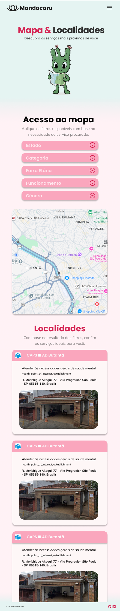

<sup>Fonte: Material produzido pelos autores (2025)</sup>

</div>

<!-- IMAGENS -->

<div align="center">
<sub>Figura 41 - Tela Cultura</sub>


<sup>Fonte: Material produzido pelos autores (2025)</sup>

</div>

<!-- IMAGENS -->

<div align="center">
<sub>Figura 42 - Tela Esporte</sub>

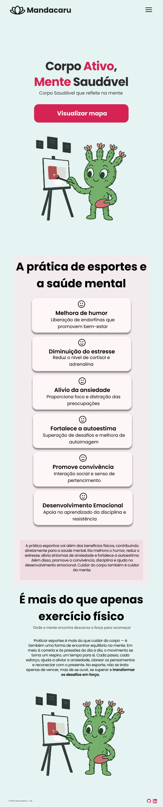

<sup>Fonte: Material produzido pelos autores (2025)</sup>

</div>

<!-- IMAGENS -->

<div align="center">
<sub>Figura 43 - Tela Saúde Mental</sub>

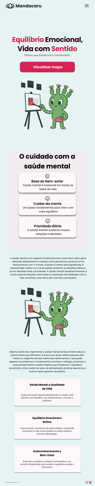

<sup>Fonte: Material produzido pelos autores (2025)</sup>

</div>

<!-- IMAGENS -->

<div align="center">
<sub>Figura 44 - Tela Sobre Nós</sub>

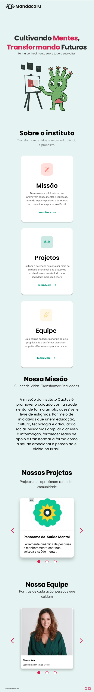

<sup>Fonte: Material produzido pelos autores (2025)</sup>

</div>

<!-- IMAGENS ADM -->

<div align="center">
<sub>Figura 45 - Tela ADM Login</sub>

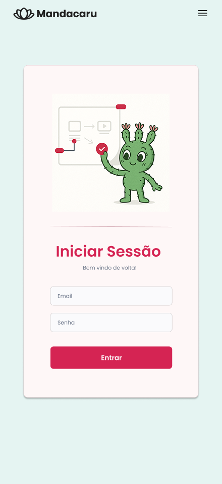

<sup>Fonte: Material produzido pelos autores (2025)</sup>

</div>

<!-- IMAGENS ADM -->

<div align="center">
<sub>Figura 46 - Tela ADM Gerenciamento</sub>

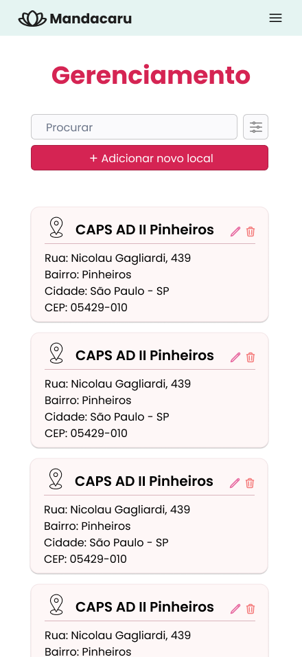

<sup>Fonte: Material produzido pelos autores (2025)</sup>

</div>

<!-- IMAGENS ADM -->

<div align="center">
<sub>Figura 47 - Tela ADM Edição</sub>

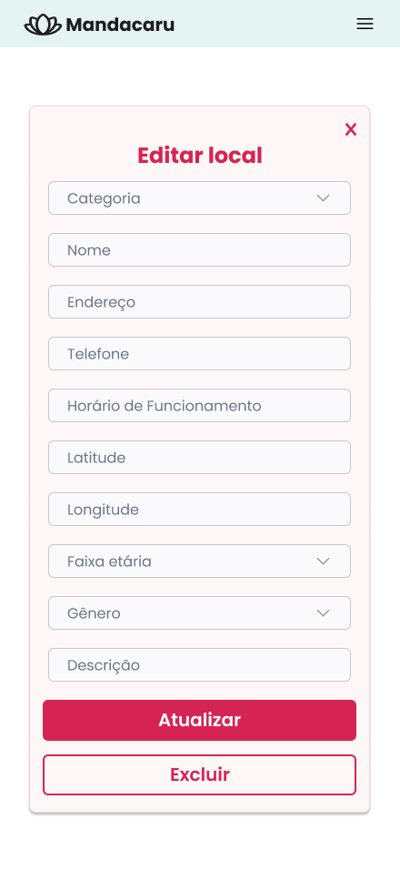

<sup>Fonte: Material produzido pelos autores (2025)</sup>

</div>

<!-- IMAGENS ADM -->

<div align="center">
<sub>Figura 48 - Tela ADM Adição</sub>

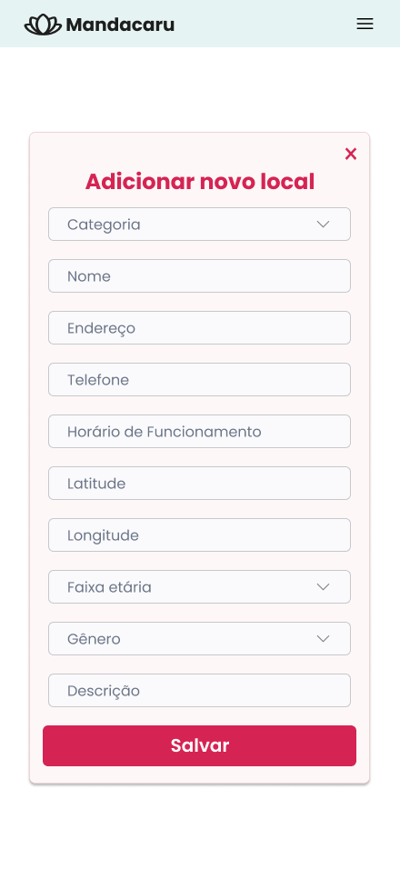

<sup>Fonte: Material produzido pelos autores (2025)</sup>

</div>

</div>
 <a href="https://www.figma.com/design/vEp7MWGBs80a1zByBFXeZc/Wireframe---Prot%C3%B3tipo?node-id=186-3&p=f&t=7bHWCZSjYf0bm9aJ-0"> Protótipo de Alta Fidelidade - MOBILE</a>
</div>

## <a name="c3.5"></a>3.5. Modelagem do banco de dados

A modelagem do banco de dados é uma etapa crucial para garantir que as informações de qualquer aplicação sejam organizadas, armazenadas e acessadas de forma eficiente e segura. Nesta fase, define-se a estrutura relacional que representa os dados sobre os locais de apoio à saúde mental, usuários, categorias e demais entidades envolvidas, estabelecendo suas relações e regras de integridade. Uma modelagem bem planejada facilita a manutenção, a escalabilidade e a consistência das informações, além de suportar as consultas necessárias para as funcionalidades da plataforma, assegurando um desempenho adequado e a confiabilidade dos dados disponibilizados aos usuários.

### <a name="c351"></a>3.5.1. Modelo relacional

O banco de dados do projeto Mandacaru foi desenvolvido com o objetivo de estruturar e organizar informações relacionadas à gestão de serviços de apoio, como centros de atendimento ou acolhimento. Ele é composto por Administrador, Serviço e Endereço. Administrador armazena dados dos usuários responsáveis pela administração do sistema. A entidade Serviço concentra as informações sobre os serviços oferecidos, como nome, descrição, público-alvo e formas de contato. Já a entidade Endereço detalha a localização geográfica de cada serviço, incluindo dados como cidade, bairro e coordenadas. A modelagem busca garantir integridade referencial e facilitar consultas eficientes, promovendo uma base sólida para o gerenciamento e a visualização dos serviços disponíveis na aplicação web a ser desenvolvida.

<div align="center">
<sub>Figura 49 - Modelagem do banco de dados do projeto</sub>
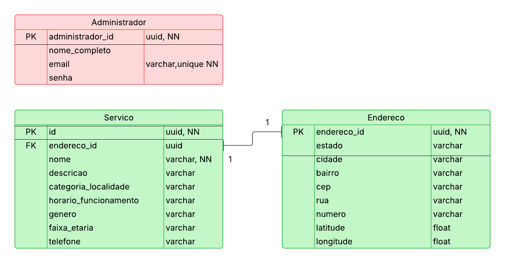
<sup>Fonte: Material produzido pelos autores (2025)</sup>
</div>

### Modelo Físico

O modelo físico de banco de dados representa a estrutura real das tabelas, campos, tipos de dados e restrições utilizadas no sistema. Ele define como as informações serão armazenadas, acessadas e relacionadas no banco, garantindo integridade, desempenho e organização eficiente dos dados.

```sql

-- Tabela de Administradores
CREATE TABLE administradores (
    id_administrador UUID PRIMARY KEY NOT NULL,
    nome_completo VARCHAR(100),
    email VARCHAR(150) UNIQUE NOT NULL,
    senha VARCHAR(255) NOT NULL
);

-- Tabela de Endereços
CREATE TABLE enderecos (
    id_endereco UUID PRIMARY KEY NOT NULL,
    estado VARCHAR(50),
    cidade VARCHAR(100),
    bairro VARCHAR(100),
    cep VARCHAR(20),
    rua VARCHAR(100),
    numero VARCHAR(10),
    latitude NUMERIC(9,6),
    longitude NUMERIC(9,6)
);

-- Tabela de Serviços
CREATE TABLE servicos (
    id_servico UUID PRIMARY KEY NOT NULL,
    id_administrador UUID NOT NULL,
    id_endereco UUID NOT NULL,
    nome VARCHAR(100) NOT NULL,
    descricao VARCHAR(500),
    categoria_localidade VARCHAR(100),
    horario_funcionamento VARCHAR(100),
    genero VARCHAR(30),
    faixa_etaria VARCHAR(30),
    telefone VARCHAR(30),

    -- Chave estrangeira: referência ao endereço do serviço
    CONSTRAINT fk_servicos_endereco
        FOREIGN KEY (id_endereco)
        REFERENCES enderecos(id_endereco)
        ON DELETE CASCADE,

    -- Validação dos valores permitidos para o campo genero
    CONSTRAINT chk_genero
        CHECK (genero IN ('Masculino', 'Feminino', 'Outro', 'Todos')),

    -- Validação dos valores permitidos para o campo faixa_etaria
    CONSTRAINT chk_faixa_etaria
        CHECK (faixa_etaria IN ('Infantil', 'Adolescente', 'Adulto', 'Idoso', 'Todos'))
);

```

### <a name="c3.5.2"></a>3.5.2. Consultas SQL e lógica proposicional

Nesta seção, são apresentadas as consultas SQL compostas utilizadas no back-end desta aplicação web, acompanhadas de suas respectivas expressões de lógica proposicional. Essa estrutura permite relacionar as condições de filtro com os resultados esperados, garantindo que as regras de negócio sejam corretamente interpretadas e aplicadas.

| #1                                 | ---                                                                                                                                                                                                                                                                                          |
| ---------------------------------- | -------------------------------------------------------------------------------------------------------------------------------------------------------------------------------------------------------------------------------------------------------------------------------------------- |
| **Expressão SQL**                  | SELECT \* FROM administradores WHERE nome_completo LIKE 'Silva' AND email LIKE ' @email.com';                                                                                                                                                                                                |
| **Proposições lógicas**            | $A$: nome_completo contém 'Silva' <br> $B$: email termina com '@email.com'                                                                                                                                                                                                                   |
| **Expressão lógica proposicional** | $A \land B$                                                                                                                                                                                                                                                                                  |
| **Tabela Verdade**                 | <table> <thead> <tr> <th>$A$</th> <th>$B$</th> <th>$A \land B$</th> </tr> </thead> <tbody> <tr> <td>F</td> <td>F</td> <td>F</td> </tr> <tr> <td>F</td> <td>V</td> <td>F</td> </tr> <tr> <td>V</td> <td>F</td> <td>F</td> </tr> <tr> <td>V</td> <td>V</td> <td>V</td> </tr> </tbody> </table> |

| #2                                 | ---                                                                                                                                                                                                                                                                                          |
| ---------------------------------- | -------------------------------------------------------------------------------------------------------------------------------------------------------------------------------------------------------------------------------------------------------------------------------------------- |
| **Expressão SQL**                  | SELECT \* FROM servicos WHERE genero IN ('Feminino', 'Masculino') AND faixa_etaria != 'Infantil';                                                                                                                                                                                            |
| **Proposições lógicas**            | $A$: genero é 'Feminino' ou 'Masculino' <br> $B$: faixa_etaria é diferente de 'Infantil'                                                                                                                                                                                                     |
| **Expressão lógica proposicional** | $A \land B$                                                                                                                                                                                                                                                                                  |
| **Tabela Verdade**                 | <table> <thead> <tr> <th>$A$</th> <th>$B$</th> <th>$A \land B$</th> </tr> </thead> <tbody> <tr> <td>F</td> <td>F</td> <td>F</td> </tr> <tr> <td>F</td> <td>V</td> <td>F</td> </tr> <tr> <td>V</td> <td>F</td> <td>F</td> </tr> <tr> <td>V</td> <td>V</td> <td>V</td> </tr> </tbody> </table> |

| #3                                 | ---                                                                                                                                                                                                                                                                                         |
| ---------------------------------- | ------------------------------------------------------------------------------------------------------------------------------------------------------------------------------------------------------------------------------------------------------------------------------------------- |
| **Expressão SQL**                  | SELECT \* FROM enderecos WHERE estado = 'SP' OR cidade = 'Campinas';                                                                                                                                                                                                                        |
| **Proposições lógicas**            | $A$: estado é 'SP' <br> $B$: cidade é 'Campinas'                                                                                                                                                                                                                                            |
| **Expressão lógica proposicional** | $A \lor B$                                                                                                                                                                                                                                                                                  |
| **Tabela Verdade**                 | <table> <thead> <tr> <th>$A$</th> <th>$B$</th> <th>$A \lor B$</th> </tr> </thead> <tbody> <tr> <td>F</td> <td>F</td> <td>F</td> </tr> <tr> <td>F</td> <td>V</td> <td>V</td> </tr> <tr> <td>V</td> <td>F</td> <td>V</td> </tr> <tr> <td>V</td> <td>V</td> <td>V</td> </tr> </tbody> </table> |

| #4                                 | ---                                                                                                                                                                                                                                                                                                                                                                  |
| ---------------------------------- | -------------------------------------------------------------------------------------------------------------------------------------------------------------------------------------------------------------------------------------------------------------------------------------------------------------------------------------------------------------------- |
| **Expressão SQL**                  | SELECT \* FROM servicos WHERE NOT (genero = 'Todos' AND faixa_etaria = 'Todos');                                                                                                                                                                                                                                                                                     |
| **Proposições lógicas**            | $A$: genero é 'Todos' <br> $B$: faixa_etaria é 'Todos'                                                                                                                                                                                                                                                                                                               |
| **Expressão lógica proposicional** | $\neg (A \land B)$                                                                                                                                                                                                                                                                                                                                                   |
| **Tabela Verdade**                 | <table> <thead> <tr> <th>$A$</th> <th>$B$</th> <th>$A \land B$</th> <th>$\neg (A \land B)$</th> </tr> </thead> <tbody> <tr> <td>F</td> <td>F</td> <td>F</td> <td>V</td> </tr> <tr> <td>F</td> <td>V</td> <td>F</td> <td>V</td> </tr> <tr> <td>V</td> <td>F</td> <td>F</td> <td>V</td> </tr> <tr> <td>V</td> <td>V</td> <td>V</td> <td>F</td> </tr> </tbody> </table> |

| #5                                 | ---                                                                                                                                                                                                                                                                                         |
| ---------------------------------- | ------------------------------------------------------------------------------------------------------------------------------------------------------------------------------------------------------------------------------------------------------------------------------------------- |
| **Expressão SQL**                  | SELECT \* FROM enderecos WHERE cep LIKE '01%' OR numero = '123';                                                                                                                                                                                                                            |
| **Proposições lógicas**            | $A$: cep começa com '01' <br> $B$: numero é '123'                                                                                                                                                                                                                                           |
| **Expressão lógica proposicional** | $A \lor B$                                                                                                                                                                                                                                                                                  |
| **Tabela Verdade**                 | <table> <thead> <tr> <th>$A$</th> <th>$B$</th> <th>$A \lor B$</th> </tr> </thead> <tbody> <tr> <td>F</td> <td>F</td> <td>F</td> </tr> <tr> <td>F</td> <td>V</td> <td>V</td> </tr> <tr> <td>V</td> <td>F</td> <td>V</td> </tr> <tr> <td>V</td> <td>V</td> <td>V</td> </tr> </tbody> </table> |

| #6                                 | ---                                                                                                                                                            |
| ---------------------------------- | -------------------------------------------------------------------------------------------------------------------------------------------------------------- |
| **Expressão SQL**                  | SELECT \* FROM administradores WHERE NOT (email LIKE '@gmail.com');                                                                                            |
| **Proposições lógicas**            | $A$: email termina com '@gmail.com'                                                                                                                            |
| **Expressão lógica proposicional** | $\neg A$                                                                                                                                                       |
| **Tabela Verdade**                 | <table> <thead> <tr> <th>$A$</th> <th>$\neg A$</th> </tr> </thead> <tbody> <tr> <td>F</td> <td>V</td> </tr> <tr> <td>V</td> <td>F</td> </tr> </tbody> </table> |

| #7                                 | ---                                                                                                                                                                                                                                                                                          |
| ---------------------------------- | -------------------------------------------------------------------------------------------------------------------------------------------------------------------------------------------------------------------------------------------------------------------------------------------- |
| **Expressão SQL**                  | SELECT \* FROM servicos WHERE categoria_localidade = 'Clínica Comunitária' AND descricao LIKE 'jovem';                                                                                                                                                                                       |
| **Proposições lógicas**            | $A$: categoria_localidade é 'Clínica Comunitária' <br> $B$: descricao contém 'jovem'                                                                                                                                                                                                         |
| **Expressão lógica proposicional** | $A \land B$                                                                                                                                                                                                                                                                                  |
| **Tabela Verdade**                 | <table> <thead> <tr> <th>$A$</th> <th>$B$</th> <th>$A \land B$</th> </tr> </thead> <tbody> <tr> <td>F</td> <td>F</td> <td>F</td> </tr> <tr> <td>F</td> <td>V</td> <td>F</td> </tr> <tr> <td>V</td> <td>F</td> <td>F</td> </tr> <tr> <td>V</td> <td>V</td> <td>V</td> </tr> </tbody> </table> |

| #8                                 | ---                                                                                                                                                                                                                                                                                                                                                                                                                                   |
| ---------------------------------- | ------------------------------------------------------------------------------------------------------------------------------------------------------------------------------------------------------------------------------------------------------------------------------------------------------------------------------------------------------------------------------------------------------------------------------------- |
| **Expressão SQL**                  | SELECT \* FROM administradores WHERE nome_completo NOT LIKE 'Silva' OR email NOT LIKE '@email.com';                                                                                                                                                                                                                                                                                                                                   |
| **Proposições lógicas**            | $A$: nome_completo contém 'Silva' <br> $B$: email termina com '@email.com'                                                                                                                                                                                                                                                                                                                                                            |
| **Expressão lógica proposicional** | $\neg A \lor \neg B$                                                                                                                                                                                                                                                                                                                                                                                                                  |
| **Tabela Verdade**                 | <table> <thead> <tr> <th>$A$</th> <th>$B$</th> <th>$\neg A    $</th> <th>$\neg B$</th> <th>$\neg A \lor \neg B$</th> </tr> </thead> <tbody> <tr> <td>F</td> <td>F</td> <td>V</td> <td>V</td> <td>V</td> </tr> <tr> <td>F</td> <td>V</td> <td>V</td> <td>F</td> <td>V</td> </tr> <tr> <td>V</td> <td>F</td> <td>F</td> <td>V</td> <td>V</td> </tr> <tr> <td>V</td> <td>V</td> <td>F</td> <td>F</td> <td>F</td> </tr> </tbody> </table> |

A construção dessas consultas reflete a flexibilidade e a precisão do sistema para atender às necessidades específicas dos usuários, como filtragem personalizada por localização, faixa etária e gênero. Essa estrutura também garante que as regras de negócio previamente definidas sejam respeitadas, promovendo uma experiência de uso consistente e alinhada com os objetivos do projeto. Além disso, a abordagem lógica na modelagem das consultas facilita a manutenção e expansão futura do sistema, oferecendo uma base sólida para a evolução da aplicação.

## <a name="c3.6"></a>3.6. WebAPI e endpoints

Nesta seção, estão descritos os principais endpoints da aplicação, organizados por funcionalidade (serviços, endereços e administração). Cada endpoint contém informações sobre o método HTTP utilizado (GET, POST, PUT, PATCH, DELETE), o endereço, os headers esperados, o formato do corpo da requisição (body) e os formatos de resposta (response).

### Serviços (servicoRoutes.js)

#### GET /servico/

- **Descrição:** Lista todos os serviços disponíveis.

- **Header:**

  - Content-Type: application/json

- **Body:** Não requer corpo.

- **Response:**

```sql
[
  {
    "id": 1,
    "nome": "Centro de Apoio Psicológico",
    "descricao": "Atendimento psicológico gratuito para adolescentes.",
    "categoria_localidade": "Saúde Mental",
    "horario_funcionamento": "08:00 - 17:00",
    "genero": "Todos",
    "faixa_etaria": "12-18",
    "telefone": "(11) 99999-9999",
    "id_endereco": 5
  }
]
```

#### GET /servico/filtrar

- **Descrição:** Filtra serviços com base em parâmetros de query.

- **Header:**

  - Content-Type: application/json

- **Query Params (opcional):**

  - estado
  - faixa_etaria
  - categoria_localidade
  - genero

- **Body:** Não requer corpo.

- **Response:** Lista filtrada de serviços.

#### POST /servico/

- **Descrição:** Cria um novo serviço.

- **Header:**

  - Content-Type: application/json

- **Body:**

```sql
{
  "nome": "Oficina de Arte Terapêutica",
  "descricao": "Atividade com foco no bem-estar emocional por meio da arte.",
  "categoria_localidade": "Cultura",
  "horario_funcionamento": "14:00 - 16:00",
  "genero": "Todos",
  "faixa_etaria": "14-20",
  "telefone": "(11) 98888-7777",
  "id_endereco": 3
}
```

- **Response:**

```sql
{
  "id": 12,
  "nome": "Oficina de Arte Terapêutica",
  "descricao": "Atividade com foco no bem-estar emocional por meio da arte.",
  "categoria_localidade": "Cultura",
  "horario_funcionamento": "14:00 - 16:00",
  "genero": "Todos",
  "faixa_etaria": "14-20",
  "telefone": "(11) 98888-7777",
  "id_endereco": 3
}
```

#### PATCH /servico/:id

- **Descrição:** Atualiza parcialmente informações de um serviço específico.

- **Header:**

  - Content-Type: application/json

- **Body:**

```sql
{
  "horario_funcionamento": "10:00 - 18:00"
}
```

- **Response:**

```sql
{
  "message": "Serviço atualizado com sucesso.",
  "id": 12
}
```

#### DELETE /servico/:id

- **Descrição:** Remove um serviço pelo ID.

- **Header:**

  - Content-Type: application/json

- **Body:** Não requer corpo.

- **Response:**

```sql
{
  "message": "Serviço removido com sucesso.",
  "id": 12
}
```

### Endereços (enderecoRoutes.js)

#### GET /endereco/

- **Descrição:** Retorna todos os endereços cadastrados.

- **Header:**

  - Content-Type: application/json

- **Body:** Não requer corpo.

- **Response:** Lista de endereços.

#### POST /endereco/

- **Descrição:** Cadastra um novo endereço.

- **Header:**

  - Content-Type: application/json

- **Body:**

```sql
{
  "rua": "Rua Exemplo",
  "numero": "100",
  "bairro": "Centro",
  "cidade": "São Paulo",
  "estado": "SP",
  "cep": "01000-000"
}
```

- **Response:**

```sql
{
  "id_endereco": 1
}
```

#### PATCH /endereco/:id

- **Descrição:** Atualiza parcialmente um endereço.

- **Header:**

  - Content-Type: application/json

- **Body:**

```sql
{
  "numero": "200"
}
```

- **Response:**

```sql
{
  "message": "Endereço atualizado com sucesso.",
  "id_endereco": 1
}
```

#### DELETE /endereco/:id

- **Descrição:** Remove um endereço pelo ID.

- **Header:**

  - Content-Type: application/json

- **Body:** Não requer corpo.

- **Response:**

```sql
{
  "message": "Endereço removido com sucesso.",
  "id_endereco": 1
}
```

### Administração (admRoutes.js)

#### GET /adm/

- **Descrição:** Renderiza a página principal do painel de administração.

- **Header:**

  - Content-Type: text/html

- **Body:** Não requer corpo.

- **Response:** Renderiza a view page1 com o título "Painel de Administração".

### Front-end (frontRoutes.js)

#### GET /

- **Descrição:** Renderiza a página inicial da aplicação.

- **Header:**

  - Content-Type: text/html

- **Body:** Não requer corpo.

- **Response:** Renderiza a view page1 com o título "Página Inicial".

#### GET /about

- **Descrição:** Renderiza a página "about" da aplicação.

- **Header:**

  - Content-Type: text/html

- **Body:** Não requer corpo.

- **Response:** Renderiza a view page2 com o título "Página Inicial".

Esta documentação apresenta de forma clara e padronizada os principais endpoints da WebAPI, alinhados com as User Stories e os arquivos implementados. A estrutura atual garante a manipulação eficiente de serviços e endereços, além da renderização das páginas de administração e front-end.

# <a name="c4"></a>4. Desenvolvimento da Aplicação Web

O desenvolvimento da aplicação web Mandacaru foi orientado pela arquitetura MVC (Model-View-Controller), visando a separação de responsabilidades e a organização do código. Utilizando tecnologias como Node.js, Express e PostgreSQL, a equipe implementou as funcionalidades essenciais da plataforma, como sistema de busca com filtros, exibição de locais em mapa e painel administrativo para gestão de dados. O desenvolvimento priorizou a responsividade, a acessibilidade e a integração entre frontend e backend, garantindo uma experiência fluida ao usuário final. Cada funcionalidade foi implementada com base nas stories definidas anteriormente, assegurando aderência às necessidades reais do público-alvo e aos objetivos do Instituto Cactus.

## <a name="c4.1"></a>4.1. Primeira versão da aplicação web

A primeira versão da aplicação web Mandacaru foi concluída ao final da Sprint 3, trazendo a estrutura básica e as principais funcionalidades do sistema. Nesta etapa, o foco esteve em garantir o funcionamento do painel administrativo, a modelagem correta do banco de dados, o fluxo de cadastro e a navegação inicial da aplicação. A seguir, são descritas as funcionalidades implementadas, o processo de desenvolvimento técnico e os desafios enfrentados.

### Estrutura e funcionalidades implementadas

Nesta versão inicial, foram entregues os seguintes componentes funcionais:

- **Página inicial** com menu de navegação.

- **Página de login** exclusiva para o administrador.

- **Painel administrativo,** permitindo:

  - Cadastro de novos serviços por meio de formulário completo.

  - Visualização e listagem de serviços cadastrados.

  - Aplicação de filtros combinados para localização de serviços por estado, bairro, faixa etária, gênero, entre outros critérios.

As telas foram construídas com design responsivo, adaptando-se bem a diferentes tamanhos de tela, e com elementos visuais atualizados utilizando CSS moderno embutido nas views HTML. A renderização dinâmica foi feita com EJS, garantindo atualização automática dos campos de filtro a partir dos dados do servidor.

### Banco de dados e inserção inicial

A modelagem do banco de dados foi estruturada com foco em garantir a integridade referencial entre entidades essenciais, como servicos e enderecos. Durante o desenvolvimento, foi realizada uma inserção inicial de dados, dividida em duas etapas:

1. **Cadastro dos endereços:** utilização de gen_random_uuid() para gerar identificadores únicos.

2. **Cadastro dos serviços:** vinculação dos serviços aos respectivos endereços via UUIDs.

Trecho exemplificativo do código SQL utilizado:

```sql
INSERT INTO enderecos (
    id_endereco, estado, cidade, bairro, cep, rua, numero, latitude, longitude
) VALUES
(gen_random_uuid(), 'São Paulo', 'São Paulo', 'Jardim Francisco Mendes', '04709-001', 'R.Bela Vista', '269', -23.633995, -46.691153),
(gen_random_uuid(), 'São Paulo', 'São Paulo', 'Vila Progredior', '05615-140', 'R.Morishigue Akagui', '77', -23.5887472, -46.7155383),
(gen_random_uuid(), 'São Paulo', 'São Paulo', 'Itaim Bibi', '04538-081', 'Av. Horácio Lafer', '560', -23.5880468, -46.684915);
```

### Interface de filtro

A interface de filtro implementada se assemelha a mecanismos de busca, permitindo ao usuário selecionar múltiplos critérios. Esses dados são manipulados em tempo real com JavaScript, organizados em um objeto centralizado ao clicar em "Aplicar Filtros", e estão prontos para envio ao servidor ou aplicação local de filtros.

Essa abordagem garante flexibilidade e usabilidade, com elementos que se atualizam automaticamente conforme os dados disponíveis no sistema.

### Ilustrações das telas

Algumas das principais telas implementadas nesta versão são:

<div align="center">
<sub>Figura 50 - Página inicial com o menu principal</sub>
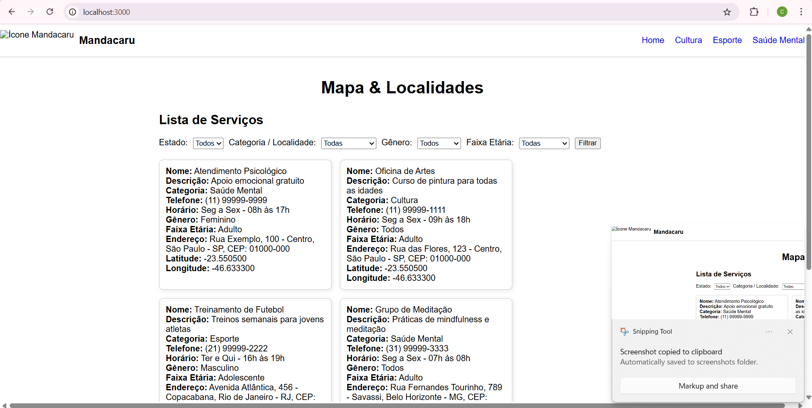
<sup>Fonte: Material produzido pelos autores (2025)</sup>
</div>

<div align="center">
<sub>Figura 51 - Painel administrativo com botão para criar novo serviço</sub>
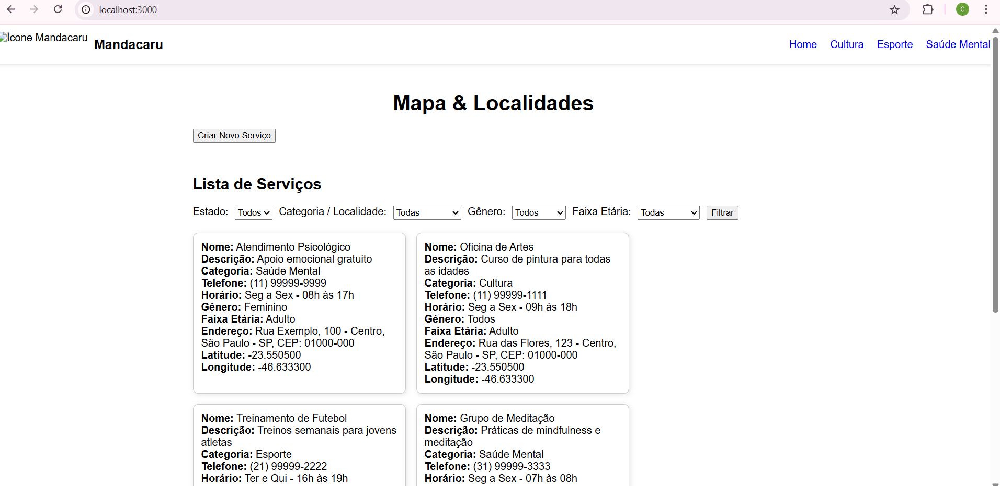
<sup>Fonte: Material produzido pelos autores (2025)</sup>
</div>

<div align="center">
<sub>Figura 52 - Formulário de cadastro de serviços</sub>
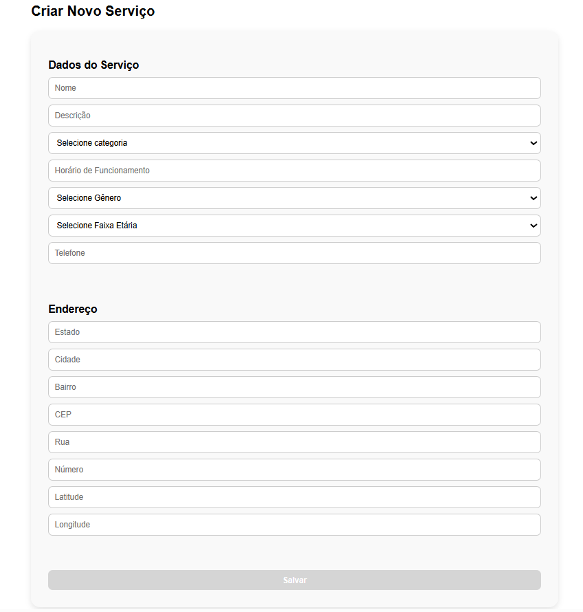
<sup>Fonte: Material produzido pelos autores (2025)</sup>
</div>

<div align="center">
<sub>Figura 53 - Lista de serviços com filtros aplicados</sub>
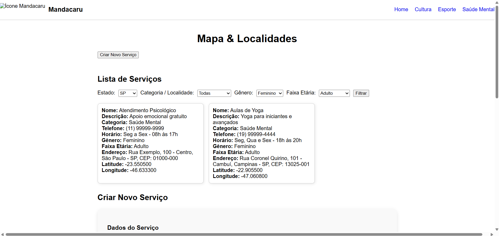
<sup>Fonte: Material produzido pelos autores (2025)</sup>
</div>

### Dificuldades enfrentadas

Durante o processo, a equipe enfrentou alguns desafios técnicos:

- Integração entre os dados de servicos e enderecos, exigindo atenção à consistência entre tabelas relacionadas.

- Mensagens de erro pouco descritivas, dificultando a depuração.

- Implementação da lógica de filtros, especialmente para garantir que múltiplos critérios funcionassem de forma simultânea e eficiente.

Esses problemas foram resolvidos com testes contínuos, ajustes incrementais e melhoria no tratamento de erros.

### Conclusão e próximos passos

A entrega da Sprint 3 marca a disponibilização de uma versão funcional do sistema, já com fluxo de cadastro, listagem e filtro de serviços operando corretamente. Com a base técnica consolidada, os próximos passos para as sprints seguintes incluem:

- Melhorar o design da interface para torná-la mais amigável e moderna.

- Integrar um mapa interativo que mostre a localização dos serviços.

- Adicionar funcionalidades voltadas à acessibilidade.

Expandir o sistema com novas páginas e seções de conteúdo, como esporte, cultura e saúde mental.

## <a name="c4.2"></a>4.2. Segunda versão da aplicação web

A Sprint 4 foi caracterizada pelo avanço na estruturação do front-end, com a implementação de uma lógica mais robusta e fluxos de navegação mais definidos. Houve também a aplicação de estilizações utilizando CSS, o que proporcionou maior aderência visual às interfaces em relação ao mockup desenvolvido na sprint anterior.

Nesta etapa, destacam-se a integração da API Leaflet e a criação da lógica de mapeamento de localidades, permitindo a exibição dinâmica de marcadores com base em dados geográficos. Foram implementados filtros no front-end, incluindo a busca de localidades por nome e o cruzamento dessas informações com a geolocalização fornecida pelo usuário.

Essas entregas compõem a base funcional da segunda versão do sistema, elevando o nível de fidelidade visual e interatividade da aplicação.

### Criação de telas (front-end):

Dentre as tarefas de desenvolvimento do sistema, destacam-se, majoritariamente, aquelas relacionadas à construção da estrutura do front-end, incluindo a criação do HTML e a aplicação de estilos por meio de CSS.

- **Login**: <br>
  A tela de login do administrador tem como principal finalidade permitir o acesso seguro à área administrativa da plataforma. Ela é composta por um layout dividido em duas seções principais: à esquerda, há uma ilustração com a mascote da plataforma, que reforça a identidade visual e proporciona uma experiência mais amigável ao usuário; à direita, encontra-se o formulário de autenticação. Essa interface exibe o título "Iniciar Sessão" seguido da mensagem de boas-vindas "Bem vindo de volta!", estabelecendo uma comunicação acolhedora. O formulário é composto por dois campos de entrada: um para o endereço de e-mail e outro para a senha. Ambos os campos devem ser preenchidos corretamente para que o botão "Entrar", localizado logo abaixo, possa ser utilizado. Ao clicar nesse botão, as credenciais inseridas são enviadas para validação, permitindo o acesso à área restrita caso estejam corretas. A tela apresenta um design limpo, com boa separação de elementos e uso de cores suaves, priorizando a clareza e a usabilidade. Essa estrutura garante uma experiência intuitiva e eficiente para os administradores no momento de acesso ao sistema.

- **Gerenciamento**: <br>
  A tela de Gerenciamento tem como principal objetivo permitir que administradores visualizem, filtrem e gerenciem unidades de atendimento cadastradas na plataforma. Logo abaixo do cabeçalho principal, onde se encontram as seções de navegação como Home, Cultura, Esporte, Saúde Mental e Sobre Nós, destaca-se o título central “Gerenciamento” A interface apresenta, na parte superior, uma barra de pesquisa acompanhada de filtros por Estado, Categoria e Faixa etária. Esses elementos permitem ao administrador refinar a exibição das unidades conforme os critérios desejados, otimizando a localização de informações específicas. À direita da barra de busca, há um botão de adição, representado por um ícone de “+”, que permite a busca, promovendo uma navegação direta e intuitiva para expandir os dados da plataforma. Na seção inferior, a interface exibe uma grade de cartões padronizados, onde cada cartão representa uma unidade de atendimento. Os cartões contêm informações como nome da unidade, endereço completo (rua, bairro, cidade, estado e CEP), além de ícones para edição e remoção.

- **Modal de Edição**: <br>
  O modal de edição permite modificar um serviço já cadastrado. Ele é exibido quando o usuário clica no ícone de lápis ✏️ associado a um item da lista (gerado dinamicamente via innerHTML). Ao ser acionado, o sistema armazena o ID do serviço selecionado e faz uma requisição GET para preencher automaticamente os campos do formulário com os dados existentes.
  O usuário pode então editar as informações e clicar em “Atualizar”, que envia uma requisição PUT para a API. Se bem-sucedido, o modal (#edicaoModal) é fechado, o ID armazenado é limpo (currentEditingId = null), e a lista de serviços é recarregada no DOM. Também há um botão “Excluir”, que dispara a função deletarServicoModal() e remove o item via DELETE.
  No DOM, a função abrirEdicaoModal(id) faz edicaoModal.style.display = "flex" para exibir o modal e preenche os campos acessando diretamente os inputs do formulário via form.<nomeDoCampo>.value = ....

- **Modal de Adição**: <br>
  Os modais de adição são responsáveis por permitir o cadastro e a edição de serviços no sistema. O modal de adição é acionado quando o usuário clica no botão “+” (elemento #abrirAdicaoModalBtn) e tem como principal função possibilitar o registro de um novo serviço. Ao ser aberto, exibe um formulário vazio contendo campos para inserção de informações como nome, descrição, categoria, horário de funcionamento, gênero atendido, faixa etária e telefone. Também são solicitados os dados de endereço, como estado, cidade, bairro, CEP, rua, número, latitude e longitude.
  Após o preenchimento, o botão “Salvar” envia os dados via requisição POST para a API. Se a operação for bem-sucedida, o modal (#adicaoModal) é ocultado com style.display = "none", o formulário é limpo (form.reset()), e a lista de serviços é atualizada dinamicamente no DOM. O botão “×” serve para fechar o modal sem enviar os dados.
  No código, o evento de clique no botão “+” dispara a função abrirAdicaoModal(), que altera diretamente o estilo do modal no DOM para display: flex, exibindo-o na tela.

- **Mapa/Home**: <br>
  A tela do mapa é responsável por exibir os principais dados do sistema. Nela, o usuário pode, por meio da geolocalização, visualizar os serviços mais próximos de sua localização, além de utilizar um sistema de filtros que personaliza sua busca. Durante a Sprint 4, o foco foi o desenvolvimento da interface dessa tela, juntamente com a implementação de uma lógica adicional de filtragem (detalhada posteriormente).
  A estrutura da página foi composta, essencialmente, por seções informativas, com destaque para o mapa, obtido por meio da integração com a API Leaflet, e para os cards de localidades, gerados dinamicamente via DOM (representação da estrutura de um documento HTML ou XML que permite ao JavaScript modificar seu conteúdo e organização).
  A estrutura da tela permaneceu bastante fiel ao mockup desenvolvido (<a href="#c3.4">Acesso ao Mockup</a>), com uma leve diferença na representação do mapa, decorrente das particularidades da interface da API Leaflet.

<div align="center">
<sub>Figura 54 - Imagem do maps</sub>
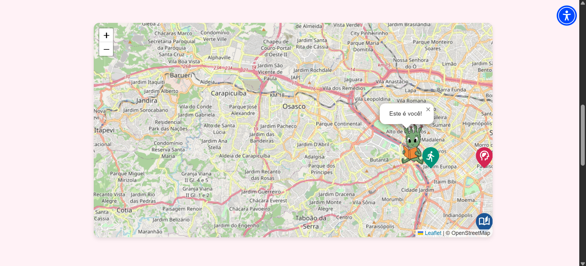
<sup>Fonte: Material produzido pelos autores (2025)</sup>
</div>

- **Sobre nós**: <br>

A tela Sobre Nós tem como finalidade apresentar, de forma institucional e organizada, as informações essenciais sobre o Instituto Cactus, promovendo a transparência e o engajamento dos usuários com a plataforma. A interface está estruturada em três seções principais: a primeira aborda a missão do instituto, destacando seu compromisso com a promoção da saúde mental; a segunda apresenta os projetos já desenvolvidos, por meio de cartões informativos padronizados que reúnem dados como nome, descrição e período de execução, facilitando a compreensão das iniciativas realizadas; e a terceira exibe a equipe responsável pela administração do instituto, com cards contendo nome e função.

- **Cultura**: <br>

A tela de Cultura é uma ferramenta informativa que conscientiza os usuários sobre o impacto positivo da cultura na saúde mental. Com a missão da plataforma Mandacaru de nutrir a mente e promover equilíbrio emocional, a tela destaca benefícios como estímulo à criatividade, redução de ansiedade e fortalecimento do senso de pertencimento, incentivando a conexão cultural. Inclui um botão "Visualizar mapa" para levá-lo à tela principal onde encontrará opções de mapa.

- **Esporte**: <br>

A tela de Esporte, é uma ferramenta informativa que conscientiza os usuários sobre os benefícios da prática esportiva para a saúde mental. Com a missão da plataforma Mandacaru de promover um corpo saudável que reflete na mente, a tela destaca vantagens como melhora de humor, redução de estresse e fortalecimento da autoestima, incentivando um estilo de vida equilibrado. Inclui um botão "Visualizar mapa" para levá-lo à tela principal onde encontrará opções de mapa.

- **Saúde Mental**: <br>

A tela de Saúde Mental, é uma ferramenta informativa que conscientiza os usuários sobre a importância do cuidado mental. Com a missão da plataforma Mandacaru de promover passos que fortalecem e transformam a vida, a tela destaca benefícios como qualidade de vida, equilíbrio emocional e autoconhecimento, abordando tabus e incentivando o diálogo e hábitos saudáveis. Inclui um botão "Visualizar mapa" para levá-lo à tela principal onde encontrará opções de mapa.

### Lógicas implementadas:

Além disso, outra área essencial de desenvolvimento durante a sprint foi a implementação de lógicas voltadas à dinamicidade da aplicação, utilizando JavaScript, bem como a conexão entre as telas por meio da criação de rotas no front-end.

- **Filtro por Nome e Ordenação dos Resultados por Localização**: <br>

Na sprint anterior, foi implementada uma lógica de filtragem baseada no banco de dados, na qual os resultados eram obtidos a partir de variáveis associadas aos filtros selecionados. No entanto, durante a Sprint 4, um dos objetivos propostos foi desenvolver uma nova lógica de filtragem, desta vez sem depender dos dados previamente cadastrados no banco. A proposta envolvia o uso da geolocalização obtida em tempo real e a filtragem de dados simples com base no nome.
Nesse contexto, foram implementados os seguintes elementos principais:

- Filtro de localidade via input (por nome, estado ou categoria);
- Ordenação dos resultados com base na proximidade geográfica;
- Vinculação entre os pins exibidos no mapa e os cards gerados na interface.

- **Conexão entre as telas (através das rotas)**:
  A partir do desenvolvimento do front-end das telas, outro tópico trabalhado durante a sprint foi a criação das rotas de conexão com as páginas do front, conforme o exemplo abaixo:

```javascript
router.get("/sobre", (req, res) => {
  // Renderiza a view da página "Sobre Nós"
  res.render("pages/sobreNosPagina", {
    pageTitle: "Sobre Nós", // Título da página passado para a view
    content: "", // Pode ser utilizado para conteúdo dinâmico na view
  });
});
```

Essas rotas são chamadas diretamente a partir dos elementos HTML, como no exemplo:

```javascript
<a href="/sobre">Sobre Nós</a>
```

- **Junção da tela de gerenciamento com modais**: <br>

A implementação foi feita a partir de uma tela de gerenciamento já iniciada anteriormente. Os modais de adição e edição foram integrados com suas respectivas funcionalidades, estilos e responsividade, possibilitando a criação e modificação de localidades. Esses dados são exibidos e manipulados dinamicamente na própria tela de gerenciamento.

### Dificuldades enfrentadas:

- **Alteração do banco (latitude e longitude estava sendo recebida apenas com dois caracteres)**: <br>

  O banco de dados desenvolvido inicialmente contava com um campo de latitude e longitude limitado a apenas dois caracteres. No entanto, para viabilizar uma geolocalização mais precisa, foi necessário reestruturar o banco, ampliando o número de caracteres permitidos nesses campos.
  Essa alteração tornou possível o armazenamento de coordenadas com maior exatidão. Como consequência, houve a necessidade de rodar o script de criação do banco novamente, de forma não planejada.

### Conclusão e próximos passos

A Sprint 4 representou um avanço significativo no desenvolvimento do sistema, com a consolidação das principais funcionalidades e a entrega de uma interface mais próxima do mockup definido. Foram aplicadas melhorias visuais, implementadas funcionalidades dinâmicas como os modais de gerenciamento e criada uma base funcional para visualização e filtragem de localidades no mapa com base em dados geográficos e geolocalização do usuário.
A estrutura atual permite uma navegação fluida e uma experiência mais intuitiva para os administradores e usuários da plataforma.
Para a Sprint 5, estão previstos os seguintes passos:
Realização de novos refinamentos visuais e ajustes de design para melhorar a consistência da interface;

- Aplicação de testes de usabilidade com usuários reais para coleta de feedbacks;
- Correções com base nos pontos identificados durante os testes;
- Validação final das funcionalidades e fluxos da plataforma.

Essas ações têm como objetivo preparar a aplicação para sua versão final, garantindo qualidade, acessibilidade e alinhamento com as expectativas dos usuários.

## <a name="c4.3"></a>4.3. Versão final da aplicação web

A Sprint 5 marca a conclusão do desenvolvimento da aplicação web Mandacaru, com foco na entrega de uma plataforma funcional, responsiva e alinhada às necessidades dos usuários. Nesta fase, foram realizados refinamentos importantes na interface, como correções de bugs identificados e a adição de funcionalidades que aprimoram a experiência do usuário, visando melhorar a qualidade, usabilidade e segurança da aplicação.

**Atualização dos filtros da tela de gerenciamento e mapa** <br>
Nesta sprint, foram realizadas melhorias nos filtros da aplicação web, com foco na usabilidade e na ampliação da abrangência dos dados. Nas telas de gerenciamento e mapa, os filtros foram aprimorados com a adição da opção "Todos" nos campos de gênero, faixa etária, categoria e estado, permitindo consultas mais amplas e sem restrições. No caso do filtro de estado, os valores disponíveis — antes limitados às siglas MG, RJ e SP — foram ampliados, passando a contemplar os 27 estados brasileiros.

**Padronização do design**<br>
Um dos pontos focais da última sprint foi a refatoração dos códigos HTML e CSS. Como cada tela foi desenvolvida por pessoas diferentes, havia variações nas margens, espaçamentos e inconsistências no menu superior e no rodapé. Por isso, foi necessário reestruturar alguns containers para que se adequassem e mantivessem uma consistência visual entre as telas, tanto no fluxo do usuário comum quanto no do administrador. 

Ademais, foram identificadas algumas particularidades relacionadas à responsividade, o que se tornou outro ponto de atenção durante a sprint. Houve ênfase especial na tela do mapa, que passou por alterações no design em relação à última versão entregue, devido feedback da etapa de testes.

**Aprimoramentos Funcionais, Visuais e de Segurança**<br>

Visando aprimorar a experiência tanto do usuário quanto do administrador, foram adicionados botões de "Ver mais" e "Ver menos" nas telas do mapa e de gerenciamento, permitindo limitar e controlar a quantidade de localidades exibidas por vez, o que melhora a organização visual e a navegabilidade dessas telas.

Além disso, foi criada uma nova seção na tela "Sobre nós", dedicada aos desenvolvedores, com informações sobre a equipe responsável pelo projeto e pelo desenvolvimento do site. A responsividade completa da tela de gerenciamento também foi finalizada, garantindo uma experiência adequada em diferentes dispositivos.

Para tornar a navegação mais clara e interativa, foram implementadas notificações de feedback para todas as ações do sistema, como exclusão, alteração, login e outras interações, proporcionando ao usuário um retorno imediato sobre suas ações.

Por fim, foi incluída uma camada de segurança com autenticação de acesso à tela de gerenciamento. Anteriormente, qualquer usuário que inserisse a URL correta podia acessá-la. Agora, apenas usuários logados como administradores conseguem entrar. Caso contrário, são automaticamente redirecionados para a tela de login.

<div align="center">
<sub>Figura 55 - Feedback pop-up</sub>

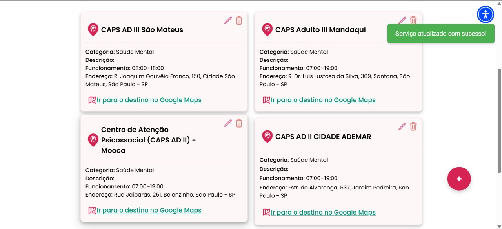

<sup>Fonte: Material produzido pelos autores (2025)</sup>

</div>

**Códigos SQL**<br>
Scripts SQL foram criados e executados para a inserção de múltiplos registros nas tabelas *enderecos* e *servicos*, com dados referentes a parques, CEUs e bibliotecas localizadas em São Paulo. As informações foram extraídas da base de dados do Instituto Cactus e organizadas em blocos estruturados de scripts SQL.

- **Dados Inseridos:**
*Tabela enderecos:* id_endereco, estado, cidade, bairro, cep, rua, numero, latitude, longitude.
*Tabela servicos:* id_servico, id_endereco, nome, categoria_localidade.

```sql
INSERT INTO enderecos (id_endereco, estado, cidade, bairro, cep, rua, numero, latitude, longitude)
VALUES (gen_random_uuid(), 'SP', 'São Paulo', 'Itaim Bibi', '04538-000', 'R. Tabapuã', '1123', -23.5816143, -46.6811393)
RETURNING id_endereco;
INSERT INTO servicos (id_servico, id_endereco, nome, descricao, categoria_localidade, data_funcionamento, horario_funcionamento, telefone, genero, faixa_etaria)
VALUES (
    gen_random_uuid(),
    (SELECT id_endereco FROM enderecos WHERE cep = '04538-000' AND numero = '1123'),
    'CAPS III Adulto Itaim Bibi', '',
    'Saúde', NULL, 'segunda a sexta: 07:00–19:00', '(11) 3079-5678', 'Todos', 'Todos'
);
```


*Observação:* Campos não fornecidos no arquivo original — como data_funcionamento, horario_funcionamento, telefone — foram mantidos como NULL, preservando a fidelidade à fonte.

Além disso, foi utilizada a interface do sistema Web para importar os scripts SQL e visualizar/gerenciar os dados geográficos inseridos, contribuindo para o enriquecimento da base de dados e a funcionalidade do sistema.

**Automatização dos filtros de estado**
Visando a melhoria da estrutura do código, foram realizadas refatorações nos filtros de estado presentes nos modais de adição e edição de localidades. Os campos, antes do tipo input, foram substituídos por campos do tipo select, gerados dinamicamente com JavaScript e preenchidos automaticamente com os 27 estados brasileiros. Essa modificação teve como objetivo evitar duplicidades, aumentar a escalabilidade da aplicação e contribuir para a padronização visual e funcional da interface.

### Dificuldades enfrentadas:

Durante o desenvolvimento, surgiram dificuldades causadas pela falta de padronização entre as telas, o que gerou inconsistências visuais. Foi preciso investir tempo no alinhamento de elementos como margens, espaçamentos e estilos, garantindo uma experiência mais uniforme e agradável para o usuário. Também houve desafios relacionados ao banco de dados, já que alguns campos estavam incompletos ou com informações ausentes, exigindo cuidados extras no momento da inserção e validação dos dados.

# <a name="c5"></a>5. Testes

A fase de testes é essencial para garantir a estabilidade, a usabilidade e a confiabilidade da aplicação web Mandacaru. Nesta etapa, foram aplicados testes manuais e automatizados com foco na validação das funcionalidades, na detecção de falhas e na verificação da experiência do usuário. Os testes seguiram boas práticas, como o padrão AAA (Arrange, Act, Assert), assegurando organização e clareza na verificação dos comportamentos esperados. Além disso, a realização de testes com usuários reais contribuiu para identificar pontos de melhoria e validar a efetividade da plataforma frente às necessidades do público-alvo. Essa abordagem fortalece a qualidade do produto final e assegura que a aplicação funcione conforme planejado.

## <a name="c5.1"></a>5.1. Relatório de testes de integração de endpoints automatizados

Testes automatizados foram implementados para garantir a estabilidade, qualidade e confiabilidade da WebAPI desenvolvida. O framework utilizado foi o Jest, escolhido por sua robustez, simplicidade de uso e recursos integrados para criação de mocks e medição de cobertura.
Foram realizados testes unitários nos controllers da aplicação, utilizando mocks para simular as respostas dos services, permitindo o isolamento da lógica dos endpoints e validação do comportamento esperado em diferentes cenários — incluindo fluxos positivos e negativos.
 
### <a name="c5.1.1"></a>5.1.1. Teste do controller admController

Este controller é responsável pelas ações de autenticação e gerenciamento do perfil do administrador.

**Login:**
Foram testados dois casos principais:

- Credenciais válidas: deve retornar o admin e o token JWT.

- Credenciais inválidas: deve retornar status 401 com mensagem clara.

```sql
test('login deve retornar token e admin quando credenciais são válidas', async () => {
  req.body = { email: 'admin@example.com', senha: 'senha123' };
  const mockAdmin = {
    id_administrador: '1',
    nome_completo: 'Admin Teste',
    email: 'admin@example.com',
  };
  admService.login.mockResolvedValueOnce({ admin: mockAdmin, token: 'mocked-token' });

  await admController.login(req, res);

  expect(res.json).toHaveBeenCalledWith({
    admin: {
      id: mockAdmin.id_administrador,
      nome_completo: mockAdmin.nome_completo,
      email: mockAdmin.email,
    },
    token: 'mocked-token',
  });
});
```

**Perfil:**
Verifica o retorno dos dados do administrador com adminId válido e status 404 para administrador não encontrado.

```sql
test('getProfile deve retornar 404 se admin não encontrado', async () => {
  req.adminId = '999';
  admService.getProfile.mockResolvedValueOnce(null);

  await admController.getProfile(req, res);

  expect(res.status).toHaveBeenCalledWith(404);
  expect(res.json).toHaveBeenCalledWith({ message: 'Administrador não encontrado' });
});
```

**Atualização:**
Garante que os dados do administrador são atualizados corretamente e valida tratamento de erro quando o ID não é encontrado.

### <a name="c5.1.2"></a>5.1.2. Teste do controller enderecoController

Controla a criação e recuperação de endereços no sistema.

**Buscar todos os endereços:**
Testa o retorno de uma lista completa de endereços.

```sql
test("buscarTodosEnderecos deve retornar todos os endereços", async () => {
    const mockEnderecos = [{ id_endereco: 1 }, { id_endereco: 2 }];
    enderecoService.getAllEnderecos.mockResolvedValueOnce(mockEnderecos);

    await enderecoController.getAllEnderecos(req, res);

    expect(enderecoService.getAllEnderecos).toHaveBeenCalled();
    expect(res.status).toHaveBeenCalledWith(200);
    expect(res.json).toHaveBeenCalledWith(mockEnderecos);
  });
```

**Criar endereço:**
Simula a criação de um novo endereço com retorno de status 201.

```sql
test("criarEndereco deve retornar o ID do novo endereço", async () => {
    req.body = { estado: "SP", cidade: "São Paulo" };
    enderecoService.createEndereco.mockResolvedValueOnce(10);

    await enderecoController.createEndereco(req, res);

    expect(enderecoService.createEndereco).toHaveBeenCalledWith(req.body);
    expect(res.status).toHaveBeenCalledWith(201);
    expect(res.json).toHaveBeenCalledWith(10);
  });
```

**Tratamento de erro:**
Valida o retorno de erro interno (500) quando há falha no service.

```sql
test("criarEndereco deve retornar 500 em caso de erro", async () => {
    req.body = {};
    enderecoService.createEndereco.mockRejectedValueOnce(
      new Error("Erro ao criar endereço")
    );

    await enderecoController.createEndereco(req, res);

    expect(res.status).toHaveBeenCalledWith(500);
    expect(res.json).toHaveBeenCalledWith({ error: "Erro ao criar endereço" });
  }
```

### <a name="c5.1.3"></a>5.1.3. Teste do controller servicoController

O controller de serviços possui testes mais extensos por ser o mais funcional da aplicação.

**Listar e filtrar serviços:**
Testa retorno de todos os serviços e filtro por critérios diversos.

```sql
test('filtrarServicos deve retornar serviços filtrados', async () => {
  req.query = { estado: 'SP' };
  const mockFiltrados = [{ id_servico: 1 }];
  servicoService.filtrarServicos.mockResolvedValueOnce(mockFiltrados);

  await servicoController.filtrarServicos(req, res);

  expect(res.json).toHaveBeenCalledWith(mockFiltrados);
});
```

**Criar serviço:**
Garante retorno do objeto criado e status HTTP 201.

```sql
test('criarServico deve retornar serviço criado', async () => {
  req.body = { nome: 'Novo Serviço' };
  const mockServicoCriado = { id_servico: 1, nome: 'Novo Serviço' };
  servicoService.criarServico.mockResolvedValueOnce(mockServicoCriado);

  await servicoController.criarServico(req, res);

  expect(res.status).toHaveBeenCalledWith(201);
  expect(res.json).toHaveBeenCalledWith(mockServicoCriado);
});
```

**Atualizar e deletar serviço:**
Verifica tanto a atualização quanto a exclusão de serviços existentes, e responde com 404 quando o ID não é encontrado.

```sql
test('deletarServico deve retornar 404 se não encontrado', async () => {
  req.params.id = '1';
  servicoService.deletarServico.mockResolvedValueOnce(null);

  await servicoController.deletarServico(req, res);

  expect(res.status).toHaveBeenCalledWith(404);
  expect(res.json).toHaveBeenCalledWith({ error: 'Serviço não encontrado' });
});
```

### <a name="c5.1.4"></a>5.1.4. Teste do controller admController

**Autenticação de administrador:**
Verifica se um administrador válido recebe token de autenticação e se falhas são tratadas corretamente.

```sql
test('loginAdm deve retornar token ao autenticar com sucesso', async () => {
  req.body = { email: 'admin@email.com', senha: '123456' };
  const mockToken = 'fake-token';
  admService.loginAdm.mockResolvedValueOnce(mockToken);

  await admController.loginAdm(req, res);

  expect(res.status).toHaveBeenCalledWith(200);
  expect(res.json).toHaveBeenCalledWith({ token: mockToken });
});


test('loginAdm deve retornar 401 se autenticação falhar', async () => {
  req.body = { email: 'admin@email.com', senha: 'errada' };
  admService.loginAdm.mockResolvedValueOnce(null);

  await admController.loginAdm(req, res);

  expect(res.status).toHaveBeenCalledWith(401);
  expect(res.json).toHaveBeenCalledWith({ error: 'Credenciais inválidas' });
});
```

### <a name="c5.1.5"></a>5.1.5. Teste do controller enderecoController

**Listar endereços:**
Testa o retorno de todos os endereços cadastrados no sistema.

```sql
test('buscarTodosEnderecos deve retornar todos os endereços', async () => {
  const mockEnderecos = [{ id_endereco: 1 }, { id_endereco: 2 }];
  enderecoService.buscarTodosEnderecos.mockResolvedValueOnce(mockEnderecos);

  await enderecoController.buscarTodosEnderecos(req, res);

  expect(res.json).toHaveBeenCalledWith(mockEnderecos);
});
```

**Criar endereço:**
Garante criação de um novo endereço e resposta adequada do sistema.

```sql
test('criarEndereco deve retornar o ID do novo endereço', async () => {
  req.body = { estado: 'SP', cidade: 'São Paulo' };
  enderecoService.criarEndereco.mockResolvedValueOnce(10);

  await enderecoController.criarEndereco(req, res);

  expect(res.status).toHaveBeenCalledWith(201);
  expect(res.json).toHaveBeenCalledWith({ id_endereco: 10 });
});

test('criarEndereco deve retornar 500 em caso de erro', async () => {
  req.body = {};
  enderecoService.criarEndereco.mockRejectedValueOnce(new Error('Erro ao criar'));

  await enderecoController.criarEndereco(req, res);

  expect(res.status).toHaveBeenCalledWith(500);
  expect(res.json).toHaveBeenCalledWith({ error: 'Erro ao criar endereço' });
});
```

### <a name="c5.1.6"></a>5.1.6. Teste do controller servicoController

**Filtrar serviços:**
Permite recuperar serviços com base em filtros, como localização.

```sql
test('filtrarServicos deve retornar serviços filtrados', async () => {
  req.query = { estado: 'SP' };
  const mockFiltrados = [{ id_servico: 1 }];
  servicoService.filtrarServicos.mockResolvedValueOnce(mockFiltrados);

  await servicoController.filtrarServicos(req, res);

  expect(res.json).toHaveBeenCalledWith(mockFiltrados);
});
```

**Criar serviço:**
Garante criação de um novo serviço e status HTTP 201.

```sql
test('criarServico deve retornar serviço criado', async () => {
  req.body = { nome: 'Novo Serviço' };
  const mockServicoCriado = { id_servico: 1, nome: 'Novo Serviço' };
  servicoService.criarServico.mockResolvedValueOnce(mockServicoCriado);

  await servicoController.criarServico(req, res);

  expect(res.status).toHaveBeenCalledWith(201);
  expect(res.json).toHaveBeenCalledWith(mockServicoCriado);
});
```

**Excluir serviço:**
Testa o comportamento do sistema ao excluir serviços, tratando corretamente ID inexistente.

```sql
test('deletarServico deve retornar 404 se não encontrado', async () => {
  req.params.id = '1';
  servicoService.deletarServico.mockResolvedValueOnce(null);

  await servicoController.deletarServico(req, res);

  expect(res.status).toHaveBeenCalledWith(404);
  expect(res.json).toHaveBeenCalledWith({ error: 'Serviço não encontrado' });
});
```

### <a name="c5.1.7"></a>5.1.7. Teste do middleware authMiddleware

O middleware authMiddleware.js é responsável por validar o token JWT enviado nas requisições a rotas protegidas. Sua função é garantir que apenas usuários autenticados possam prosseguir, evitando o acesso não autorizado à API.

**Token Válido:**
Verifica se, ao receber um token JWT válido e bem formatado, o middleware permite a continuidade do fluxo, adicionando corretamente as informações do usuário à requisição. O middleware chama next() e anexa os dados decodificados ao objeto req.

```sql
test('authMiddleware deve permitir acesso com token válido', () => {
  const token = jwt.sign({ adminId: 1, isAdm: true }, JWT_SECRET);
  const req = httpMocks.createRequest({ headers: { authorization: `Bearer ${token}` } });
  const res = httpMocks.createResponse();
  const next = jest.fn();

  authMiddleware(req, res, next);

  expect(req.adminId).toBe(1);
  expect(req.isAdm).toBe(true);
  expect(next).toHaveBeenCalled();
});
```

**Token Ausente:**
Simula uma requisição sem token no cabeçalho de autorização. O middleware deve bloquear o acesso e retornar um erro HTTP 401 e a mensagem "Token não fornecido".

```sql
test('authMiddleware deve bloquear acesso sem token', () => {
  const req = httpMocks.createRequest();
  const res = httpMocks.createResponse();
  const next = jest.fn();

  authMiddleware(req, res, next);

  expect(res.statusCode).toBe(401);
  expect(res._getJSONData().message).toBe("Token não fornecido");
  expect(next).not.toHaveBeenCalled();
});
```

**Token Inválido:**
Avalia a resposta do middleware quando o token fornecido é inválido ou malformado. Neste caso, o acesso também deve ser negado, retornando um erro HTTP 401 e a mensagem "Token inválido".

```sql
test('authMiddleware deve bloquear acesso com token inválido', () => {
  const req = httpMocks.createRequest({ headers: { authorization: "Bearer tokeninvalido" } });
  const res = httpMocks.createResponse();
  const next = jest.fn();

  authMiddleware(req, res, next);

  expect(res.statusCode).toBe(401);
  expect(res._getJSONData().message).toBe("Token inválido");
  expect(next).not.toHaveBeenCalled();
});
```

### <a name="c5.1.8"></a>5.1.8. Teste do middleware isAdm.js

O middleware isAdm.js tem como objetivo garantir que apenas usuários com privilégios administrativos possam acessar determinadas rotas. Para isso, ele verifica a propriedade isAdm, previamente inserida pelo authMiddleware no objeto req.

**Permissão concedida(isAdm: true):**
Permite o avanço para o próximo middleware ou controller quando a requisição contém req.isAdm = true, retornando acesso autorizado, com chamada de next().

```sql
test('deve permitir acesso quando req.isAdm é true', () => {
  const req = httpMocks.createRequest();
  req.isAdm = true;
  const res = httpMocks.createResponse();
  const next = jest.fn();

  isAdm(req, res, next);

  expect(next).toHaveBeenCalled();
  expect(res._isEndCalled()).toBe(false);
});
```

**Permissão negada(isAdm: false):**
Simula uma requisição de um usuário autenticado, porém sem privilégios administrativos. O middleware deve negar o acesso e retornar o erro 403 e mensagem "Acesso restrito a administradores".

```sql
test('deve bloquear acesso quando req.isAdm é false', () => {
  const req = httpMocks.createRequest();
  req.isAdm = false;
  const res = httpMocks.createResponse();
  const next = jest.fn();

  isAdm(req, res, next);

  expect(res.statusCode).toBe(403);
  expect(res._getJSONData().message).toBe("Acesso restrito a administradores");
  expect(next).not.toHaveBeenCalled();
});
```

**Permissão negada(isAdm: ausente)**
Este teste cobre o caso em que a propriedade isAdm não está definida — o que pode indicar falha anterior no middleware de autenticação. O acesso também deve ser negado e deve retonar o erro 403, impedindo o avanço da requisição por falta de verificação administrativa.

```sql
test('deve bloquear acesso quando req.isAdm está ausente', () => {
  const req = httpMocks.createRequest();
  const res = httpMocks.createResponse();
  const next = jest.fn();

  isAdm(req, res, next);

  expect(res.statusCode).toBe(403);
  expect(res._getJSONData().message).toBe("Acesso restrito a administradores");
  expect(next).not.toHaveBeenCalled();
});
```

### <a name="c5.1.9"></a>5.1.9. Execução e cobertura dos testes


Os testes foram executados com:

```sql
npm test
```

A saída no terminal foi:

```sql
PASS  tests/admController.test.js
PASS  tests/enderecoController.test.js
PASS  tests/servicoController.test.js
PASS  tests/authMiddleware.test.js
PASS  tests/isAdm.test.js
PASS  tests/admRoutes.test.js
PASS  tests/enderecoRoutes.test.js
PASS  tests/servicoRoutes.test.js
```

Com a seguinte cobertura:

```sql
admController.js       | 100%
enderecoController.js  | 91.66%
servicoController.js   | 84.44%
authMiddleware.js      | 93.75%
isAdm.js               | 100%
admRoutes.js           | 100%
enderecoRoutes.js      | 100%
servicoRoutes.js       | 100%
```

O único console.error visualizado foi propositalmente gerado por um teste de erro simulado em enderecoController, comprovando que o sistema está preparado para lidar com falhas.

### <a name="c5.1.10"></a>5.1.10. Conclusão

Os testes automatizados com Jest demonstraram alta organização, clareza e robustez. Cada função dos controllers foi validada com simulações controladas, uso de mocks e cobertura de fluxos positivos e negativos. Isso garante:

- Qualidade do código e prevenção de regressões;
- Confiança na lógica de negócio da API;
- Tratamento adequado de erros com mensagens e status apropriados.

Com isso, os testes implementados contribuem para uma aplicação segura, estável e confiável, alinhada às boas práticas de desenvolvimento de APIs RESTful.

## <a name="c5.2"></a>5.2. Testes de usabilidade

Os testes de usabilidade foram conduzidos com o objetivo de avaliar a experiência de navegação e a facilidade de uso do sistema proposto. Durante a aplicação dos testes, os participantes foram orientados a realizar as tarefas primeiro como usuários comuns e, em seguida, como administradores, a fim de analisar a usabilidade em diferentes perfis de uso. Com esse objetivo, foram realizadas as seguintes tarefas:

- **Tarefa 1:** Encontrar elementos através da rolagem vertical pela homepage
- **Tarefa 2:** Acessar o menu de acessibilidade
- **Tarefa 3:** Voltar ao topo da página
- **Tarefa 4:** Buscar CAPS próximos à localização
- **Tarefa 5:** Buscar parques ou quadras para aliviar o estresse
- **Tarefa 6:** Filtrar locais por faixa etária
- **Tarefa 7:** Buscar localidade por nome
- **Tarefa 8:** Navegar pelo mapa e abrir detalhes de localidade
- **Tarefa 9:** Acessar rota no Google Maps
- **Tarefa 10:** Entender relação entre lazer cultural e saúde mental
- **Tarefa 11:** Entender benefícios dos esportes para a saúde mental
- **Tarefa 12:** Conhecer a missão do Instituto Cactus
- **Tarefa 13:** Compreender a proposta do site
- **Tarefa 14:** Fazer login no painel administrativo
- **Tarefa 15:** Editar localidade existente
- **Tarefa 16:** Criar nova localidade
- **Tarefa 17:** Excluir localidade cadastrada


A distribuição de participantes variou de acordo com o bloco de tarefas. As tarefas de 1 a 10 contaram com a participação de 6 usuários. A Tarefa 11 foi avaliada por 3 usuários. As Tarefas 12 e 13 envolveram 4 usuários. Por fim, as tarefas administrativas (Tarefas 14 a 17) foram realizadas por 5 usuários. Esta variação foi necessária para adequar o teste ao tempo disponível e ao número de voluntários.

Abaixo, está apresentada uma análise detalhada dos resultados obtidos. Primeiramente, os dados quantitativos gerais foram organizados em uma tabela com o número total de usuários por tarefa, o número de sucessos fáceis e o número de sucessos com dificuldade. A tabela pode ser acessada por meio do link referente aos
<a href="https://docs.google.com/spreadsheets/d/1mz_cILcxvzudgWw8IieHQ9Zcm4jMSB-YGcp7ZBAePBk/edit?usp=sharing "> testes de usabilidade</a>.

Para facilitar a interpretação visual desses dados, foram elaborados dois gráficos:

O primeiro, um gráfico de barras empilhadas, mostra a quantidade de usuários que completaram cada tarefa com sucesso, diferenciando os casos de sucesso fácil e os casos com dificuldade. Como pode ser observado, a maioria das tarefas apresentou um desempenho bastante positivo, com todos os participantes conseguindo concluir as atividades de maneira fácil. As exceções ficaram por conta das Tarefas 2, 10, 11 e 12, que apresentaram pelo menos um registro de sucesso com dificuldade. Nessas tarefas específicas, os testers mostraram-se hesitantes, confusos e, ainda, com necessidade maior de esforço na realização do que foi proposto.

<div align="center">
<sub>Figura 56 - GRÁFICO 1 - Testes de Usabilidade por Tarefa (Barras Empilhadas)</sub>
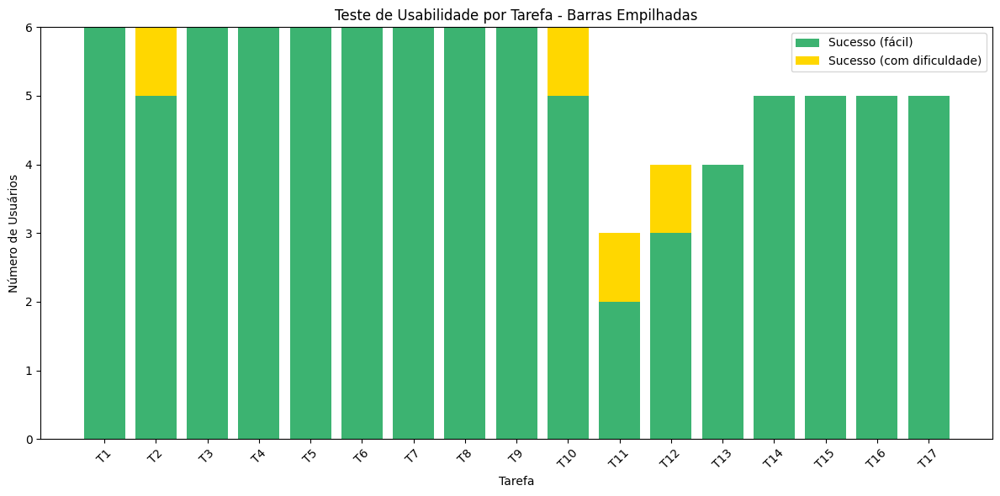
<sup>Fonte: Material produzido pelos autores (2025)</sup>
</div>

O segundo gráfico, de barras agrupadas, apresenta uma comparação entre o total de participantes de cada tarefa e o número de usuários que a realizaram com facilidade. Este formato destaca visualmente as discrepâncias nas tarefas em que houveram dificuldades (Tarefas 2, 10, 11 e 12). A visualização reforça que a maior parte teve um desempenho ideal, com poucos pontos de atenção.

<div align="center">
<sub>Figura 57 - GRÁFICO 2 - Testes de Usabilidade por Tarefa (Barras Agrupadas)</sub>
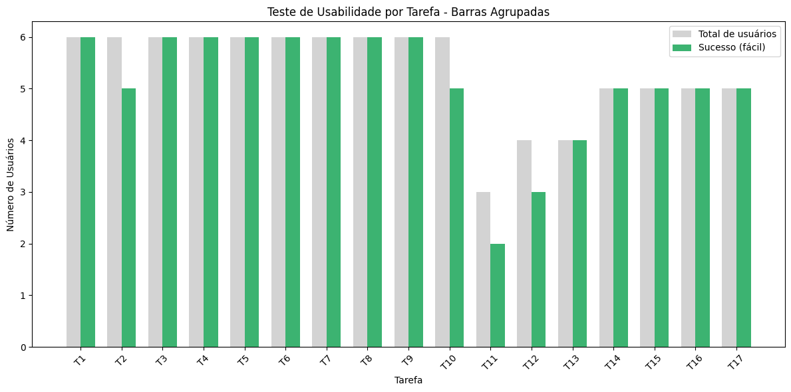
<sup>Fonte: Material produzido pelos autores (2025)</sup>
</div>

Com relação ao perfil das tarefas, é importante destacar que as dificuldades ocorreram especialmente nas tarefas relacionadas à compreensão de conteúdos institucionais ou informativos (como as Tarefas 10 a 12), o que sugere a necessidade na organização visual dessas seções. Também foi identificado um pequeno desafio na localização ou no uso do menu de acessibilidade (Tarefa 2), o que pode indicar a necessidade de ajustes na visibilidade ou na nomenclatura do recurso.

Já as tarefas administrativas (Tarefas 14 a 17), que exigiam ações como login, edição, criação e exclusão de localidades, apresentaram um desempenho altamente satisfatório. Todos os usuários conseguiram completar as tarefas com facilidade, demonstrando que o painel administrativo está intuitivo e funcional.

Diante dos resultados apresentados, é possível concluir que os testes de usabilidade foram bastante positivos, com elevado índice de sucesso entre os usuários. As pequenas dificuldades identificadas servem como pontos de melhoria específicos. A partir desses resultados, passos futuros envolvem a realização de ajustes pontuais nas áreas mencionadas, com o objetivo de garantir uma experiência ainda mais fluida e acessível para todos os perfis de usuário.

## <a name="c5.3"></a>5.3. Testes OWASP Top 10

A segurança é um dos pilares fundamentais no desenvolvimento de aplicações web, especialmente quando se trata de sistemas que lidam com dados sensíveis e públicos vulneráveis, como é o caso do Mandacaru. Nesse contexto, o OWASP Top 10 (Open Worldwide Application Security Project) representa uma referência internacionalmente reconhecida que reúne as dez principais vulnerabilidades de segurança em aplicações web, com base em dados reais coletados por especialistas da área.

A adoção das diretrizes do OWASP Top 10 no Mandacaru foi aplicada no Mandacaru para minimizar riscos de invasões, vazamentos de informações, acessos indevidos e falhas que comprometam a integridade da plataforma. Considerando que o projeto se propõe a ser uma ponte segura entre usuários em situação de vulnerabilidade e serviços de apoio em saúde mental, a aplicação dessas boas práticas reforça o compromisso do time com a confidencialidade, confiabilidade e responsabilidade social da solução.

Para a aplicação no projeto, o grupo contou com o auxílio de inteligência artificial, elaborando um prompt detalhado para viabilizar a execução dos testes da melhor forma. A seguir, são apresentados o prompt utilizado e o respectivo resultado.

```bash
_Considere o OWASP Top 10 como referência. Quero que analise este projeto e verifique se ele está vulnerável a algum dos 10 principais riscos de segurança. Para cada um dos 10 itens, me diga:_

_1. Se há vulnerabilidades ou não._

_2. Justifique com base no código, práticas descritas ou ausência delas._

_3. Dê sugestões diretas de como mitigar ou corrigir as vulnerabilidades._

_4. Aponte trechos de código e configurações críticas, se possível._


_Informações sobre o projeto_

_1. Stack e Arquitetura_

_Linguagem: JavaScript_

_Frameworks e bibliotecas: express, ejs, bcrypt, dotenv, jsonwebtoken, pg_

_Frontend: HTML, EJS e CSS puro_

_Tipo de aplicação: MVC (usando service no lugar de model)_

_Banco de dados: PostgreSQL via Supabase_

_ORM: Nenhum_

_Autenticação/autorização: JWT para autenticação de administradores, com middleware próprio_

_Fluxo de usuários comuns: usuários não autenticados podem visualizar os dados, mas *não possuem funcionalidades críticas, portanto, **não foram implementadas validações extremamente rigorosas* para esse fluxo._


_2. Práticas de Segurança Implementadas_

_Validação de entrada: ( verificar se existe)_

_Sanitização de dados: Não há uma pré-validação para inserção dos dados_

_Uso de HTTPS: Não implementado_

_Criptografia de senhas: Sim, com bcrypt_

_Token JWT com expiração: Sim_

_Verificação de permissões por nível: Sim, fluxo separado para admin (com autenticação) e usuário comum (sem autenticação)_

_Middleware de segurança (helmet, CORS, etc): Não implementado_

_Proteção contra CSRF: Não há_


_3. Dados Sensíveis e Armazenamento_

_Dados tratados: email e senha do administrador_

_Armazenamento: Hash seguro de senha com bcrypt_


_4. Boas Práticas de Código_

_Validação de tipos/formatos nos endpoints: (verificar)_

_Manipulação de erros: (verificar se é feita corretamente)_

_Logging seguro (sem expor dados sensíveis): (verificar)_

_Uso de variáveis de ambiente: Sim, mas pedir para revisar se chaves estão realmente seguras_


_5. Infraestrutura / Deploy_

_Hospedagem: ainda não foi hospedado_

_Variáveis de ambiente seguras no deploy: (avaliar)_

_Controle de versão de dependências: (avaliar)_

_CI/CD: Sim, usando GitHub com Gitflow_

_Exposição pública de rotas sensíveis: (verificar)_


_6. Dependências_

_Auditoria de segurança recente (npm audit, snyk): (não informado, verificar)_

_Uso de bibliotecas confiáveis: Sim_

_Versionamento (package-lock travado): (verificar)_


_7. Logs e Monitoramento_

_Logging de falhas de login/autenticação: (verificar)_

_Log de ações do usuário: (verificar)_

_Ferramenta de monitoramento: (não está sendo usada, verificar necessidade)_


_Requisito principal:_

_Verifique se esse projeto está seguro diante do OWASP Top 10:_

_1. Quebra de controle de acesso_

_2. Falhas criptográficas_

_3. Injeção_

_4. Design inseguro_

_5. Configuração incorreta de segurança_

_6. Componentes vulneráveis e desatualizados_

_7. Falhas de autenticação e gerenciamento de sessão_

_8. Falhas de integridade de software e dados_

_9. Registro e monitoramento ineficientes_

_10. SSRF (Server-Side Request Forgery)_


_Quero uma análise clara e objetiva, com exemplos e sugestões práticas de segurança._
```

A seguir, é possível visualizar o resultado dos testes:

### Análise de Segurança – OWASP Top 10 (2021)

#### 1. **Quebra de Controle de Acesso (Broken Access Control)**

**Vulnerável?** Provável vulnerabilidade.

**Justificativa:**

- Falta de autenticação para o fluxo de usuário comum.
- Ausência de controle de permissões nas rotas públicas.
- Risco de exposição de dados administrativos em rotas não protegidas.

**Trechos críticos:**

- `isAdm.js`, `admRoutes.js`, `servicoRoutes.js`

**Recomendações:**

- Proteja todas as rotas sensíveis com middleware de autenticação.
- Verifique os níveis de permissão por tipo de usuário.
- Considere implementar controle baseado em papéis (RBAC).

---

#### 2. **Falhas Criptográficas (Cryptographic Failures)**

**Vulnerável?** Parcialmente seguro.

**Justificativa:**

- `bcrypt` é usado corretamente para senhas.
- Falta de HTTPS compromete a transmissão segura de dados.
- JWT tem expiração, mas não se sabe o algoritmo usado nem a força da chave.

**Trechos críticos:**

- `admController.js`, `.env`

**Recomendações:**

- Exigir HTTPS em produção.
- Utilizar `HS256` ou `RS256` com segredos longos e seguros.
- Armazenar os segredos unicamente em variáveis de ambiente.

---

#### 3. **Injeção (Injection)**

**Vulnerável?** Sim.

**Justificativa:**

- Queries SQL diretas com `pg`, sem uso confirmado de _prepared statements_.
- Ausência de sanitização de entrada do usuário.
- Alto risco de SQL Injection.

**Trechos críticos:**

- `src/services/*.js`, `src/controllers/*.js`

**Recomendações:**

- Utilize _prepared statements_ para todas as consultas SQL.
- Implemente validação e sanitização de entrada com bibliotecas como `Joi`, `Zod` ou `validator.js`.

---

#### 4. **Design Inseguro (Insecure Design)**

**Vulnerável?** Provável.

**Justificativa:**

- Não há proteção contra CSRF.
- Falta de rate limiting e validações de entrada.
- Design confia demais na divisão entre admin e usuário sem proteção técnica adequada.

**Recomendações:**

- Implementar proteção contra CSRF.
- Adicionar rate limiting com `express-rate-limit`.
- Validar todos os dados recebidos em endpoints, mesmo que de leitura.

---

#### 5. **Configuração Incorreta de Segurança (Security Misconfiguration)**

**Vulnerável?** Sim.

**Justificativa:**

- Não há uso de middleware de segurança (`helmet`, `cors`).
- HTTPS não implementado.
- Variáveis de ambiente podem estar mal protegidas.

**Recomendações:**

- Usar `helmet` para proteção de headers.
- Configurar `CORS` de forma restritiva.
- Implementar HTTPS com certificados válidos na produção.

---

#### 6. **Componentes Vulneráveis e Desatualizados (Vulnerable and Outdated Components)**

**Vulnerável?** Não auditado.

**Justificativa:**

- Não houve confirmação de uso de `npm audit`, `snyk` ou `dependabot`.
- Não se sabe se o `package-lock.json` está atualizado.

**Recomendações:**

- Executar `npm audit` regularmente.
- Ativar `dependabot` no GitHub.
- Garantir versionamento fixo e atualizado de dependências.

---

#### 7. **Falhas de Autenticação e Gerenciamento de Sessão**

**Vulnerável?** Parcialmente seguro.

**Justificativa:**

- Uso de JWT com expiração é bom.
- Não há sistema de logout com blacklist de tokens.
- Nenhuma limitação de tentativas no login (brute force).

**Trechos críticos:**

- `admController.js`, `authMiddleware.js`

**Recomendações:**

- Implementar rate limiting no login.
- Adicionar logout com blacklist de tokens ou refresh tokens.
- Monitorar tentativas suspeitas de login.

---

#### 8. **Falhas de Integridade de Software e Dados**

**Vulnerável?** Provável.

**Justificativa:**

- Não há verificação de integridade nas dependências ou no processo de CI/CD.
- `npm ci` ou hashes não estão sendo utilizados.

**Recomendações:**

- Usar `npm ci` para instalações confiáveis.
- Assinar entregas ou builds, se possível.

---

#### 9. **Registro e Monitoramento Ineficientes**

**Vulnerável?** Sim.

**Justificativa:**

- Não há logs de autenticação, ações críticas ou falhas.
- Nenhuma ferramenta de monitoramento foi mencionada.

**Recomendações:**

- Adicionar `winston` ou `pino` para logging estruturado.
- Logar eventos de login, erro e ações administrativas.
- Integrar com ferramentas como `Sentry`, `LogRocket` ou `Datadog`.

---

#### 10. **Server-Side Request Forgery (SSRF)**

**Vulnerável?** Pouco provável.

**Justificativa:**

- A aplicação não aparenta realizar requisições externas baseadas em input do usuário.

**Recomendações:**

- Se no futuro forem feitas requisições baseadas em input, implementar validação e whitelisting de URLs.

---

### Resumo e Planos Futuros de Ação

#### Pontos Críticos:

- **Validação e sanitização de entrada estão ausentes.**
- **Rotas sensíveis podem estar expostas.**
- **Falta de middleware de segurança e HTTPS.**
- **Não há logging nem monitoramento.**
- **Possível exposição a SQL Injection.**

#### Ações Recomendadas:

- Implementar _prepared statements_ e validação de dados.
- Proteger todas as rotas com autenticação e autorização.
- Adicionar `helmet`, `cors` e configurar HTTPS.
- Implementar _rate limiting_, logs seguros e CSRF.
- Auditar dependências com `npm audit` e versionar `package-lock.json`.
- Criar rotina de monitoramento e logging estruturado.

# <a name="c6"></a>6. Estudo de Mercado e Plano de Marketing

O estudo de mercado e o plano de marketing são ferramentas estratégicas indispensáveis para orientar o posicionamento e a comunicação de um produto ou serviço. No contexto de soluções voltadas à saúde mental, compreender o comportamento do consumidor, as demandas não atendidas e o cenário competitivo permite identificar nichos de atuação e construir uma proposta de valor diferenciada. Já o plano de marketing traduz essas análises em ações práticas, definindo canais, mensagens, formatos e estratégias de relacionamento com o público. Juntos, estudo de mercado e plano de marketing garantem que a aplicação não apenas alcance as pessoas certas, mas também gere engajamento, confiança e impacto real no cotidiano dos usuários.

## <a name="c6.1"></a>6.1. Resumo Executivo

O projeto Mandacaru nasce da urgência em ampliar o acesso a informações sobre equipamentos voltados à promoção da saúde mental, especialmente diante do avanço dos transtornos mentais no Brasil e da carência de plataformas que centralizem esse tipo de dado de forma acessível, gratuita e confiável. A aplicação Web proposta oferece uma solução prática e responsiva, voltada à população em situação de vulnerabilidade, com atenção especial aos recortes de gênero, território e faixa etária.

Como diferencial competitivo, a plataforma adota uma arquitetura de dados altamente curada, integrando filtros avançados de pesquisa por estado, faixa etária, gênero e categoria de atuação, promovendo uma experiência intuitiva e segmentada. Além disso, destaca-se por sua usabilidade responsiva, design limpo e acessibilidade universal, incluindo recursos voltados a públicos diversos, como jovens e mulheres, alinhando-se aos pilares estratégicos do Instituto Cactus. O caráter coletivo da solução também se diferencia de iniciativas que operam de forma descentralizada, tornando-se um ponto de encontro digital entre quem busca apoio e quem oferta cuidado.

Os objetivos estratégicos da solução envolvem: (i) ampliar a visibilidade de iniciativas e serviços em saúde mental; (ii) facilitar a navegação e o mapeamento de recursos por meio de uma interface digital acessível; (iii) apoiar a tomada de decisão de gestores, ONGs e cidadãos; e (iv) contribuir para a consolidação de políticas públicas baseadas em dados, democratizando o acesso à informação e fortalecendo redes de apoio. A plataforma também se propõe como ferramenta complementar para pesquisadores, ativistas e profissionais da saúde, favorecendo a formulação de diagnósticos territoriais e ações assertivas. Assim, o projeto posiciona-se como uma ponte entre cuidado, território e cidadania, oferecendo valor social duradouro.

## <a name="c6.2"></a>6.2. Análise de Mercado

A análise de mercado é uma etapa fundamental para entender o ambiente em que um produto ou serviço será inserido, permitindo identificar oportunidades, desafios e o comportamento dos consumidores. No contexto atual, marcado pelo avanço tecnológico e pela crescente demanda por soluções digitais voltadas à saúde mental, compreender as dinâmicas econômicas, tecnológicas e regulatórias desse setor torna-se essencial para garantir o sucesso e a relevância da aplicação desenvolvida. Esta análise busca apresentar um panorama detalhado do mercado, contemplando seu tamanho, crescimento e as principais tendências que impactam a inovação e a adoção de plataformas digitais focadas no bem-estar mental.

### <a name="c6.2.1"></a>6.2.1. Visão Geral do Setor

O setor de aplicações web voltadas à saúde mental no Brasil se encontra em expansão, impulsionado por avanços tecnológicos, mudanças regulatórias e crescente demanda por serviços acessíveis e personalizados. Atualmente, o Brasil lidera o cenário latino-americano de healthtechs, concentrando cerca de 65% das startups da região, de acordo com o portal Saúde Business. Em 2024, os investimentos no setor cresceram 37,6%, totalizando US$ 253,7 milhões. Esse crescimento reflete a busca por soluções inovadoras que atendam às necessidades de saúde da população, especialmente em áreas como saúde mental, onde a demanda por serviços acessíveis é crescente.

De acordo com o Relatório HealthTech Recap 2024, a adoção de tecnologias como Inteligência Artificial nas healthtechs brasileiras aumentou de 14% para 20% nos últimos dois anos, visando maior eficiência e personalização no atendimento. Ainda, a regulamentação da telessaúde no Brasil avançou com a aprovação da Lei 14.510/2022, que autoriza e disciplina a prática da telessaúde em todo o território nacional, incluindo serviços de saúde mental. No entanto, cerca de 80% dos aplicativos de saúde mental não atendem a padrões mínimos de segurança e privacidade, evidenciando a necessidade de desenvolvimento de soluções mais seguras e confiáveis.

Nesse cenário, o Instituto Cactus, referência nacional na promoção da saúde mental, tem atuado como parceiro estratégico em iniciativas que ampliam o acesso a informações e cuidados psicológicos, como é o caso da aplicação web Mandacaru, que está sendo tratada neste documento. Utilizando recursos como geolocalização, filtros personalizados e foco em acessibilidade, o projeto busca oferecer uma solução confiável e segura, alinhada às demandas tecnológicas atuais, aos marcos regulatórios recentes e ao contexto socioeconômico de expansão do setor.

### <a name="c6.2.2"></a>6.2.2. Tamanho e Crescimento do Mercado

O mercado global de aplicativos voltados à saúde mental tem apresentado um crescimento expressivo nos últimos anos. De acordo com a Grand View Research, o segmento de mental health apps foi avaliado em aproximadamente US$ 5,2 bilhões em 2022 e deve alcançar cerca de US$ 17,5 bilhões até 2030. Esse avanço é impulsionado principalmente pelo aumento da conscientização sobre saúde mental e pelo acesso ampliado a smartphones e internet, especialmente entre populações mais jovens.

Além disso, o mercado global de tecnologias voltadas para saúde mental, que inclui não apenas aplicativos, mas também plataformas digitais e serviços baseados em IA, foi estimado em cerca de US$ 7,5 bilhões em 2023. A expectativa é que esse setor atinja US$ 32,97 bilhões até 2032, número que reflete uma crescente demanda por soluções digitais integradas e escaláveis. Especificamente na América do Sul, o mercado de aplicativos de saúde mental conta com previsão de crescimento para US$ 2,1 bilhões até 2035, de acordo com o relatório da Future Market Insights.

No Brasil, o cenário da saúde digital também segue uma tendência de expansão acelerada. A Statista aponta que a receita do mercado de Digital Health no país foi de US$ 6,35 bilhões em 2024, com projeção de atingir US$ 21,92 bilhões até 2030, a uma taxa de crescimento anual de 23,2%. Esses dados confirmam o espaço crescente para soluções tecnológicas que abordam o bem-estar psicológico, especialmente aquelas que integram acessibilidade, confiança e inovação, como a plataforma em desenvolvimento em parceria com o Instituto Cactus.

### <a name="c6.2.3"></a>6.2.3. Tendências de mercado

Nos últimos anos, observou-se uma crescente valorização da saúde mental como parte fundamental do bem-estar geral, impulsionando o desenvolvimento de soluções tecnológicas voltadas ao cuidado psicológico. A digitalização da saúde mental é uma tendência global que combina inovação, acessibilidade e personalização do atendimento.

No campo tecnológico, destacam-se o uso de inteligência artificial para triagem de sintomas, plataformas web com geolocalização para mapeamento de serviços e aplicativos móveis voltados ao acompanhamento emocional. Um exemplo, de acordo com a McKinsey & Company, é o uso de chatbots e assistentes virtuais em contextos terapêuticos, que oferecem apoio imediato e auxiliam na triagem de pacientes.
Do ponto de vista comportamental, há um aumento na busca por apoio psicológico digital, especialmente entre jovens adultos. Segundo pesquisa da Mental Health America, mais de 60% das pessoas que procuram ajuda preferem iniciar esse processo por meios digitais devido à praticidade e agilidade do processo. Isso está ligado à maior conscientização sobre saúde mental, ao combate ao estigma e à conveniência proporcionada por plataformas online.

No aspecto mercadológico, empresas e organizações têm investido cada vez mais em soluções escaláveis e acessíveis, com foco em atendimento preventivo e personalizado. O modelo B2B2C (Business-To-Business-To-Consumer), com parcerias entre instituições sociais, governo e empresas privadas, tem crescido como forma de ampliar o alcance dos serviços de saúde mental digital.

No Brasil, observa-se o fortalecimento de um ecossistema voltado à inovação social em saúde mental, impulsionado por organizações como o Instituto Cactus, que promove parcerias estratégicas com centros de pesquisa, universidades e iniciativas públicas. Esse movimento reflete uma tendência mais ampla de integração entre conhecimento acadêmico, tecnologia e impacto social. A atuação conjunta com instituições de ensino evidencia o potencial das tecnologias abertas e da formação interdisciplinar para responder às lacunas existentes no acesso a cuidados psicológicos, especialmente em regiões com menor oferta de serviços especializados.

## <a name="c6.3"></a>6.3. Análise da Concorrência

A análise da concorrência permite compreender o posicionamento da plataforma Mandacaru frente a outras iniciativas que atuam no mesmo campo, como aplicativos de saúde mental, sites institucionais e mapas de serviços públicos. Essa etapa foi fundamental para identificar lacunas no mercado, oportunidades de diferenciação e boas práticas já utilizadas por soluções semelhantes. Ao observar aspectos como usabilidade, acessibilidade e confiabilidade das informações, foi possível reafirmar a proposta de valor do Mandacaru como uma plataforma gratuita, inclusiva e centrada na promoção da saúde mental, especialmente voltada a públicos em situação de vulnerabilidade.

### <a name="c6.3.1"></a>6.3.1. Principais Concorrentes

O ecossistema digital voltado à promoção da saúde mental no Brasil encontra-se em processo de amadurecimento, com iniciativas que, embora relevantes, apresentam lacunas significativas de cobertura, acessibilidade e personalização. Entre os concorrentes diretos, destaca-se o **Mapa Saúde Mental**, que opera por meio de uma base colaborativa de dados, porém sem curadoria institucional formalizada. Outro exemplo é o **Bem-Estar Unicamp**, projeto com escopo restrito ao ambiente universitário. Aplicativos comerciais como **Zenklub** e **Vittude** também ocupam espaço no setor, oferecendo acesso pago a atendimentos psicológicos, com foco no público de classe média e alta.

Entre os concorrentes indiretos, plataformas genéricas como **Google Maps**, **Instagram** e grupos em redes sociais são comumente utilizados para buscar serviços em saúde mental. No entanto, essas ferramentas não foram concebidas com foco nesse tipo de navegação e apresentam baixa confiabilidade, ausência de filtros específicos, e risco elevado de desinformação.

De modo geral, essas soluções não contemplam plenamente a população em situação de vulnerabilidade, carecem de filtros específicos (como gênero, faixa etária ou tipos de serviço) e não oferecem atualizações regulares com validação técnica.

### <a name="c6.3.2"></a>6.3.2. Vantagens Competitivas da Aplicação Web

A aplicação web **Mandacaru** foi concebida para suprir lacunas estruturais dos modelos existentes, oferecendo um sistema gratuito, confiável e voltado à inclusão social. Seu principal diferencial reside na **curadoria ativa dos dados**, realizada em parceria com o Instituto Cactus, garantindo a confiabilidade e relevância das informações publicadas. A plataforma conta com filtros de pesquisa avançados, permitindo que o usuário selecione estado, faixa etária, gênero e categoria de atuação, o que viabiliza uma busca mais personalizada e eficaz.

Além disso, o **design responsivo e acessível** prioriza a experiência do usuário em dispositivos móveis, facilitando o acesso a públicos jovens e periféricos. A linguagem visual foi desenhada para acolher diferentes identidades, com atenção especial às necessidades de mulheres e adolescentes. Por fim, sua **arquitetura escalável** e compromisso com dados abertos viabilizam integrações futuras com políticas públicas, consolidando o Mandacaru como um instrumento estratégico de fortalecimento das redes de cuidado em saúde mental no Brasil.

## <a name="c6.4"></a>6.4 Público-Alvo

A definição do público-alvo é essencial para orientar as decisões de design, comunicação e funcionalidades de uma aplicação WEB. Com foco em acessibilidade, prevenção e cuidado em saúde mental, a aplicação é voltada principalmente para mulheres e adolescentes em situação de vulnerabilidade social, além de jovens adultos que enfrentam desafios emocionais no cotidiano. Tais grupos foram priorizados devido ao alinhamento com a missão do Instituto Cactus e à necessidade de ferramentas digitais que facilitem o acesso a locais de acolhimento e bem-estar. Com base em pesquisas, personas e user stories desenvolvidas, a plataforma busca responder de forma sensível e prática às demandas reais desse público, promovendo inclusão e autonomia.

### <a name="c6.4.1"></a>6.4.1. Segmentação de Mercado

A aplicação web Mandacaru está inserida no mercado de tecnologias voltadas para a saúde mental, com especial atenção ao público mais afetado por questões emocionais e psicológicas: **mulheres e adolescentes**. Essa escolha é respaldada por estudos, como a PNS/IBGE (2020), que indicam maior prevalência de transtornos mentais nessas populações, reforçando a necessidade de soluções acessíveis e específicas.

A segmentação do mercado considera critérios **demográficos (gênero e idade)**, **comportamentais (uso intensivo de plataformas digitais)** e **psicográficos (interesse em bem-estar, autocuidado e pertencimento)**. A plataforma visa alcançar indivíduos em todo o território nacional, independentemente da localização geográfica, promovendo o acesso à informação de forma **universal, equitativa e descentralizada**.

Com filtros personalizáveis por **gênero, faixa etária, tipo de serviço e categoria de atendimento**, a aplicação oferece uma experiência centrada no usuário, promovendo a visibilidade de iniciativas sociais e fortalecendo redes colaborativas em diferentes territórios e contextos.

### <a name="c6.4.2"></a>6.4.2. Perfil do Público-Alvo

O público-alvo da aplicação Mandacaru é constituído, prioritariamente, por **mulheres e adolescentes**, com idades entre **12 e 29 anos**, pertencentes a diversos contextos sociais e regiões do país de acordo com a Pesquisa Nacional por Amostra de Domicílios Contínua, realizada pelo IBGE em 2021. Trata-se de um público que, embora heterogêneo, compartilha **necessidades comuns relacionadas ao acesso à informação, cuidado em saúde mental, segurança emocional e valorização do autocuidado**.

Demograficamente, abrange estudantes, jovens em início de vida profissional, mães jovens e demais perfis femininos em transição de ciclos de vida. Psicograficamente, essas pessoas valorizam **ambientes acolhedores, linguagem inclusiva e recursos digitais intuitivos**, que facilitem a busca por apoio emocional de forma segura, gratuita e empática.

Comportamentalmente, são usuárias frequentes de dispositivos móveis e redes sociais, preferindo **plataformas digitais que garantam privacidade, agilidade e confiabilidade das informações**. Buscam soluções que respeitem sua autonomia e ofereçam caminhos práticos para identificar serviços, projetos e instituições ligados à saúde mental.

A aplicação Mandacaru atende a essas expectativas ao reunir, de forma interativa e responsiva, dados sobre equipamentos, iniciativas e ações em saúde mental de todo o país, consolidando-se como uma ferramenta essencial para o fortalecimento do cuidado psicossocial em escala nacional.

## <a name="c6.5"></a>6.5. Posicionamento

O posicionamento do Mandacaru no mercado digital de saúde mental foi estrategicamente definido para destacar seus diferenciais enquanto solução gratuita e acessível. Voltada à prevenção e ao bem-estar emocional, a aplicação se distancia de abordagens puramente clínicas ou comerciais ao adotar uma perspectiva educativa, territorial e acolhedora. Seu valor está na curadoria de dados, na interface amigável e na conexão entre pessoas e espaços de cuidado. Ao se posicionar como uma ferramenta social de acesso ampliado, especialmente para populações vulneráveis, o Mandacaru reforça seu compromisso com a democratização da saúde mental e com os princípios do Instituto Cactus.

### <a name="c6.5.1"></a>6.5.1. Proposta de Valor Única

O Mandacaru se posiciona como a plataforma digital gratuita e curada para acesso a informações sobre saúde mental no Brasil, com foco na população em situação de vulnerabilidade, especialmente mulheres e adolescentes. Nossa proposta de valor única reside na capacidade de oferecer um diretório abrangente e confiável de equipamentos e serviços de saúde mental, suprindo a lacuna de plataformas centralizadas, acessíveis e com dados validados. Em um cenário onde a desinformação e a dificuldade de acesso a cuidados são desafios latentes, o Mandacaru se destaca pela curadoria ativa dos dados em parceria com o Instituto Cactus, garantindo a relevância e a segurança das informações. Facilitamos a conexão entre quem busca apoio e as iniciativas que oferecem cuidado, com filtros de pesquisa avançados que permitem uma navegação personalizada por estado, faixa etária, gênero e categoria de atuação. Isso empodera o usuário a encontrar o recurso mais adequado às suas necessidades, promovendo autonomia e acesso democratizado à saúde mental. Além disso, ao oferecer uma plataforma que facilita o acesso rápido e seguro a serviços essenciais, o Mandacaru contribui diretamente para a redução do tempo de busca por ajuda, potencialmente aumentando o engajamento com tratamentos e iniciativas de prevenção, o que representa um impacto positivo para a saúde mental da população atendida.

### <a name="c6.5.2"></a>6.5.2. Estratégia de Diferenciação

Nossa estratégia de diferenciação se baseia em três pilares principais: confiabilidade da informação, acessibilidade e personalização. Enquanto concorrentes diretos operam com bases colaborativas sem curadoria formal ou são restritos a nichos específicos, o Mandacaru se diferencia pela validação técnica e institucional dos dados, assegurada pela parceria com o Instituto Cactus. Isso elimina o risco de desinformação e garante que os usuários encontrem serviços legítimos e de qualidade. A gratuidade e o design responsivo garantem acessibilidade universal, em contraste com aplicativos comerciais pagos que excluem a população de baixa renda. Além disso, a riqueza dos filtros de pesquisa permite uma personalização da busca que não é encontrada em plataformas genéricas ou redes sociais. Essa combinação de dados curados, gratuidade e segmentação aprofundada nos posiciona como a solução mais completa e confiável para a população em vulnerabilidade que busca informações sobre saúde mental. Essa abordagem nos posiciona não só como uma plataforma informativa, mas como um agente ativo na promoção do bem-estar mental, capaz de influenciar positivamente a qualidade de vida dos usuários. Espera-se que essa diferenciação gere maior confiança dos usuários, aumento do uso recorrente da plataforma e fortalecimento da rede de apoio em saúde mental.

## <a name="c6.6"></a>6.6. Estratégia de Marketing

A estratégia de marketing da plataforma Mandacaru foi pensada para ampliar sua visibilidade, engajar o público-alvo e fortalecer a missão institucional do Instituto Cactus. Com foco em ações de divulgação digital, a comunicação será conduzida por meio de redes sociais, parcerias com organizações da sociedade civil, instituições públicas e canais educativos, sempre com linguagem acessível e visual empático. Além disso, a utilização de narrativas sensíveis e dados confiáveis busca criar conexões reais com os usuários, reforçando o propósito social da ferramenta. A estratégia prioriza o alcance orgânico, a identificação com causas sociais e o envolvimento de comunidades para consolidar o Mandacaru como uma referência em cuidado e prevenção em saúde mental.

### <a name="c6.6.1"></a>6.6.1. Produto/Serviço

O Mandacaru é uma aplicação web gratuita que serve como um diretório digital de equipamentos e serviços de saúde mental em todo o Brasil. Suas funcionalidades chave incluem filtros avançados de pesquisa por estado, cidade, faixa etária, gênero e categoria de atendimento (ex: CAPS, ambulatório, ONGs, projetos sociais, etc.). Os usuários se beneficiam de uma experiência de busca simplificada e eficaz, encontrando recursos que realmente se encaixam em suas necessidades e perfis. O principal diferencial é a curadoria rigorosa dos dados em parceria com o Instituto Cactus, assegurando que as informações sejam confiáveis, atualizadas e relevantes. A aplicação também se destaca pelo design responsivo e inclusivo, que garante acessibilidade em diferentes dispositivos e uma linguagem visual acolhedora, especialmente pensada para mulheres e adolescentes, promovendo uma navegação intuitiva e segura.

### <a name="c6.6.2"></a>6.6.2. Preço

O modelo de precificação adotado para a aplicação Mandacaru é gratuito para o usuário final. Essa estratégia é fundamental e intrínseca à proposta de valor do projeto, que visa a democratização do acesso à informação em saúde mental, especialmente para populações em situação de vulnerabilidade social. A gratuidade elimina barreiras econômicas e alinha-se diretamente com o objetivo social do Mandacaru de promover inclusão e equidade. A sustentabilidade do projeto será baseada em parcerias estratégicas com instituições públicas e privadas, fundações e organizações do terceiro setor, que compartilham da missão de promover a saúde mental no Brasil. Essa abordagem garante a continuidade da plataforma sem onerar o público-alvo, reforçando o compromisso com o impacto social e a responsabilidade coletiva.

### <a name="c6.6.3"></a>6.6.3. Praça (Distribuição)

A distribuição do Mandacaru será predominantemente por canais digitais, aproveitando a ampla conectividade e o comportamento online do público-alvo. O principal canal será o próprio website do Mandacaru, otimizado para navegadores e dispositivos móveis, garantindo acesso direto e fácil. Além disso, a aplicação será distribuída através de parcerias estratégicas com ONGs, associações de saúde mental, secretarias de saúde estaduais e municipais, escolas e universidades. Essas instituições atuarão como multiplicadores, divulgando o Mandacaru para suas redes e comunidades. Serão realizadas também ações de divulgação em veículos de comunicação que atingem o público-alvo, como portais de notícias e blogs focados em saúde, bem-estar e direitos sociais. O objetivo é assegurar que a plataforma seja encontrada onde o público mais necessita e busca informações.

### <a name="c6.6.3"></a>6.6.4. Promoção

A estratégia de promoção do Mandacaru focará em marketing de conteúdo, SEO e redes sociais, com o objetivo de construir autoridade e engajamento. Para SEO (Search Engine Optimization), serão otimizadas palavras-chave relacionadas à saúde mental, busca por terapias, apoio psicológico e serviços de bem-estar, garantindo que o Mandacaru apareça nas primeiras posições dos buscadores. Nas redes sociais (Instagram, TikTok, Facebook, LinkedIn), serão criados conteúdos informativos, educativos e inspiradores, com foco em conscientização sobre saúde mental, desmistificação de tabus e divulgação das funcionalidades da plataforma. Serão exploradas campanhas de influenciadores sociais e digitais que abordem temas de saúde mental e direitos humanos, alcançando diretamente o público-alvo. O marketing de conteúdo incluirá um blog com artigos sobre temas relevantes, guias práticos e histórias de impacto, posicionando o Mandacaru como uma fonte de informação confiável e um ponto de apoio para a comunidade. Se houver orçamento, campanhas pagas em mídias sociais e Google Ads podem complementar a estratégia para impulsionar o alcance inicial.

# <a name="c7"></a>7. Conclusões e trabalhos futuros

A aplicação web Mandacaru se consolidou como uma plataforma que conecta pessoas a espaços de cuidado em saúde mental, reunindo informações confiáveis sobre centros de apoio psicossocial, parques, centros culturais e outros equipamentos públicos voltados ao bem-estar. Com foco na acessibilidade, no acolhimento e na usabilidade, a solução se mostrou eficaz ao reunir em um só lugar dados úteis e organizados de forma clara, facilitando a busca por locais próximos que promovam saúde emocional e social. O uso de recursos como geolocalização e filtros por tipo de espaço proporcionou uma navegação prática, atendendo às necessidades do público-alvo de forma direta e sensível.

Tendo em vista os avanços e o cumprimento do propósito inicial, ainda existem novas possibilidades de aprimoramento e expansão. Um dos recursos priorizados para versões futuras é a criação de um botão emergencial, que ofereça um acesso rápido ao número 188, do CVV (Centro de Valorização da vida), permitindo que, em momentos de crise, o usuário não precise percorrer toda a plataforma em busca de ajuda, bastando um clique para receber apoio imediato. Esse botão representa um passo importante na humanização e agilidade da resposta da plataforma em situações de urgência emocional.

Outra funcionalidade de potencial inclusão é a adição de um chatbot, integrado à busca por localização, que auxilie os usuários a encontrar de forma mais orientada os equipamentos mais próximos, conforme suas necessidades. A ideia é tornar a interação ainda mais acessível, especialmente para usuários que se sintam mais confortáveis com comunicação guiada. Ainda na questão relacionada à experiência do usuário no mandacaru, um sistema de login para o usuário comum é de plausível implementação, visando permitir que as pessoas salvem locais de interesse, acompanhem atualizações e contribuam ativamente com a plataforma (com as sugestões de contribuição passando por uma curadoria dos administradores).

Nesse sentido, pretende-se também abrir espaço para que usuários possam sugerir novas localidades a serem inseridas no mapa e dar feedbacks sobre os serviços visitados, contribuindo para o fortalecimento da curadoria colaborativa e para a constante atualização das informações oferecidas. Essa funcionalidade agregaria valor à proposta inicial da plataforma ao estimular o envolvimento da comunidade no mapeamento e avaliação dos espaços de cuidado.

Por fim, pensando no impacto positivo da aplicação Web, o grupo planeja expandir o alcance do Mandacaru para além do estado de São Paulo, ampliando a base de dados e mapeando equipamentos de outras regiões do Brasil. Esse processo de expansão deve ser realizado de forma gradual e responsável, assegurando que os mesmos critérios de confiabilidade e curadoria de dados sejam mantidos.

Tomando como base o desenvolvimento do projeto a que este documento se refere, é notável que os próximos passos apontam para o potencial evolutivo da aplicação e evidenciam o comprometimento do Mandacaru como uma ponte segura, acolhedora e acessível entre o cuidado em saúde mental e a população que mais precisa dele. Com dedicação e sensibilidade, a tecnologia pode ser cultivada para nutrir o cuidado, a inclusão e o acesso à saúde mental para todos.

# <a name="c8"></a>8. Referências

1. AS 5 FORÇAS DE PORTER: analisando a competitividade no setor de saúde. Disponível em: https://commerciare.com.br/as-5-forcas-de-porter-analisando-a-competitividade-no-setor-de-saude/. Acesso em: 25 abr. 2025.

2. BRUNO. Kick-off presencial, 25 abr. 2025.

3. INSTITUTO CACTUS. Home - Instituto Cactus. Disponível em: https://institutocactus.org.br/. Acesso em: 25 abr. 2025.

4. PANORAMA DA SAÚDE MENTAL. Panorama da Saúde Mental. Disponível em: https://panoramasaudemental.org/. Acesso em: 25 abr. 2025.

5. SAÚDE-MENTAL-E-ATENÇÃO-PSICOSSOCIAL-NA-PANDEMIA-COVID-19-REC. Disponível em: https://www.fiocruzbrasilia.fiocruz.br/wp-content/uploads/2020/04/Saúde-Mental-e-Atenção-Psicossocial-na-Pandemia-Covid-19-recomendações-gerais.pdf. Acesso em: 25 abr. 2025.

6. SAÚDE MENTAL NO TRABALHO – UM DESAFIO DE GESTÃO. InPress. Disponível em: https://inpresspni.com.br/saude-mental-no-trabalho-um-desafio-de-gestao. Acesso em: 25 abr. 2025.

7. UNICEF. Saúde mental de adolescentes e jovens: Eu pergunto, gente constrói — Agenda Cidade UNICEF Pavuna. Disponível em: https://www.unicef.org/brazil/relatorios/saude-mental-de-adolescentes-e-jovens-eu-pergunto-gente-constroi-agenda-cidade-unicef-pavuna. Acesso em: 24 jun. 2025.

8. W3C. Web Accessibility Initiative (WAI) — Recursos para acessibilidade. Disponível em: https://www.w3.org/WAI/resources/. Acesso em: 24 jun. 2025.

